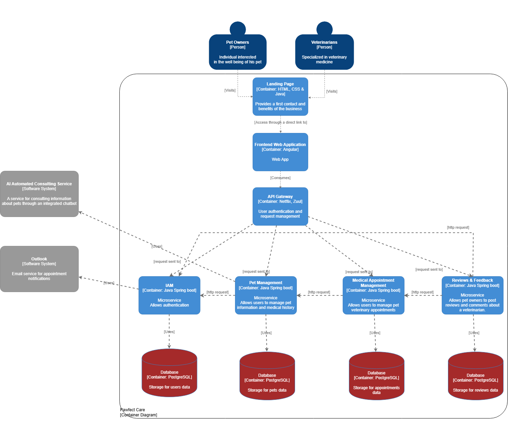
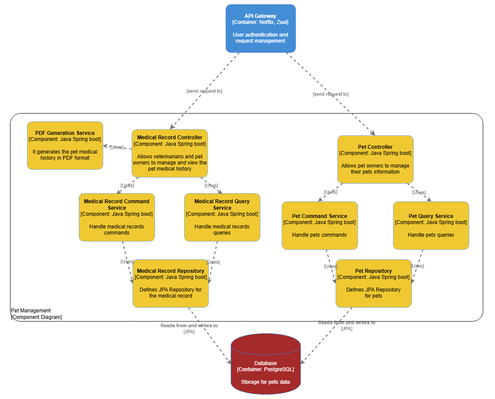
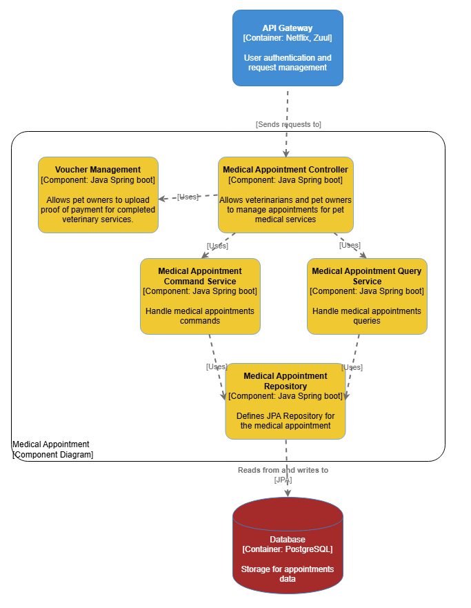
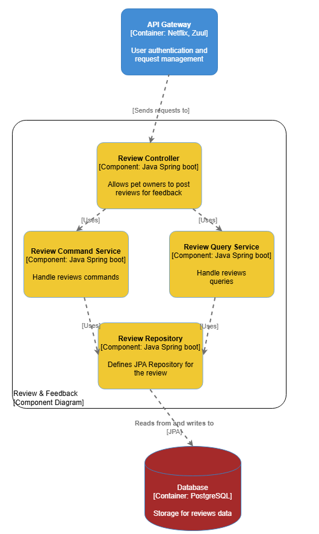
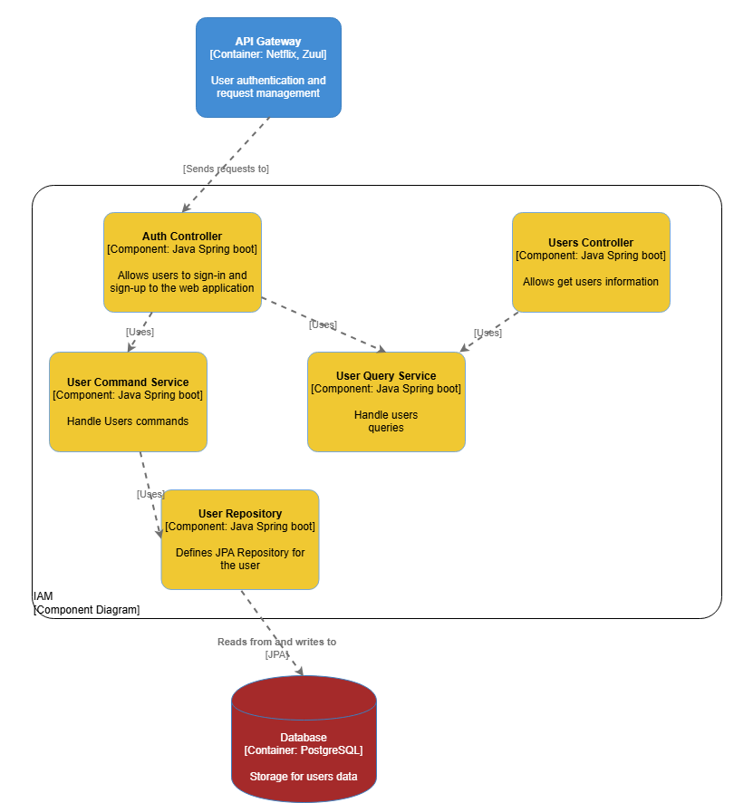
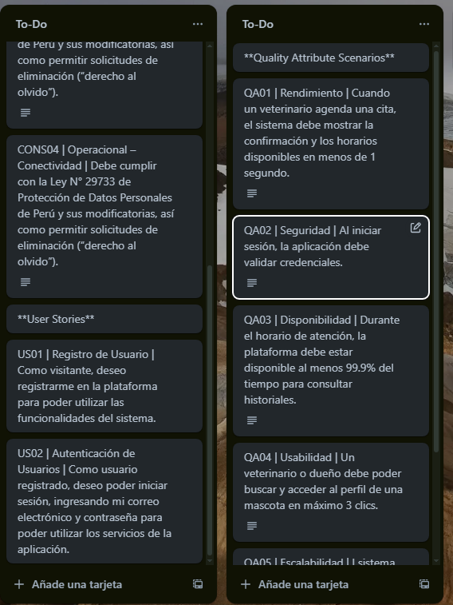
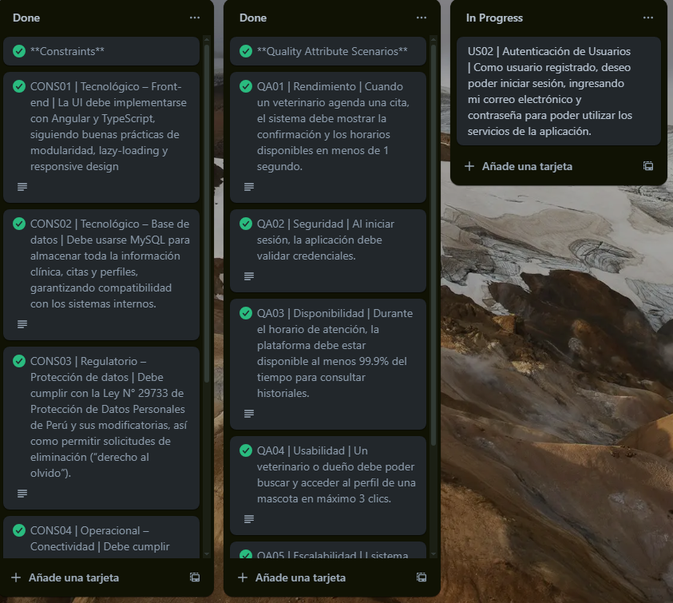

# Capítulo IV: Product Architecture Design

## 4.1. Desing Concepts, ViewPoints & ER Diagrams

## 4.1.1. Principles Statements

A partir de la visión de la arquitectura de negocio, se han identificado los siguientes principios que guiarán el desarrollo del proyecto. Estos principios están diseñados para garantizar que las decisiones técnicas y de diseño estén alineadas con los objetivos a largo plazo:

1. **Solicitudes asincrónicas sobre las sincrónicas**: Siempre que sea posible, se priorizará el uso de requests asincrónicas para mejorar la escalabilidad y la capacidad de respuesta del sistema.

2. **Programación orientada a objetos**: Se fomentará el uso de paradigmas de programación orientada a objetos para estructurar el código en torno a entidades y sus interacciones, mejorando la modularidad y la reutilización.

3. **Uso de bibliotecas con soporte comercial**: Se priorizará el uso de bibliotecas y herramientas que cuenten con soporte comercial para garantizar estabilidad y soporte a largo plazo.

4. **Diseño impulsado por el dominio (DDD)**: Se utilizará el enfoque de Diseño Impulsado por el Dominio para garantizar que el modelo de negocio esté en el centro de las decisiones de diseño, promoviendo una alineación clara entre los requisitos del negocio y la implementación técnica.

5. **Adopción de principios SOLID**: Para garantizar un diseño de software robusto, flexible y fácil de mantener, se aplicarán los siguientes principios:

   - **Principio de Responsabilidad Única (SRP)**: Cada clase o módulo del sistema estará alineado a una única responsabilidad. Esto permitirá que el código sea más fácil de testear, mantener y extender.

   - **Principio Abierto/Cerrado (OCP)**: Las clases y módulos estarán diseñados para ser abiertos a la extensión pero cerrados a la modificación. Esto permitirá añadir funcionalidad al negocio sin alterar el funcionamiento de otros componentes, evitando que se produzcan comportamientos inesperados en el sistema.
   
   - **Principio de Sustitución de Liskov (LSP)**: Las clases derivadas podrán sustituir a sus clases base sin alterar la lógica del negocio. Esto garantizará que las implementaciones específicas sean coherentes con los objetivos del proyecto y la aplicación.

   - **Principio de Segregación de Interfaces (ISP)**: Se diseñarán interfaces pequeñas y específicas para cada funcionalidad, evitando interfaces grandes y genéricas. Esto asegurará que los componentes del sistema solo implementen las interfaces que realmente se necesiten, promoviendo modularidad y simplicidad.

   - **Principio de Inversión de Dependencias (DIP)**: Los módulos de alto nivel dependerán de abstracciones en lugar de implementaciones concretas. Esto permitirá desacoplar los componentes del sistema, facilitando la reutilización y el mantenimiento del código a largo plazo.

Estos principios se aplicarán de manera consistente en el desarrollo del proyecto, asegurando un diseño alineado con los objetivos estratégicos y las mejores prácticas de ingeniería de software.

## 4.1.2. Approaches Statements Architectural Styles & Patterns

En el desarrollo del software, se considerarán enfoques arquitectónicos y patrones que permitan abordar la complejidad del sistema y garantizar su alineación con los objetivos del negocio. Uno de los enfoques principales será el uso del patrón Domain Driven Design (DDD), que ofrece los siguientes beneficios:

1. **Enfoque en el dominio del negocio**: Prioriza entender y modelar el dominio central del negocio, asegurando un desarrollo de software orientado a los procesos del negocio y sus objetivos.

2. **Lenguaje ubicuo**: Utiliza un lenguaje común entre desarrolladores y partes interesadas, garantizando una adecuada comprensión con los principales skateholders.

3. **Modelado centrado en el dominio**: Se desarrolla un modelo que representa con precisión las entidades y relaciones clave del negocio, sirviendo como base para estructurar y construir el software.

4. **Colaboración continua**: Fomenta una interacción constante entre los desarrolladores y los expertos en el dominio, lo que permite realizar ajustes progresivos al software conforme evolucionan las necesidades del negocio.

5. **División en contextos específicos**: Los sistemas se organizan en contextos claramente definidos, cada uno con su propio modelo de dominio, lo que simplifica la gestión de la complejidad y permite que los equipos trabajen de manera autónoma.

6. **Gestión eficaz de la complejidad**: Facilita el control de la lógica de negocio al identificar y estructurar de forma clara las entidades, valores y eventos, asegurando que las reglas del negocio se mantengan consistentes.

7. **Flexibilidad y evolución**: Gracias a su enfoque iterativo, el software puede ajustarse fácilmente a los cambios o al crecimiento del negocio, garantizando su sostenibilidad y capacidad de escalar a largo plazo.

Además del enfoque DDD, se considerarán otros patrones arquitectónicos y estilos como:

- **Arquitectura en capas**: Para separar responsabilidades en diferentes capas (presentación, lógica de negocio, acceso a datos), promoviendo modularidad y facilidad de mantenimiento.
- **Microservicios**: Dado que el sistema requiere escalabilidad y despliegue independiente, se evaluará la adopción de una arquitectura basada en microservicios.
- **CQRS (Command Query Responsibility Segregation)**: Para separar las operaciones de lectura y escritura, optimizando el rendimiento y la escalabilidad en sistemas con alta concurrencia.

Estos enfoques y patrones serán evaluados y aplicados según las necesidades específicas del proyecto, asegurando un diseño arquitectónico robusto.

## 4.1.3. Context Diagram

El diagrama de contexto es un recurso clave para analizar las conexiones entre Pawfect Care y los elementos externos que lo rodean. Este enfoque permite identificar posibles áreas de mejora e integración, proporcionando una visión clara de cómo el sistema interactúa con su entorno.

## 4.1.4. Approach driven ViewPoints Diagrams

### Container Diagram

En este diagrama se expresa una representación visual que muestra los principales contenedores de software que componen un sistema. Por ejemplo, aplicaciones, bases de datos y microservicios que interactúan entre sí.

### Pet Management Component Diagram
A continuación, se presenta el diagrama de componentes para el microservicio de gestión de mascotas.

### Medical Appointment Management Component Diagram
A continuación, se presenta el diagrama de componentes para el microservicio de gestión de citas.

### Reviews & Feedback Component Diagram
A continuación, se presenta el diagrama de componentes para el microservicio de Feedback y reviews.

### IAM Component Diagram

### UML Activity Diagrams
#### Veterinarian

#### Pet Owner

### UML Class Diagram

## 4.1.5. Relational/Non Relational Database Diagram
Optamos por utilizar PostgreSQL como sistema de gestión de bases de datos, gestionado mediante pg Admin 4. Esta elección se basa en la experiencia previa del equipo con el lenguaje SQL y en la eficacia de esta herramienta para cubrir las necesidades de nuestro proyecto.

## 4.1.6. Design Patterns

Los patrones de diseño identificados para el desarrollo del sistema son los siguientes:

### Command

Este patrón encapsula una solicitud como un objeto, permitiendo parametrizar clientes con diferentes solicitudes, encolar o registrar solicitudes, y soportar operaciones como deshacer. Es especialmente útil para desacoplar el objeto que envía una solicitud del que la recibe.

**Aplicación en el sistema:**

- **En Pet Management:**
  - `CreatePetCommand`
  - `EditPetCommand`
  - `DeletePetCommand`
  - `CreateMedicalRecordCommand`
  - `EditMedicalRecordCommand`
  - `DeleteMedicalRecordCommand`

- **En Medical Appointment:**
  - `CreateMedicalAppointmentCommand`
  - `EditMedicalAppointmentCommand`
  - `DeleteMedicalAppointmentCommand`

- **En Reviews & Feedback:**
  - `CreateReviewCommand`
  - `EditReviewCommand`
  - `DeleteReviewCommand`

Con ello se permite implementar de forma flexible la gestión de operaciones (como creación, edición o eliminación) y facilita características futuras como el historial de acciones o deshacer cambios.

---

### Builder

Este patrón permite construir un objeto complejo paso a paso. Es ideal cuando el proceso de construcción debe permitir diferentes representaciones del objeto que se está construyendo.

**Aplicación en el sistema:**

- Para construir objetos de tipo perfil (Profile) tanto de **pet owners** como de **veterinarians**, ya que estos pueden contener múltiples atributos opcionales como la foto de perfil para dueños de mascotas y veterinarios.

Con ello se permite crear perfiles personalizados de forma clara y escalable, evitando constructores con demasiados parámetros y mejorando la legibilidad del código.

## 4.1.7. Tactics

Los atributos de calidad seleccionados para este proyecto son rendimiento, seguridad, disponibilidad, usabilidad y escalabilidad. Las tácticas que se aplicarán para cada una de ellas son las siguientes:

- **Rendimiento:** Para optimizar el rendimiento del sistema, se emplearán técnicas de caché para reducir los tiempos de respuesta ante solicitudes repetidas. Asimismo, se utilizará el balanceo de carga para distribuir eficientemente las peticiones entre múltiples servidores, evitando cuellos de botella y mejorando el tiempo de respuesta global.

- **Seguridad:** La protección del sistema se garantizará mediante el uso de autenticación segura (como OAuth 2.0 o MFA) y encriptación de datos sensibles en tránsito y en reposo. Además, se validarán todas las entradas del usuario y se aplicarán controles de acceso estrictos para prevenir accesos no autorizados o vulnerabilidades como la inyección de código.

- **Disponibilidad:** Se implementará una arquitectura tolerante a fallos que incluya réplicas automáticas y monitoreo continuo. Además, se hará uso de infraestructura en la nube con mecanismos de recuperación ante desastres para asegurar que el sistema esté disponible incluso en caso de fallas o interrupciones del servicio.

- **Usabilidad:** Se diseñará una interfaz centrada en la experiencia del usuario, con flujos de navegación simples e intuitivos. La retroalimentación inmediata a las acciones y la consistencia en los elementos de interfaz permitirán una curva de aprendizaje baja y una interacción eficiente.

- **Escalabilidad:** Se adoptará una arquitectura basada en microservicios que permita escalar componentes de manera independiente según la carga. También se utilizarán herramientas de orquestación y contenedores para facilitar el despliegue automatizado y el crecimiento horizontal del sistema en función de la demanda.

## 4.2  Architectural Drivers
### 4.2.1    Design Purpose 
Para el desarrollo de la aplicación "Pawfect Care", que conecta a las veterinarias y sus servicios con los dueños de mascotas. Se sugiere adoptar la arquitectura de microservicios, ya que favorece una estructura organizada y eficiente, simplificando la gestión, el mantenimiento y el desarrollo continuo gracias a sus componentes pequeños e independientes. Además, cada microservicio puede ser desarrollado con diferentes lenguajes y marcos de trabajo, lo que proporciona una gran flexibilidad tecnológica que se ajusta perfectamente a la naturaleza innovadora de Pawfect Care.  En un entorno en línea, es esencial que la aplicación tenga alta resistencia a fallos y capacidad para escalar según la demanda, debido a la variabilidad del tráfico. Por ejemplo, cuando se lanzan nuevas versiones o se implementan actualizaciones importantes, la aplicación debe ser capaz de gestionar el aumento en el uso sin afectar la calidad de la experiencia del usuario. Además, la arquitectura de microservicios posibilita despliegues independientes y específicos para cada servicio. Este enfoque también favorece la experimentación y la implementación rápida de nuevas funcionalidades sin afectar los servicios ya establecidos, permitiendo a "Pawfect Care" adaptarse rápidamente a las necesidades cambiantes de sus usuarios y a las tendencias del mercado.
### 4.2.2    Primary Functionality (Primary User Stories)
| USER STORY ID | TÍTULO | DESCRIPCIÓN |
|----------|----------|----------|
| US01 | Registro de Usuario | Como visitante, deseo registrarme en la plataforma para poder utilizar las funcionalidades del sistema. | 
| US02 | Autenticación de Usuarios | Como usuario registrado, deseo poder iniciar sesión, ingresando mi correo electrónico y contraseña para poder utilizar los servicios de la aplicación. |
| US03 | Gestión de Cuentas de Usuarios | Como dueño de mascota y médico veterinario, deseo gestionar el perfil de mi cuenta para mantener la información actualizada. |
| US04 | Creación de Perfil de Mascota | Como dueño, deseo crear un perfil de mi mascota para tener su información almacenada en la plataforma. |
| US05 | Edición de Perfil de Mascota | Como dueño, deseo editar el perfil de mi mascota para actualizar su información cuando sea necesario. |
| US06 | Visualización de Perfiles de Mascotas | Como dueño, deseo visualizar los perfiles de mis mascotas para revisar la información registrada.|
| US07 | Búsqueda de Mascotas | Como médico veterinario, deseo buscar mascotas por su nombre para acceder rápidamente a su información en el sistema. |
| US08 | Gestión de Perfiles de Mascotas | Como dueño de mascota, deseo gestionar y poder eliminar los perfiles de mis mascotas para asegurarme de que la información esté correctamente registrada y actualizada. |
| US09 | Agendamiento de Citas | Como usuario, deseo agendar citas veterinarias para asegurar que mi mascota reciba atención médica en el momento adecuado. |
| US10 | Cancelación de Citas | Como usuario, deseo cancelar una cita si no puedo asistir para evitar problemas de horario y reorganizar la atención. |
| US11 | Búsqueda de Citas por fecha | Como dueño de mascota o médico veterinario, deseo poder buscar citas por fecha para acceder rápidamente a la información de la cita. |
| US12 | Edición de Citas Veterinarias | Como médico veterinario, deseo editar las citas para hacer cambios en la fecha o estado cuando sea necesario. |
| US13 | Búsqueda de dueño de mascota | Como médico veterinario, deseo poder buscar citas de clientes agendados por su nombre y DNI para poder ubicarlos rápidamente. |
| US19 | Visualización del Historial Médico | Como dueño, deseo visualizar el historial médico de mi mascota para revisar su estado de salud y tratamientos previos. |
| US20 | Actualización del Historial Médico | Como doctor veterinario, deseo actualizar el historial médico de las mascotas para que los dueños tengan la información más reciente sobre sus tratamientos. |

### 4.2.3 Quality Attribute Scenarios
| ID | ATRIBUTO DE CALIDAD | ESCENARIO | HISTORIA DE USUARIO USADA |
|----|---------------------|-----------|---------------------------|
| QA01 | Rendimiento | Cuando un veterinario agenda una cita, el sistema debe mostrar la confirmación y los horarios disponibles en menos de 1 segundo. | US09 (Agendamiento de Citas) |
| QA02 | Seguridad | Al iniciar sesión, la aplicación debe validar credenciales. | US02 (Autenticación de Usuarios) |
| QA03 | Disponibilidad | Durante el horario de atención, la plataforma debe estar disponible al menos 99.9% del tiempo para consultar historiales. | US19 (Visualización del Historial Médico) |
| QA04 | Usabilidad | Un veterinario o dueño debe poder buscar y acceder al perfil de una mascota en máximo 3 clics. | US07 (Búsqueda de Mascotas) |
| QA05 | Escalabilidad | El sistema debe soportar hasta 1 000 usuarios concurrentes (veterinarios y dueños) sin degradar tiempos de respuesta. | US19 (Visualización del Historial Médico) - US20 (Actualización del Historial Médico) |
### 4.2.4  Constraints
| ID | CONSTRAINTS | DESCRIPCIÓN |
|----|-------------|-------------|
| CONS01 | Tecnológico – Front-end | La UI debe implementarse con Angular y TypeScript, siguiendo las buenas prácticas de modularidad, lazy-loading y responsive design. |
| CONS02 | Tecnológico – Base de datos | Debe usarse MySQL para almacenar toda la información clínica, citas y perfiles, garantizando compatibilidad con los sistemas internos. |
| CONS03 | Regulatorio – Protección de datos | Debe cumplir con la Ley N° 29733 de Protección de Datos Personales de Perú y sus modificatorias, así como permitir solicitudes de eliminación (“derecho al olvido”). |
| CONS04 | Operacional – Conectividad | Debe funcionar correctamente con conexiones de hasta 3G y degradarse de forma manejable (sin pérdida de datos) en casos de latencia alta. |
### 4.2.5  Architectural Concerns
| ID | ARQUITECTURAL CONCERNS |
|----|------------------------|
| ARC01 |  Los datos personales de los usuarios podrían estar expuestos a riesgos si no se implementan adecuadamente medidas de seguridad robustas. |
| ARC02 | Utilizar lo aprendido en tecnologías en proyectos previos como Java Spring Boot, Angular, MySQL y Github |
| ARC03 | Asignar responsabilidades cada integrante según su mejor especialidad para un mejor desempeño. |
| ARC04 | Lograr un rendimiento óptimo en términos de tiempos de respuesta y eficiencia del procesamiento podría ser difícil, particularmente bajo cargas de trabajo elevadas. |
| ARC05 | Integrar microservicios de manera que se mantenga la cohesión y se facilite el mantenimiento podría ser un desafío, especialmente si se busca mantener una alta modularidad y flexibilidad en la arquitectura. |

## 4.3  ADD Iterations

### 4.3.1   Iteration N: 1

#### 4.3.1.1        Architectural Design Backlog N: 1

#### 4.3.1.2       Establish Iteration Goal by Selecting Drivers

**Drivers:**

 - **Incorporación:** permitir que Pet Owners y Veterinarians se registren e inicien sesión.

 - **Integración:** validar envío de correos con Outlook API y respuesta de IA simulada.

 - **Usabilidad:** definir límites claros de contexto para usuarios primerizos.

**Meta de la Iteración:**  
Definir y validar el contexto del sistema: implementar los flujos básicos de registro/login, simular el envío de recordatorios por email y el módulo de consultoría IA, y asegurar que los dueños de las mascotas y veterinarias puedan interactuar correctamente con el sistema de Pawfect Care.

#### 4.3.1.3       Choose One or More Elements of the System to Refine

Ya que es la primera iteracion, se debe escojer elementos para refinar.

#### 4.3.1.4       Choose One or More Design Concepts That Satisfy the Selected Drivers

<table>
  <tr>
    <th>Desiciones</th>
    <th>Justificacion</th>
  </tr>
  <tr>
    <td>Arquitectura de Microservicios</td>
    <td>Hemos optado por descomponer la plataforma en microservicios independientes para maximizar la escalabilidad, la resiliencia y la autonomía de los equipos. Cada servicio (usuarios, mascotas, citas, chatbot) puede desarrollarse, desplegarse y escalarse de forma aislada, reduciendo el riesgo de impactos colaterales y acelerando la entrega continua. Además, facilita la adopción de distintas tecnologías y versiones sin afectar al resto del sistema.</td>
  </tr>
  <tr>
    <td>Solicitudes Asíncronas sobre Sincrónicas</td>
    <td> Priorizamos el uso de mensajería y colas para las operaciones de larga duración (por ejemplo, envío de emails o consultas de IA), de modo que el frontend nunca bloquee la experiencia de usuario. Esto mejora la capacidad de respuesta del sistema, permite gestionar picos de carga de forma eficiente y garantiza que las tareas intensivas se procesen en segundo plano, sin degradar el rendimiento percibido por el usuario.</td>
  </tr>
  <tr>
    <td>Diseño Impulsado por el Dominio (DDD)</td>
    <td> Adoptamos DDD para asegurar que la estructura del código refleje fielmente los conceptos de negocio: veterinarios, dueños, mascotas y citas. Esto establece un “lenguaje ubicuo” entre desarrolladores y stakeholders, facilita la evolución del modelo de dominio y reduce las brechas de comunicación. Cada microservicio habita su propio bounded context, evitando ambigüedades y permitiendo validar reglas de negocio de forma clara e inequívoca.</td>
  </tr>
  <tr>
    <td>Contenerización con Docker</td>
    <td>Decidimos empaquetar cada microservicio en un contenedor Docker para garantizar portabilidad, coherencia entre entornos (desarrollo, pruebas, producción) y despliegues reproducibles. Docker simplifica la configuración del entorno, acelera la provisión de instancias y minimiza la típica “funciona en mi máquina” al encapsular dependencias y configuraciones en imágenes ligeras y versionadas.</td>
  </tr>
  <tr>
    <td>Patrón CQRS en AppointmentService</td>
    <td>Aplicamos CQRS (Command Query Responsibility Segregation) en el servicio de citas para separar rutas de escritura (crear, editar, cancelar) de consultas (listar, filtrar por fecha o estado). Gracias a esta segregación, optimizamos el rendimiento de lectura en escenarios de alta concurrencia, podemos escalar independientemente cada lado y facilitar la implementación de mecanismos de event sourcing o materialized views que aceleren aún más la entrega de datos.</td>
  </tr>
</table>

#### 4.3.1.5       Instantiate Architectural Elements, Allocate Responsibilities, and Define Interfaces

<table>
  <tr>
    <th>Desiciones</th>
    <th>Justificacion</th>
  </tr>
  <tr>
    <td>Crear AuthService como microservicio independiente</td>
    <td>Separar el manejo de autenticación y generación de JWT en un servicio autónomo facilita el cumplimiento de políticas de seguridad, permite escalar el login de forma aislada y simplifica la integración con Spring Security OAuth para la emisión y validación de tokens.</td>
  </tr>
  <tr>
    <td>Implementar PetService con Spring Data JPA</td>
    <td>Encapsular toda la lógica de creación, edición, búsqueda y eliminación de perfiles de mascota en un microservicio con repositorios JPA garantiza coherencia transaccional, facilita la implementación de pruebas unitarias y reutiliza automáticamente CRUD básicos.</td>
  </tr>
  <tr>
    <td>Definir NotificationService que consuma Outlook API</td>
    <td>Centralizar el envío de correos de confirmación y recordatorios en un servicio dedicado que abstraiga el cliente de Outlook API reduce la repetición de código, optimiza la trazabilidad de envíos y facilita el cambio a otro proveedor de email si fuera necesario.</td>
  </tr>
  <tr>
    <td>Crear ChatbotService con interfaz REST hacia AI externa</td>
    <td>Instanciar un microservicio que exponga un endpoint /chatbot/consulta y consuma el servicio de consultoría AI permite aislar la lógica de procesamiento de lenguaje, gestionar cuotas y monitorizar llamadas al proveedor, y mantener la UI desacoplada.</td>
  </tr>
  <tr>
    <td>Asignar responsabilidad de UI a Angular Material</td>
    <td>Delegar al frontend en Angular con Material Design la responsabilidad de presentar formularios de registro, tablas de mascotas y diálogos de confirmación asegura una experiencia consistente y acelera el desarrollo de componentes reutilizables.</td>
  </tr>
  <tr>
    <td>Establecer DB per microservicio en PostgreSQL for Azure</td>
    <td>Proveer esquemas de base de datos independientes para usuarios, mascotas y citas en PostgreSQL desplegado en Azure evita cuellos de botella, permite políticas de respaldo y escalado granular, y alinea con los requisitos de alta disponibilidad.</td>
  </tr>
</table>

#### 4.3.1.6       Sketch Views (C4 & UML) and Record Design Decisions

<table>
  <tr>
    <th>Elemento</th>
    <th>Responsabilidad</th>
  </tr>
  <tr>
    <td>Pet Owners</td>
    <td> Representan a los usuarios finales que registran, gestionan y visualizan información de sus mascotas a través de la plataforma Pawfect Care.</td>
  </tr>
  <tr>
    <td>Veterinarians</td>
    <td>Usuarios profesionales que acceden al sistema para registrar tratamientos, consultas, diagnósticos y controlar los historiales clínicos de las mascotas. </td>
  </tr>
  <tr>
    <td>Pawfect Care System</td>
    <td>Sistema principal que centraliza toda la gestión de datos veterinarios y la interacción entre veterinarios y dueños de mascotas. Incluye módulos de autenticación, gestión de mascotas, historial clínico, y reportes.</td>
  </tr>
  <tr>
    <td>Outlook API</td>
    <td>Servicio externo encargado de facilitar el envío automatizado de correos electrónicos como recordatorios de citas y confirmaciones de registro.</td>
  </tr>
  <tr>
    <td>AI Automated Consulting Services</td>
    <td> Módulo de inteligencia artificial diseñado para analizar síntomas ingresados y proporcionar sugerencias preliminares de diagnóstico o urgencia, asistiendo tanto a veterinarios como a dueños de mascotas.</td>
  </tr>
</table>

#### 4.3.1.7   	Analysis of Current Design and Review Iteration Goal (Kanban Board)  (Avance 1)

