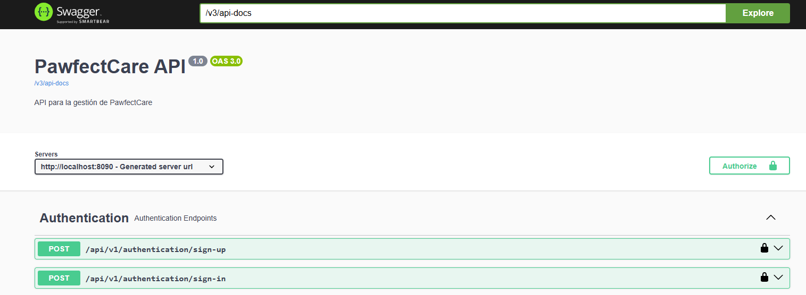
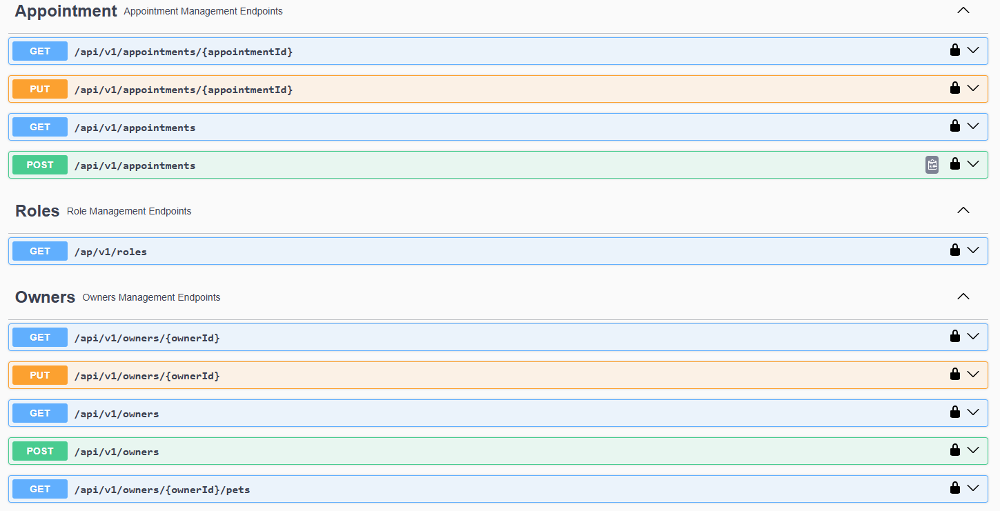
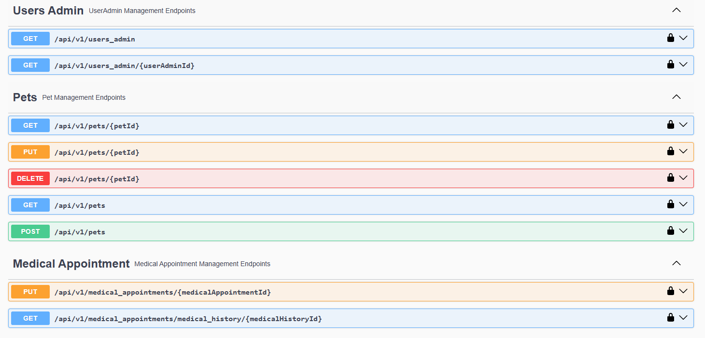
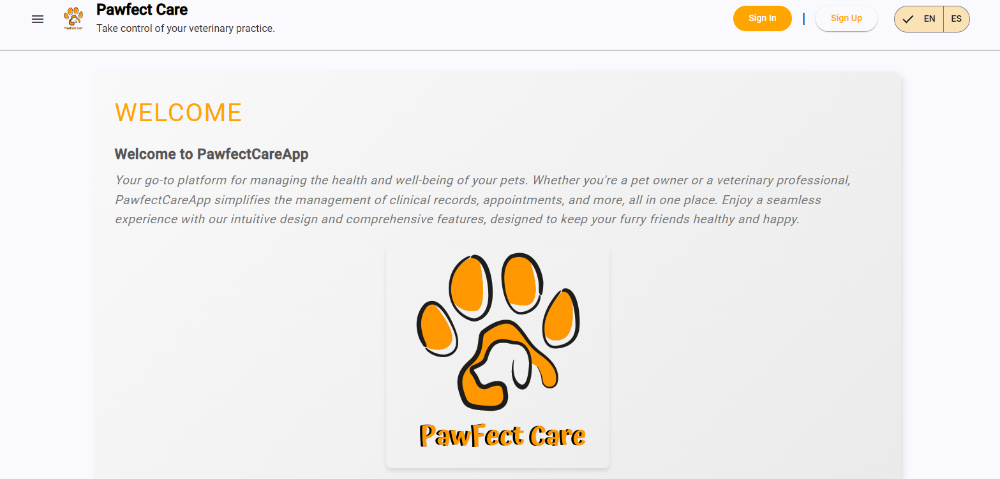
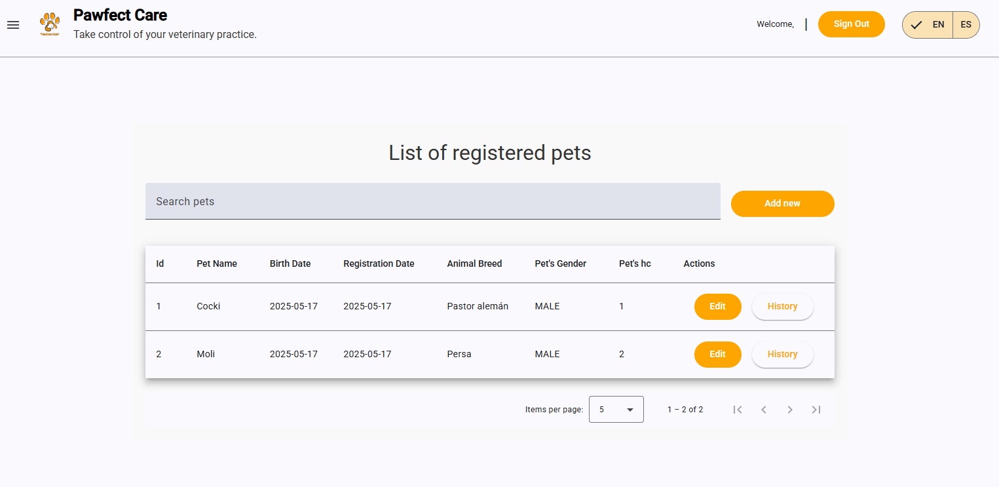

## 5.3  Microservices Implementation

### 5.3.1   Sprint 1

#### 5.3.1.1       Sprint Backlog 1
| **Sprint #**   | **Sprint 1**                                                                                                                                                                                                                  |     |     |                                                                                             |           |                    |     |
|-----------------|----------------------------------------------------------------------------------------------------------------------------------------------------------------------------------------|-----|-----|---------------------------------------------------------------------------------------------|-----------|--------------------|-----|
| **User Story**  | **Work-item / Task**                                                                                                                                                                                                         |     |     |                                                                                             |           |                    |     |
| **ID**         | **Title**                        | **Id** | **Title**                        | **Description**                                                                             | **Estimation (hours)** | **Assigned To**    | **Status (To-do / In-Process / To-Review / Done)** |
| ****     |  | **** |                   |           |      |    |     |
| ****     |  | **** |                   |           |      |    |     |
| ****     |  | **** |                   |           |      |    |     |

#### 5.3.1.2       Development Evidence for Sprint Review

En esta sección, se presentan los commits realizados en el repositorio del front end, back end, back end testing y el reporte en GitHub. Estos commits reflejan el progreso y las mejoras implementadas durante el Sprint 1, proporcionando una visión detallada de las actividades de desarrollo y las contribuciones del equipo.

| **Repository**                                                                 | **Branch** | **Commit Id**                              | **Commit Message**                                                                                                                                                                                                                                                                        | **Commit Message Body** | **Committed on (Date)** |
|--------------------------------------------------------------------------------|------------|--------------------------------------------|-------------------------------------------------------------------------------------------------------------------------------------------------------------------------------------------------------------------------------------------------------------------------------------------|-------------------------|-------------------------|
| [https://github.com/SI657-2501-Grupo-6-Fundamentos/PawFect-Care-BackEnd](https://github.com/SI657-2501-Grupo-6-Fundamentos/PawFect-Care-BackEnd) | main | `caa88605581ed16bfd96147b35a5b18537ae8b83` | feat: add backend | - | 09/05/25 |
| [https://github.com/SI657-2501-Grupo-6-Fundamentos/PawFect-Care-FrontEnd](https://github.com/SI657-2501-Grupo-6-Fundamentos/PawFect-Care-FrontEnd) | main | `074a0d5932e28c81ac7ac80d606c9cc04f49a15c` | feat: Add front end | - | 16/05/25 |
| [https://github.com/SI657-2501-Grupo-6-Fundamentos/Pawfect-Care-report/tree/tp](https://github.com/SI657-2501-Grupo-6-Fundamentos/Pawfect-Care-report/tree/tp) | tp | `3eb8bd4fafa5b9ee99a82119218cc3515e97aa7e` | feat(report): add chore | - | 16/05/25 |
| [https://github.com/SI657-2501-Grupo-6-Fundamentos/Pawfect-Care-report/tree/tp](https://github.com/SI657-2501-Grupo-6-Fundamentos/Pawfect-Care-report/tree/tp) | tp | `789d2a9aa0a238ad222e1ca100c421477bf49e39` | feat(report): add Pattern Based Backend Application(s) | - | 16/05/25 |
| [https://github.com/SI657-2501-Grupo-6-Fundamentos/Pawfect-Care-report/tree/tp](https://github.com/SI657-2501-Grupo-6-Fundamentos/Pawfect-Care-report/tree/tp) | tp | `bfdc851661e380af28a4b46efb65d8ad975c215f` | feat(docs): add Unit Test: CreatePetCommand | - | 16/05/25 |
| [Pawfect-Care-Backend-Testing](https://github.com/SI657-2501-Grupo-6-Fundamentos/Pawfect-Care-Backend-Testing) | `dev`     |  `f0ed7cc39cae8492ff5384a8288e3bf6ffdabaef`   | feat: add MedicalAppointmentCommandServiceTest | - | 16/05/25 |
| [Pawfect-Care-Backend-Testing](https://github.com/SI657-2501-Grupo-6-Fundamentos/Pawfect-Care-Backend-Testing) | `dev`     |  `16917e34ddb2f6769e48204bb1709b425e48c0ce`   | feat: add PetCommandServiceTest for updating a pet | - | 16/05/25 |
| [Pawfect-Care-Backend-Testing](https://github.com/SI657-2501-Grupo-6-Fundamentos/Pawfect-Care-Backend-Testing) | `dev`     | `16917e34ddb2f6769e48204bb1709b425e48c0ce` | feat: Add PetCommandServiceTest & OwnerCommandServiceTest | - | 16/05/25 |

#### 5.3.1.3       Testing Suite Evidence for Sprint Review

En este sprint, se han incorporado pruebas de aceptación escritas en **Gherkin**, asegurando que los requisitos del usuario se validen de manera efectiva. A continuación, se proporciona el enlace al repositorio de las pruebas de aceptación, donde se encuentra una descripción detallada de los escenarios de prueba y su implementación:

**Repositorio de pruebas de aceptación:**  
[https://github.com/SI657-2501-Grupo-6-Fundamentos/Pawfect-Care-Backend-Testing](https://github.com/SI657-2501-Grupo-6-Fundamentos/Pawfect-Care-Backend-Testing)

| **Repository**                                                                             | **Branch** | **Commit Id**                          | **Commit Message**                                                                                                                                                         | **Commit Message Body** | **Committed on (Date)** |
|--------------------------------------------------------------------------------------------|------------|----------------------------------------|----------------------------------------------------------------------------------------------------------------------------------------------------------------------------|-------------------------|-------------------------|
| [Pawfect-Care-Acceptance-Tests](https://github.com/SI657-2501-Grupo-6-Fundamentos/Pawfect-Care-Acceptance-Tests) | `main`     | `5ba730d2580f106bf46ee74aa7d6b9baab668554` | feat: add gherkin files .feature | - | 16/05/25 |

#### 5.3.1.4       Execution Evidence for Sprint Review

Acá presentamos las capturas de los endpoints que tiene nuestro backend:

Acá presentamos las capturas de nuestro frontend:

#### Inicio:

#### Vista para registrar clientes o para visualizarlos:

#### Vista para registrar mascotas o para visualizarlas:

#### Vista para registrar una cita o para visualizarlas:
