# COURSE PROJECT

---

<p align="center">
    <strong>Universidad Peruana de Ciencias Aplicadas (UPC)</strong><br>    
    </img><br>
    <strong>Carrera de Ingeniería de Software - Ciclo VII</strong><br><br>
    <strong>Fundamentos de Arquitectura de Software - SI729</strong><br>
    <br><strong>Profesor: Ernesto Ocampo Tello</strong><br>
    <br><strong><b>INFORME DEL TRABAJO FINAL</strong></b><br>
</p>

<p align="center">
    <strong>Startup del Proyecto: PawCare</strong><br>
    <strong>Producto: Pawfect Care</strong><br>
</p>

<div>
    <h3 align="center">Team Members:</h3>
</div>

<div>
    <table align="center">
        <tr>
            <th style="text-align:center;">Member</th>
            <th style="text-align:center;">Code</th>
        </tr>
        <tr>
            <td>Aranda Vallejos, Oscar Gabriel</td>
            <td>U202218167</td>
        </tr>
        <tr>
            <td>Chirinos Zúñiga, Rodrigo Manuel</td>
            <td>U202217804</td>
        </tr>
        <tr>
            <td>Gutierrez Garcia, Jose Eduardo</td>
            <td>U202221518</td>
        </tr>
        <tr>
            <td>Silva Morales, Renzo Cesar</td>
            <td>U20221C362</td>
        </tr>
    </table>
    </div>
</body>

<p align="center">
<br><strong>2025-01</strong></p>
<br>

---
# Registro de Versiones del Informe

| Versión | Fecha | Autor | Descripción de la modificación |
|----|----|----|----|
| TB1 | 19/04/2025 | PawCare | Redacción de los Capítulos I: Introduction, II: Requirements Elicitation & Analysis, III: Requirements Specification. |
| TB2 | 04/05/2025 | PawCare | Redacción de el Capítulo IV: Product Architecture Design.  |
| TP1 | 17/05/2025 | PawCare | Redacción de el Capítulo V: Product Implementation, Validation & Deployment.  |
| TB3 | 08/06/2025 | PawCare | Redacción de el Capítulo V: Micorservices Implementation: 5.2.3	Sprint 2  |
| TB4 | 22/06/2025 | PawCare | Redacción de el Capítulo V: Micorservices Implementation: 5.2.4	Sprint 3  |


# Contenido
## Tabla de contenidos
- [**Registro de Versiones del Informe**](#registro-de-versiones-del-informe)
- [**Contenido**](#contenido)
    - [Tabla de contenidos](#tabla-de-contenidos)
- [**Student Outcome**](#student-outcome)
- ## [ **Capítulo I: Introducción** ](#-capítulo-i-introducción-)
  - [**1.1. Startup Profile**](#11-startup-profile)
    - [**1.1.1. Descripción de la Startup**](#112-descripción-de-la-startup)
    - [**1.1.2. Perfiles de integrantes del equipo**](#113-perfiles-de-integrantes-del-equipo)
  - [**1.2. Solution Profile**](#12-solution-profile)
    - [**1.2.1. Nombre del Producto**](#121-nombre-del-producto)
    - [**1.2.2 Antecedentes y problemática**](#122-antecedentes-y-problemática)
    - [What (¿Qué?)](#what-qué)
    - [Who (¿Quién?)](#who-quién)
    - [Where (¿Dónde?)](#where-dónde)
    - [When (¿Cuándo?)](#when-cuándo)
    - [Why (¿Por qué?)](#why-por-qué)
    - [How (¿Cómo?)](#how-cómo)
    - [How much (¿Cuánto?)](#how-much-cuánto)
    - [**1.2.3 Lean UX Process**](#122-lean-ux-process)
    - [**1.2.3.1. Lean UX Problem Statements**](#1221-lean-ux-problem-statements)
    - [**1.2.3.2. Lean UX Assumptions**](#1222-lean-ux-assumptions)
    - [**1.2.3.3. Lean UX Hypothesis Statements**](#1223-lean-ux-hypothesis-statements)
    - [**1.2.3.4. Lean UX Canvas**](#1224-lean-ux-canvas)
  - [**1.3. Segmentos objetivo**](#13-segmentos-objetivo)
- ## [ **Capítulo II: Requirements Elicitation \& Analysis**](#-capítulo-ii-requirements-elicitation--analysis)
  - [**2.1. Competidores**](#21-competidores)
    - [**2.1.1. Análisis competitivo**](#211-análisis-competitivo)
    - [**2.1.2. Estrategias y tácticas frente a competidores**](#212-estrategias-y-tácticas-frente-a-competidores)
  - [**2.2. Entrevistas**](#22-entrevistas)
    - [**2.2.1. Diseño de entrevistas**](#221-diseño-de-entrevistas)
    - [**2.2.2. Registro de entrevistas**](#222-registro-de-entrevistas)
    - [**2.2.3. Análisis de entrevistas**](#223-análisis-de-entrevistas)
  - [**2.3. Needfinding**](#23-needfinding)
    - [**2.3.1. User Personas**](#231-user-personas)
    - [**2.3.2. User Task Matrix**](#232-user-task-matrix)
    - [**2.3.3. Empathy Mapping**](#234-empathy-mapping)
    - [**2.3.4. As-is Scenario Mapping**](#235-as-is-scenario-mapping)
  - [**2.4. Ubiquitous Language**](#24-ubiquitous-language)
- ## [ **Capítulo III: Requirements Specification**](#-capítulo-iii-requirements-specification)
  - [**3.1. To-Be Scenario Mapping**](#31-to-be-scenario-mapping)
      - [**3.1.1. Requisitos Funcionales**](#311-requisitos-funcionales)
      - [**3.1.2. Requisitos No Funcionales**](#312-requisitos-no-funcionales)
      - [**3.1.3. User Stories vs Requisitos Funcionales y No Funcionales**](#313-user-stories-vs-requisitos-funcionales-y-no-funcionales)
  - [**3.2. User Stories**](#32-user-stories)
  - [**3.3. Impact Mapping**](#33-impact-mapping)
  - [**3.4. Product Backlog**](#34-product-backlog)
  - ## [**Capítulo IV: Product Architecture Design**](#capítulo-iv-product-architecture-design)
  - [**4.1	Desing Concepts, ViewPoints & ER Diagrams**](#41-design-concepts,-viewpoints-&-er-diagrams)
    - [**4.1.1. Principles Statements**](#411-principles-statements)
    - [**4.1.2. Approaches Statements Architectural Styles & Patterns**](#412-approaches-statements-architectural-styles-&-patterns)
    - [**4.1.3. Context Diagram**](#413-context-diagram)
    - [**4.1.4. Approach driven ViewPoints Diagrams**](#414-approach-driven-viewPoints-diagrams)
    - [**4.1.5. Relational/Non Relational Database Diagram**](#415-relational/non-relational-database-diagram)
    - [**4.1.6. Design Patterns**](#416-design-patterns)
    - [**4.1.7. Tactics**](#417-tactics)
  - [**4.2. Architectural Drivers**](#42-architectural-drivers)
    - [**4.2.1. Design Purpose**](#421-design-purpose)
    - [**4.2.2. Primary Functionality (Primary User Stories)**](#422-primary-functionality-(primary-user-stories))
    - [**4.2.3. Quality Attribute Scenarios**](#423-quality-attribute-scenarios)
    - [**4.2.4. Constraints**](#424-constraints)
    - [**4.2.5. Architectural Concerns**](#425-architectural-concerns)
  - [**4.3. ADD Iterations**](#43-add-iterations)
    - [**4.3.1. Iteration N: 1**](#431-iteration-n:-1)
      - [**4.3.1.1. Architectural Design Backlog N: 1**](#4311-architectural-design-backlog-n:-1)
      - [**4.3.1.2. Establish Iteration Goal by Selecting Drivers**](#4312-establish-iteration-goal-by-selecting-drivers)
      - [**4.3.1.3. Choose One or More Elements of the System to Refine**](#4313-choose-one-or-more-elements-of-the-system-to-refine)
      - [**4.3.1.4. Choose One or More Design Concepts That Satisfy the Selected Drivers**](#4314-choose-one-or-more-design-concepts-that-satisfy-the-selected-drivers)
      - [**4.3.1.5. Instantiate Architectural Elements, Allocate Responsibilities, and Define Interfaces**](#4315-instantiate-architectural-elements,-allocate-responsibilities,-and-define-interfaces)
      - [**4.3.1.6. Sketch Views (C4 & UML) and Record Design Decisions**](#4316-sketch-views-(c4-&-uml)-and-record-design-decisions)
      - [**4.3.1.7. Analysis of Current Design and Review Iteration Goal (Kanban Board)**](#4317-analysis-of-current-design-and-review-iteration-iteration-goal-(kanban-board))
- ## [**Capítulo V: Product Implementation, Validation & Deployment**](#capítulo-v-product-implementation-validation--deployment)
  - [**5.1. Testing Suites & General Patterns**](#51-testing-suites--general-patterns)
    - [**5.1.1. Backend Application Core Testing Suite**](#511-backend-application-core-testing-suite)
    - [**5.1.2. Pattern Based Backend Application(s)**](#512-pattern-based-backend-applications)
    - [**5.1.3. Pattern Based Custom Software Library**](#513-pattern-based-custom-software-library)
    - [**5.1.4. Framework Pattern Driven Refactoring Report**](#514-framework-pattern-driven-refactoring-report)
  - [**5.2. Software Configuration Management**](#52-software-configuration-management)
    - [**5.2.1. Software Development Environment Configuration**](#521-software-development-environment-configuration)
    - [**5.2.2. Source Code Management**](#522-source-code-management)
    - [**5.2.3. Source Code Style Guide & Conventions**](#523-source-code-style-guide--conventions)
    - [**5.2.4. Software Deployment Configuration**](#524-software-deployment-configuration)
  - [**5.3. Microservices Implementation**](#53-microservices-implementation)
    - [**5.3.1. Sprint 1**](#531-sprint-1)
      - [**5.3.1.1. Sprint Backlog 1**](#5311-sprint-backlog-1)
      - [**5.3.1.2. Development Evidence for Sprint Review**](#5312-development-evidence-for-sprint-review)
      - [**5.3.1.3. Testing Suite Evidence for Sprint Review**](#5313-testing-suite-evidence-for-sprint-review)
      - [**5.3.1.4. Execution Evidence for Sprint Review**](#5314-execution-evidence-for-sprint-review)
      - [**5.3.1.5. Microservices Documentation Evidence for Sprint Review**](#5315-microservices-documentation-evidence-for-sprint-review)
      - [**5.3.1.6. Software Deployment Evidence for Sprint Review**](#5316-software-deployment-evidence-for-sprint-review)
      - [**5.3.1.7. Team Collaboration Insights during Sprint**](#5317-team-collaboration-insights-during-sprint)
      - [**5.3.1.8. Kanban Board**](#5318-kanban-board)
    - [**5.3.2. Sprint 2**](#532-sprint-2)
      - [**5.3.2.1. Sprint Backlog 2**](#5321-sprint-backlog-2)
      - [**5.3.2.2. Development Evidence for Sprint Review**](#5322-development-evidence-for-sprint-review)
      - [**5.3.2.3. Testing Suite Evidence for Sprint Review**](#5323-testing-suite-evidence-for-sprint-review)
      - [**5.3.2.4. Execution Evidence for Sprint Review**](#5324-execution-evidence-for-sprint-review)
      - [**5.3.2.5. Microservices Documentation Evidence for Sprint Review**](#5325-microservices-documentation-evidence-for-sprint-review)
      - [**5.3.2.6. Software Deployment Evidence for Sprint Review**](#5326-software-deployment-evidence-for-sprint-review)
      - [**5.3.2.7. Team Collaboration Insights during Sprint**](#5327-team-collaboration-insights-during-sprint)
      - [**5.3.2.8. Kanban Board**](#5328-kanban-board)
    - [**5.3.3. Sprint 3**](#533-sprint-3)
      - [**5.3.3.1. Sprint Backlog 3**](#5331-sprint-backlog-3)
      - [**5.3.3.2. Development Evidence for Sprint Review**](#5332-development-evidence-for-sprint-review)
      - [**5.3.3.3. Testing Suite Evidence for Sprint Review**](#5333-testing-suite-evidence-for-sprint-review)
      - [**5.3.3.4. Execution Evidence for Sprint Review**](#5334-execution-evidence-for-sprint-review)
      - [**5.3.3.5. Microservices Documentation Evidence for Sprint Review**](#5335-microservices-documentation-evidence-for-sprint-review)
      - [**5.3.3.6. Software Deployment Evidence for Sprint Review**](#5336-software-deployment-evidence-for-sprint-review)
      - [**5.3.3.7. Team Collaboration Insights during Sprint**](#5337-team-collaboration-insights-during-sprint)
      - [**5.3.3.8. Kanban Board (Avance 4)**](#5338-kanban-board-avance-4)
- [**Conclusiones**](#conclusiones)
- [**Conclusiones y recomendaciones**](#conclusiones-y-recomendaciones)
- [**Video About-the-Team**](#video-about-the-team)
- [**Bibliografía**](#bibliografía)
- [**Anexos**](#anexos)


# Student Outcome

| Criterio específico | Acciones realizadas | Conclusiones |
|----|----|----|
| Actualiza conceptos y conocimientos necesarios para su desarrollo profesional y en especial para su proyecto en soluciones de software. | **Aranda Vallejos, Oscar Gabriel**<br>*TB1*<br> A partir de la etapa del Needfinding pude definir nuestros requisitos funcionales y no funcionales. Estos fueron fundamentales para identificar nuestras historias de usuario y establecer un product backlog consistente.<br>*TB2*<br>Durante esta iteración, investigué y actualicé conceptos clave relacionados con la arquitectura de software, como el uso del modelo C4 para la representación visual de sistemas y la aplicación de principios SOLID en el diseño de componentes.<br>*TP1*<br>Durante esta entrega, profundicé en conceptos clave sobre pruebas automatizadas para aplicaciones backend, investigando buenas prácticas y estructuras comunes de testeo. Además, exploré el uso de patrones en bibliotecas personalizadas y la importancia del refactor basado en frameworks para mejorar la mantenibilidad del software.<br>*TB3*<br>Durante esta iteración trabajé en la migración del sistema monolítico a microservicios, desarrollando el medical record service, el schedule service y el pet service. Para esto, investigué buenas prácticas en comunicación entre servicios REST, configuración de servicios independientes y seguridad en arquitecturas distribuidas.<br>*TB4*<br> Durante este sprint, trabajé en mejorar y estabilizar los microservicios del backend, especialmente en los servicios de pet, medical record y schedule. Me enfoqué en optimizar los endpoints, revisar el código y mejorar la documentación técnica. También colaboré en pruebas funcionales para asegurar que los servicios se integren correctamente en un entorno más estructurado. <br><br>**Chirinos Zúñiga, Rodrigo Manuel**<br>*TB1*<br>Al hacer las preguntas para las entrevistas se pudo mapear las funcionalidades del proyecto y realizar de la mejor manera el product backlog, junto con los requisitos funcionales bien especificados.<br>*TB2*<br>Tras desarrollar drivers arquitectónicos como los architectural concerns, pude actualizar nociones sobre los requerimientos no funcionales del sistema. Esto, junto a los primary functionality y constraints, me permitieron ofrecer una visión renovada sobre los requerimientos fundamentales del core del negocio y limitaciones que deberemos respetar.<br>*TP1*<br>En esta etapa, trabajé en la implementación de microservicios, enfocándome en la evidencia técnica de desarrollo, testing y despliegue del Sprint 1. Esto implicó una comprensión más profunda de prácticas CI/CD, pruebas automatizadas, y colaboración ágil en equipo.<br>*TB3*<br>Me encargué del desarrollo del appointments service y el reviews service. Durante el proceso, profundicé en el diseño de APIs REST, la gestión de errores entre microservicios y cómo aplicar patrones como Service Registry para que los servicios se comuniquen de forma eficiente.<br>*TB4*<br> En esta iteración trabajé en el desarrollo del frontend, integrando los microservicios a través de llamadas HTTP. Me encargué de implementar vistas relacionadas con citas y reseñas, asegurando que la conexión entre frontend y backend funcione correctamente. Este trabajo me ayudó a reforzar habilidades de consumo de APIs REST y diseño de interfaces funcionales. <br><br>**Gutierrez Garcia, Jose Eduardo**<br>*TB1*<br>Durante la elaboración del Capítulo 1 (Introducción y análisis de la problemática) y del Capítulo 2 (Especificación de requisitos), profundicé en metodologías de Lean UX, mapeo de impacto y definición de segmentos de usuarios. Me capacité en el uso de herramientas colaborativas (Git, Markdown, GitFlow) y en buenas prácticas de documentación técnica, lo que me permitió estructurar el informe de manera coherente y profesional. Gracias a este proceso, fortalecí mi comprensión de cómo alinear las necesidades del negocio con soluciones de software efectivas.<br>*TB2*<br>Durante esta iteración analicé los constraints, atributos de calidad y el modelo C4 para seleccionar elementos que requieran una refinación y desarrollar nuestro Kanban Board.<br>*TP1*<br>Durante esta fase, participé activamente en la implementación de microservicios y documentación técnica del Sprint 1. Reforcé conocimientos sobre integración continua, despliegue, y control de versiones, y me familiaricé con herramientas para evidencia de testing, ejecución y colaboración de equipo.<br>*TB3*<br>Desarrollé el account service y el profile service. Tuve que aprender a desacoplar responsabilidades del sistema monolítico original, adaptar la base de datos para cada microservicio, y configurar controladores para la autenticación y la gestión de usuarios de manera individual.<br>*TB4*<br> En este sprint participé activamente en el backend junto a Oscar, trabajando en la mejora de los microservicios de account y profile. También actualicé la documentación técnica usando Swagger y ayudé a definir convenciones para estandarizar las respuestas de las APIs. Coordiné con los compañeros de frontend para garantizar una integración fluida. <br><br>**Silva Morales, Renzo Cesar**<br>*TB1*<br>Mediante el desarrollo de entrevistas logré interpretar las funcionalidades que debería incluir nuestra propuesta y las necesidades del cliente.<br>*TB2*<br>Tras diseñar y actualizar el diagrama de base de datos de manera continua, pude ser consciente de los atributos o campos requeridos al momento de gestionar mascotas y citas veterinarias.<br>*TP1*<br>Me encargué de la configuración del entorno de desarrollo, manejo del código fuente y despliegue del software. Este proceso me permitió consolidar conocimientos sobre herramientas de control de versiones, guías de estilo de código y configuraciones para entornos de producción.<br>*TB3*<br>Trabajé en la implementación del treatment service y el diagnostic service. Durante este desarrollo, reforcé mis conocimientos sobre la separación de responsabilidades, controladores REST, y cómo asegurar la integridad de datos cuando los servicios trabajan de manera aislada.<br>*TB4*<br> Me encargué de desarrollar partes del frontend, específicamente en los módulos relacionados con diagnósticos y tratamientos. Implementé formularios, validaciones y lógica para mostrar la información correctamente. Además, trabajé en conjunto con Rodrigo para conectar las vistas con los servicios REST y resolver problemas de integración.  | *TB1:*<br>El equipo ha demostrado una actualización efectiva de conceptos y conocimientos clave para el desarrollo de PawFect Care. Al profundizar en metodologías ágiles (Lean UX, mapeo de impacto), herramientas de control de versiones (Git, GitFlow) y documentación técnica (Markdown), cada miembro fortaleció su base profesional y aportó soluciones más alineadas con las necesidades del proyecto. Esto se traduce en una implementación más sólida, coherente y escalable de la plataforma veterinaria.<br><br>*TB2:*<br>El equipo consolidó su conocimiento en arquitectura de software mediante la implementación de conceptos fundamentales como el modelo C4, principios SOLID y patrones de diseño. Además, se fortaleció la capacidad de análisis al trabajar con drivers arquitectónicos, constraints y atributos de calidad, lo que permitió una mejor alineación entre los objetivos del negocio y las decisiones técnicas. Este enfoque iterativo y colaborativo asegura que el proyecto avance con una base sólida y escalable, adaptándose a las necesidades del sistema y del cliente.<br><br>*TP1:*<br>Durante esta tercera entrega, el equipo fortaleció sus competencias técnicas y profesionales al aplicar conocimientos clave en pruebas automatizadas, implementación de microservicios, y gestión del entorno de desarrollo. Cada integrante asumió un rol específico que permitió profundizar en aspectos como CI/CD, testing, refactorización con patrones, y control de versiones. Estas acciones consolidan una base sólida para el desarrollo escalable y mantenible del sistema PawFect Care, alineándose con buenas prácticas de la ingeniería de software moderna y contribuyendo de manera efectiva al logro de los objetivos del proyecto.<br><br>*TB3:*<br>Durante este sprint, todo el equipo logró adaptarse a la arquitectura de microservicios, lo cual implicó una actualización importante de conocimientos técnicos. Se comprendió mejor cómo dividir un sistema en componentes independientes, cómo manejar la comunicación entre ellos, y la importancia de tener una configuración adecuada para evitar errores en producción. Esta experiencia fortaleció nuestras habilidades en diseño de software moderno, algo muy útil para nuestra formación como ingenieros de software.<br><br>TB4: <br> Durante esta iteración, el equipo logró completar la migración de todos los bounded contexts definidos a sus respectivos microservicios, avanzando también en el desarrollo del frontend. Jose y Oscar asumieron roles clave en la implementación y documentación del backend, mientras que Renzo y Rodrigo se enfocaron en construir e integrar el frontend con los servicios existentes. Esta etapa fue clave para reforzar la arquitectura del sistema y acercarse a una solución completa, manteniendo un enfoque colaborativo y técnico que fortalece el aprendizaje continuo del equipo. |


| Criterio específico | Acciones realizadas | Conclusiones |
|----|----|----|
|Reconoce la necesidad del aprendizaje permanente para el desempeño profesional y el desarrollo de proyectos en soluciones de software.| **Aranda Vallejos, Oscar Gabriel**<br>*TB1*<br> Al desarrollar las historias de usuario, identifiqué y reconocí áreas clave para ser implementadas en bounded contexts. Para ello, utilicé el product backlog con el fin de extraer las historias de usuario más relevantes para el core del negocio y visualizar los futuros bounded context en base a sus epics.<br>*TB2*<br>Reconocí sistemas externos y elementos de la arquitectura del negocio para diagramas de contexto, contenedores y componentes. Además reconocí la importancia de cada panaroma del sistema para implementar el modelo de microservicios.<br>*TP1*<br>Durante la elaboración del apartado de testing, investigué sobre frameworks modernos para pruebas unitarias y de integración en aplicaciones backend. También me capacité en patrones de diseño aplicables al testing, lo cual me permitió mejorar la cobertura y eficiencia de las pruebas implementadas.<br>*TB3*<br>Durante esta etapa del proyecto entendí que dominar la arquitectura de microservicios no era suficiente, por eso investigué constantemente nuevas prácticas de integración y monitoreo. También tuve que revisar documentación oficial de Spring Boot y experiencias reales de migraciones para mejorar el diseño de mis servicios.<br>*TB4*<br> Durante este sprint, me di cuenta de que aún tenía vacíos respecto a la configuración avanzada de microservicios y la documentación con Swagger. Por eso, dediqué tiempo adicional a investigar sobre buenas prácticas para documentar APIs REST y asegurar su entendibilidad. Esto me ayudó a comprender mejor la importancia de seguir aprendiendo para mejorar la calidad de mis entregables.   <br><br>**Chirinos Zúñiga, Rodrigo Manuel**<br>*TB1*<br> En el desarrollo de esta parte inicial del proyecto el product backlog y los requisitos funcionales y no funcionales fueron lo fundamental para desarrollar el servicio en base a las necesidades de los usuarios. <br>*TB2*<br>Al definir los drivers arquitectónicos, pude reconocer de qué manera se relacionan con otros items. Pude desarrollar las primary user stories y ver como se relacionan con las historias de usuario que son core para el negocio.<br>*TP1*<br>Para cumplir con la implementación de microservicios, busqué comprender las buenas prácticas del diseño desacoplado y los principios de escalabilidad. Me capacité en el uso de herramientas modernas como Postman y Docker, y en cómo documentar y testear servicios de forma continua.<br>*TB3*<br>Me di cuenta de que no bastaba con lo que ya sabía sobre desarrollo backend. Tuve que aprender nuevas formas de comunicar servicios, manejar excepciones distribuidas y documentar adecuadamente mis endpoints. Para ello, consulté tutoriales, foros técnicos y la documentación de herramientas como Spring Cloud.<br>*TB4*<br> Al trabajar con tecnologías de frontend que no había utilizado a profundidad, tuve que aprender por mi cuenta cómo manejar los estados y consumir servicios REST de manera eficiente. Esto me mostró lo importante que es seguir formándome fuera del aula y estar preparado para adaptarme a diferentes roles dentro del equipo.  <br><br>**Gutierrez Garcia, Jose Eduardo**<br>*TB1*<br>Al enfrentar nuevos desafíos — como definir los bounded contexts, redactar user stories y diseñar el backlog — identifiqué áreas donde debía profundizar: gestión de proyectos ágiles, documentación   y diseño de experiencia de usuario. Para ello, consulté tutoriales, documentación oficial y prácticas recomendadas en foros especializados. Este proceso reafirmó mi compromiso con el aprendizaje continuo, indispensable para mantener la calidad y escalabilidad de cualquier solución de software.<br>*TB2*<br>Identifiqué la necesidad de mantenerse actualizado en herramientas y enfoques modernos, como el uso de Kanban para la gestión de tareas y la integración de patrones arquitectónicos como Domain Driven Design (DDD).<br>*TP1*<br>Durante esta entrega, profundicé en conceptos de microservicios y CI/CD, y exploré herramientas como Docker y GitHub Actions. Asimismo, investigué sobre la correcta documentación de endpoints y despliegues para mejorar la mantenibilidad del sistema.<br>*TB3*<br>En este sprint comprendí que la tecnología cambia constantemente, así que busqué mantenerme actualizado leyendo artículos, viendo videos y practicando con ejemplos reales para implementar correctamente los servicios de account y profile. Incluso revisé cómo otros equipos solucionaban problemas similares al desacoplar autenticación.<br>*TB4*<br> Durante esta etapa me enfrenté a varios retos técnicos, especialmente al integrar Swagger con los microservicios y asegurar que la documentación esté alineada con el código real. Para resolver esto, revisé documentación oficial, tutoriales y ejemplos. Me quedó claro que seguir aprendiendo por iniciativa propia es clave para mantenerme competitivo y preparado en el área de desarrollo backend. <br><br>**Silva Morales, Renzo Cesar**<br>*TB1*<br> Con el análisis de entrevistas pude reconocer otros competidores y factores clave que nos ayudarían a ofrecer un valor agregado superior.<br>*TB2*<br>Tras identificar patrones de diseño, pude determinar un nuevo enfoque para el modelado de los diagramas UML. Esto me permitió asegurar una alineación con los objetivos del negocio y utilizar los requisitos funcionales a modo de validación.<br>*TP1*<br>Al trabajar en la configuración del entorno de desarrollo, aprendí sobre convenciones de estilo de código, automatización del despliegue y control de versiones. También estudié sobre el impacto de una buena gestión de entorno en la eficiencia y calidad del desarrollo.<br>*TB3*<br>Entendí que si no sigo aprendiendo y adaptándome, no puedo responder a los retos que trae un sistema distribuido. Por eso, investigué sobre patrones de diseño para microservicios, validación de datos entre servicios y prácticas para asegurar escalabilidad, más allá de lo visto en clase. <br>*TB4*<br> Me tocó trabajar en el frontend, un área que no domino por completo, así que tuve que investigar por mi cuenta y pedir apoyo para avanzar con las vistas. Esto me hizo entender que el aprendizaje constante es parte natural del desarrollo profesional, especialmente cuando se trabaja en equipos multidisciplinarios. | TB1: <br> El proyecto reforzó en todos nosotros la importancia del aprendizaje permanente. Identificamos brechas en áreas como gestión de APIs, diseño UX y despliegue en la nube, y las abordamos mediante investigación, auto‑formación y consulta de fuentes especializadas. Este compromiso con la mejora continua asegura que, más allá de esta entrega, mantendremos la capacidad de adaptarnos a nuevas tecnologías y mejores prácticas en el desarrollo de soluciones de software.<br><br> TB2: <br> El equipo reforzó su compromiso con el aprendizaje continuo al profundizar en conceptos avanzados como patrones de diseño, modelado UML y la implementación de microservicios. Además, se fortaleció la capacidad de análisis al trabajar con drivers arquitectónicos y herramientas modernas como Kanban, lo que permitió una mejor alineación entre los objetivos técnicos y de negocio. Este enfoque asegura que el equipo esté preparado para enfrentar desafíos futuros y mantener la calidad del proyecto.<br><br>TP1: <br> A lo largo de esta tercera entrega, el equipo demostró una actitud proactiva frente al aprendizaje continuo, adoptando nuevas herramientas, tecnologías y buenas prácticas esenciales en la industria del software. Este enfoque constante hacia la mejora profesional no solo elevó la calidad del producto, sino que también potenció el desarrollo individual de competencias clave para enfrentar los desafíos del entorno tecnológico actual. <br><br>TB3: <br> Todo el equipo fue consciente de que, para enfrentar un cambio de arquitectura como la migración de un monolito a microservicios, no era suficiente con lo aprendido previamente. Cada miembro buscó por su cuenta nuevos conocimientos, aplicó buenas prácticas actualizadas y reconoció que en esta carrera profesional es clave aprender de manera continua. Este proceso nos hizo más conscientes de la necesidad del autoaprendizaje para seguir creciendo como ingenieros. <br><br>TB4: <br> Durante este sprint, todos los miembros del equipo enfrentaron desafíos técnicos que los llevaron a buscar soluciones fuera del contenido visto en clase. La necesidad de investigar, aprender nuevas herramientas y adaptarse a distintos roles dentro del proyecto demostró que el aprendizaje permanente no solo es necesario, sino una habilidad fundamental para el crecimiento como ingenieros de software.|


----

# **Capítulo I: Introducción**

## 1.1. Startup Profile

### 1.1.1. Descripción de la Startup
“Pawfect Care” es una plataforma integral destinada a la gestión veterinaria y a la visualización de historiales clínicos. La idea fundamental detrás de esta plataforma es simplificar y optimizar la administración de diversos aspectos relacionados con el cuidado de las mascotas. Esto incluye la gestión de usuarios, clientes, productos y servicios, así como la organización de historiales clínicos. El objetivo es proporcionar una herramienta que facilite tanto a los propietarios de mascotas como a los veterinarios en el manejo de la información y las tareas diarias.

- **Misión:** Nuestra misión es mejorar la calidad de vida de las mascotas y sus dueños, ofreciendo una plataforma que simplifique la gestión veterinaria y el acceso a la información de salud de las mascotas

- **Visión:** Ser la plataforma líder en la gestión veterinaria, reconocida por su eficiencia, confiabilidad y facilidad de uso.


### 1.1.2. Perfiles de integrantes del equipo

|           Photo                        |                                                                                                                                                                                                                                                                                                    Description                                                                                                                                                                                                                                                                                                    |
| :------------------------------------------------: | :---------------------------------------------------------------------------------------------------------------------------------------------------------------------------------------------------------------------------------------------------------------------------------------------------------------------------------------------------------------------------------------------------------------------------------------------------------------------------------------------------------------------------------------------------------------------------------------------------------------: |
| Oscar Gabriel Aranda Vallejos  | Tengo 20 años y soy estudiante de la carrera de Ingeniería de Software, poseo conocimientos básicos en Unity, C++ y diseño web. Me considero una persona preparada y perseverante en cumplir con los objetivos del proyecto; además, siempre estoy dispuesto a aprender nuevos conceptos.            |
| Rodrigo Chirinos Zúñiga |     Tengo 20 años, soy un estudiante de la carrera de Ingeniería de Software, considero que soy una persona responsable y de escucha activa. Estoy comprometido con mis compañeros en realizar un buen trabajo y así aprender todos en el proceso. También tengo conocimientos en programación en C++, HTML, CSS y JavaScript.      |
| Jose Eduardo Gutierrez Garcia  |    Mi Tengo 21 años, actualmente me encuentro cruzando mi 7mo ciclo de la carrera de ingeniería de software en la UPC. Me gusta jugar videojuegos y practicar natación, soy un gran aficionado de la tecnología y del ensamblaje de computadoras. Me considero una persona dispuesta siempre a aprender tecnologías nuevas, creativa y responsable.         |
| Renzo Cesar Silva Morales  |  Tengo 20 años y soy estudiante de la carrera de Ingeniería de Software. Me considero un estudiante atento y responsable con los trabajos. Poseo conocimientos en programación en lenguajes como C++, C# y Python. Estoy dispuesto y me comprometo a ayudar al equipo en el proyecto.       |


## 1.2. Solution Profile

Pawfect Care es una aplicación diseñada específicamente para el uso en clínicas veterinarias, enfocada en la gestión interna de todas sus operaciones y en facilitar el acceso a la información clínica para los dueños de las mascotas. Esta aplicación no solo permite a los veterinarios manejar de manera más eficiente y organizada los historiales clínicos de sus pacientes, sino que también ofrece herramientas para gestionar recordatorios, controlar el inventario de productos y realizar otras tareas esenciales para el funcionamiento de la veterinaria. La interfaz de Pawfect Care ha sido diseñada para ser intuitiva y amigable, lo que permite a los veterinarios llevar un control detallado y preciso de cada aspecto de su práctica sin complicaciones. Además, la aplicación proporciona una funcionalidad adicional: la posibilidad de publicar las historias clínicas para que los dueños de las mascotas puedan acceder a ellas cuando lo necesiten. Esto garantiza que los propietarios estén siempre informados sobre el estado de salud de sus mascotas y puedan consultar los detalles médicos en cualquier momento, mejorando así la comunicación y la transparencia entre la clínica y sus clientes.


### 1.2.1. Nombre del Producto

Pawfect Care es el nombre de nuestra plataforma digital, una combinación de las palabras en inglés “paw” (pata) y “perfect” (perfecto), lo que transmite el concepto de “cuidado perfecto para las mascotas”. El nombre refleja el compromiso del producto con la salud, el bienestar y la atención responsable de los animales, a través de una solución tecnológica intuitiva, profesional y centrada tanto en veterinarias como en dueños de mascotas.

### 1.2.2. Antecedentes y problemática

Con la finalidad de poder conocer y comprender con mayor precisión las necesidades de nuestros usuarios, en este caso universitarios, hemos hecho un estudio por medio de la técnica 5w’s & 2H’s. Según el sitio web Rockcontent (2019) 5w’s & 2H’s es una de las metodologías de gestión empresarial más utilizadas. Puede aplicarse en muchos momentos, empresas y proyectos, ayuda a responder una serie de preguntas decisivas para hacer que las acciones de un negocio sean más estratégicas y precisas. Sin más preámbulos, por siguiente mostraremos la información que hemos logrado recopilar por medio de esta técnica.


#### Uso de la técnica The 5'W's w Y 2'H's

| LAS 5W y 2H | Pregunta                                                | Descripción                                                                                                                                                                                                                                                                                                                                                                                                                                                                                                          |
| ----------- | ------------------------------------------------------- | -------------------------------------------------------------------------------------------------------------------------------------------------------------------------------------------------------------------------------------------------------------------------------------------------------------------------------------------------------------------------------------------------------------------------------------------------------------------------------------------------------------------- |
| What?        | ¿Cuál es el problema?                                     |      El problema radica en la ausencia de una aplicación que sea tanto intuitiva como fácil de usar en el entorno veterinario, y que, además, permita integrar y gestionar eficazmente los múltiples aspectos que involucra esta práctica                                                                                                           |
| When?       | ¿Cuándo sucede el problema?                                   |           El problema surge cuando las clínicas veterinarias carecen de una aplicación que sea intuitiva y sencilla de usar, lo que dificulta la integración y gestión eficiente de los diversos aspectos necesarios para su funcionamiento diario.                                                                                                                                                                                          |
| Where?       | ¿Dónde sucede el problema?                             |          El problema ocurre en las clínicas veterinarias, donde la falta de una aplicación complica la integración y gestión de las múltiples áreas necesarias para su funcionamiento. Esto no solo afecta a los veterinarios en su labor diaria, sino que también impacta a los dueños de mascotas, quienes necesitan una forma sencilla de acceder a la información y los servicios relacionados con la salud de sus animales.                                                                                                                               |
| Why?      | ¿Por qué sucede el problema?                               |        El problema se debe al desconocimiento de aplicaciones que estén específicamente diseñadas para atender las necesidades complejas y diversas de una clínica veterinaria. Existen muchas aplicaciones pero no son lo suficientemente flexibles o integrales para abarcar todos los campos necesarios, como la gestión de historiales clínicos, el control de inventario, y la comunicación con los dueños de las mascotas. Esto crea dificultades tanto para los veterinarios, que se ven obligados a utilizar múltiples herramientas o procesos manuales, como para los dueños de mascotas, que enfrentan limitaciones en el acceso a la información relevante.                                                                                                                                                                        |
| Who?        | ¿Qué llevara a las personas a usar nuestro producto?                         | Las personas optarán por Pawfect Care debido a la facilidad con la que podrán completar los campos necesarios, la amplia difusión que la aplicación tendrá en redes sociales, y especialmente por lo sencillo que resulta rellenar las historias clínicas sin la complicación de tener que llenar campos obligatorios. |
| How?        | ¿En qué condiciones los clientes usaran nuestro producto?               |                                     Los clientes utilizarán nuestro producto en condiciones donde necesiten una solución eficiente y fácil de usar para gestionar las operaciones de su clínica veterinaria. Esto incluye situaciones en las que buscan una herramienta que simplifique el manejo de historiales clínicos, controle el inventario, y facilite la comunicación con los dueños de las mascotas. Además, lo usarán cuando requieran una aplicación que les permita acceder y compartir información médica de manera rápida y sin complicaciones, especialmente en un entorno donde el tiempo y la precisión son esenciales.                                                                                                                                    |
| How Much?   | ¿Con qué frecuencia o en qué cantidad se utilizará nuestro producto? |                                                           Nuestro producto está diseñado para ser utilizado diariamente por las clínicas veterinarias. El sistema de gestión clínica se utilizará en la mayoría de las interacciones clínicas, desde la admisión de pacientes hasta el seguimiento post-tratamiento. Dado que el acceso a la información clínica y la gestión de citas es una necesidad recurrente, esperamos que el personal utilice la plataforma constantemente a lo largo del día. Además, los dueños de mascotas podrán acceder a la información relevante de sus mascotas, lo que también incentivará un uso frecuente por parte de ellos, especialmente para verificar el historial clínico y programar citas.                                 |


## 1.2.3. Lean UX Process.

#### 1.2.3.1. Lean UX Problem Statements.

La aplicación Pawfect Care busca resolver la necesidad de una herramienta integral que facilite la gestión diaria de las clínicas veterinarias. Al ofrecer una interfaz intuitiva y fácil de usar, la aplicación trata de eliminar las complejidades y dificultades asociadas con la administración de múltiples aspectos de la práctica veterinaria en un solo lugar, permitiendo que tanto veterinarios como propietarios de mascotas tengan acceso rápido y sencillo a la información relevante.

#### 1.2.3.2. Lean UX Assumptions.

Para desarrollar la aplicación Pawfect Care, partimos de varias suposiciones clave que guiarán nuestro proceso de diseño y desarrollo. Estas suposiciones están basadas en una comprensión inicial de las necesidades y problemas de nuestros usuarios objetivo, así como en los resultados esperados para el negocio. A medida que avanzamos en el desarrollo, estas suposiciones se validarán mediante pruebas y retroalimentación continua para asegurar que la solución propuesta cumpla con las expectativas y resuelva eficazmente los desafíos identificados.

**Features:**

- Sistema de gestión de citas para facilitar la organización del tiempo en las clínicas.
- Almacenamiento y visualización de historiales clínicos de las mascotas de forma rápida y segura.
- Notificaciones automáticas para recordatorios de vacunas, tratamientos o revisiones.
- Sección para la venta de productos veterinarios, integrando un catálogo accesible para los clientes.
- Sistema de reportes de ingresos, control de inventario, y análisis de datos para mejorar la eficiencia administrativa.
- Interfaz intuitiva y adaptable para ser utilizada tanto en dispositivos móviles como en computadoras.


**Business Outcomes:**

- Aumento de la eficiencia operativa de las clínicas, reduciendo el tiempo en tareas administrativas.
- Mejora en la satisfacción del cliente, permitiendo un acceso rápido a la información médica de sus mascotas y facilitando la interacción con la clínica.
- Generación de ingresos adicionales a través de suscripciones premium que ofrezcan funciones avanzadas y comisiones por la venta de productos veterinarios.
- Reducción de errores y tiempos de espera en la gestión clínica, lo que aumentará la retención de clientes y atraerá nuevos usuarios.

**Users:**
- **Segmento 1 – Clinicas Veterinarias:** Veterinarias de distintos tamaños, desde consultorios individuales hasta centros de atención con varios especialistas. Este segmento se enfoca en mejorar el manejo de la información médica, el control de inventarios y la programación de citas, con el objetivo de incrementar su eficiencia y brindar un servicio de mayor calidad a sus clientes.

- **Segmento 2 – Dueños de Mascotas:** Propietarios que necesitan gestionar de manera eficiente la salud de sus mascotas, incluyendo jóvenes acostumbrados a usar aplicaciones móviles y también aquellos poco familiarizados con la tecnología. Este segmento busca acceder a una forma más accesible de organizar la información médica de sus animales.

**User Outcomes & Benefits:**

- Reducción de tiempo en la gestión de citas y actualización de historiales médicos.
- Mejor organización en el manejo de inventarios y productos.
- Mejora en la relación con los clientes, ofreciendo un acceso directo a la información de salud de sus mascotas.
- Simplificación en la administración de las clínicas veterinarias, reduciendo errores y tiempos de espera.

**User Assumptions:**

- **¿Quién es el usuario?**
  Los usuarios principales son las clínicas veterinarias y los dueños de mascotas.<br>

- **¿Dónde encaja la aplicación en su vida?**
  La aplicación se integra en la rutina diaria de las clínicas veterinarias y en la vida cotidiana de las mascotas, facilitando su tratamiento y cuidado.<br>

- **¿Qué problemas tienen nuestros usuarios y como se puede resolver?**
  Los usuarios enfrentan la falta de una aplicación especializado para la gestión integral de clínicas veterinarias y la ausencia de un portal donde se pueda acceder fácilmente a la historia clínica de una mascota. Nuestra aplicación resuelve estos problemas proporcionando una plataforma única para administrar todos los aspectos de la clínica y facilitar el acceso a la información médica.<br>

- **¿Dónde y cuándo es usada nuestra aplicación?**
  La aplicación se utiliza principalmente en clínicas veterinarias. Los momentos clave para su uso son durante las consultas veterinarias y cuando los dueños deciden cambiar de veterinario y necesitan trasladar el historial clínico o el registro de vacunas a otro establecimiento.<br>

- **¿Qué características son importantes?**
  Las características esenciales incluyen una interfaz fácil de usar en dispositivos móviles, computadoras y laptops. Además, es crucial la eliminación de campos innecesarios u obligatorios que puedan complicar el proceso de registro.<br>

- **¿Cómo debe verse nuestra aplicación y como debe comportarse?**
 Nuestra aplicación debe tener un diseño funcional y amigable, tanto para veterinarios como para dueños de mascotas. Debe permitir un registro rápido y sencillo de nuevos pacientes y la actualización de historiales clínicos, evitando campos obligatorios que no aporten valor al proceso de registro y atención.<br>

**Business Assumptions**

- Los veterinarios y asistentes están dispuestos a adoptar herramientas digitales si mejoran la eficiencia en sus clínicas.
- Los dueños de mascotas valorarán una aplicación que les permita acceder a la información de salud de sus animales en cualquier momento.
- Las clínicas veterinarias estarán dispuestas a pagar por suscripciones premium o herramientas avanzadas de gestión si aumentan la productividad.
- El mercado de clínicas veterinarias aún utiliza métodos manuales o desactualizados, lo que genera ineficiencias que la aplicación puede resolver.
- Habrá una aceptación de la aplicación tanto por usuarios jóvenes familiarizados con la tecnología como por aquellos menos habituados al uso de herramientas digitales.


#### 1.2.3.3. Lean UX Hypothesis Statements.

Para asegurar que nuestra solución esté alineada con las necesidades y expectativas de nuestros usuarios, hemos formulado las siguientes hipótesis utilizando el enfoque Lean UX. Este enfoque nos permitirá validar nuestras suposiciones a través de iteraciones constantes y ajustes basados en el feedback de los usuarios


**Creemos que** si diseñamos una aplicación intuitiva que permita a los veterinarios gestionar historiales clínicos y recordatorios de manera eficiente.
**Sabremos** que hemos tenido éxito cuando observemos un aumento en la eficiencia operativa y una reducción en el tiempo dedicado a tareas administrativas en las clínicas veterinarias
**cuando** las clínicas adopten nuestra aplicación y reporten mejoras en su flujo de trabajo diario, habremos validado nuestra hipótesis.


**Creemos que** lal ofrecer una plataforma que facilite el acceso a la historia clínica de las mascotas para los dueños
**Sabremos** que nuestra solución es efectiva cuando recibamos comentarios positivos de los usuarios sobre la facilidad de acceso y la utilidad de la información médica compartida
**cuando** los dueños de mascotas utilicen la aplicación para consultar y manejar la salud de sus animales sin problemas, habremos confirmado que estamos resolviendo una necesidad real.


**Creemos que** que si eliminamos los campos obligatorios innecesarios y simplificamos el proceso de registro en la aplicación.
**Sabremos** que hemos logrado nuestro objetivo cuando los usuarios experimenten una mayor satisfacción y una reducción en los errores de entrada de datos.
**cuando** tanto veterinarios como propietarios de mascotas reporten una experiencia de usuario fluida y sin frustraciones, habremos validado que nuestra aplicación cumple con las expectativas de simplicidad y funcionalidad..


#### 1.2.3.4. Lean UX Canvas

<table border="1" cellpadding="10" cellspacing="0">
    <tr>
        <td><strong>Lean UX Canvas</strong></td>
        <td><strong>Fecha:</strong> 18/04/2025</td>
        <td><strong>Primera Iteración</strong></td>
    </tr>
    <tr>
        <td>
            <strong>Business Problem</strong><br>
            La gestión de clínicas veterinarias enfrenta desafíos significativos debido al uso de métodos manuales o sistemas desactualizados, lo que resulta en ineficiencias operativas, errores en la documentación y una experiencia insatisfactoria tanto para los veterinarios como para los propietarios de mascotas. La falta de una herramienta integral complica la administración de citas, historiales clínicos y la venta de productos veterinarios.
        </td>
        <td>
            <strong>Solutions</strong><br>
            - Gestión de citas.<br>
            - Almacenamiento y visualización de historiales clínicos.<br>
            - Notificaciones automáticas para recordatorios de vacunas y tratamientos.<br>
            - Venta de productos veterinarios.<br>
            - Reportes de ingresos y control de inventario.
        </td>
        <td>
            <strong>Business Outcomes</strong><br>
            - Incremento de la eficiencia operativa en las clínicas veterinarias.<br>
            - Mejora en la satisfacción del cliente con acceso rápido a la información médica.<br>
            - Generación de ingresos adicionales a través de suscripciones premium y ventas de productos.<br>
            - Reducción de errores y tiempos de espera en la gestión clínica.
        </td>
    </tr>
    <tr>
        <td>
            <strong>Users</strong><br>
            - <strong>Segmento 1 – Clinicas Veterinarias:</strong> Clínicas de diferentes tamaños que necesitan mejorar la gestión de información médica, citas e inventarios.<br>
            - <strong>Segmento 2 – Dueños de Mascotas:</strong> Propietarios que buscan una forma eficiente de gestionar la salud de sus mascotas y acceder a la información médica de manera digital.
        </td>
        <td>
            <strong>Hypotheses</strong><br>
            - Creemos que diseñar una aplicación intuitiva para veterinarios mejorará la eficiencia en la gestión clínica.<br>
            - Sabemos que hemos tenido éxito cuando observamos una mejora en la eficiencia operativa y una reducción en el tiempo dedicado a tareas administrativas.<br>
            - Creemos que una plataforma que facilite el acceso a la historia clínica para los dueños será bien recibida.<br>
            - Sabemos que nuestra solución es efectiva cuando recibimos comentarios positivos sobre la facilidad de acceso a la información médica.<br>
            - Creemos que simplificar el proceso de registro eliminará campos innecesarios y mejorará la experiencia del usuario.<br>
            - Sabemos que hemos logrado nuestro objetivo cuando reportan una experiencia de usuario fluida y sin frustraciones.
        </td>
        <td>
            <strong>User Outcomes & Benefits</strong><br>
            - Reducción del tiempo en la gestión de citas y actualización de historiales.<br>
            - Mejor organización en inventarios y productos.<br>
            - Mejora en la relación con los clientes mediante acceso directo a la información médica.<br>
            - Simplificación en la administración de las clínicas, reduciendo errores y tiempos de espera.
        </td>
    </tr>
    <tr>
        <td>
            <strong>What's the most important thing we need to learn first?</strong><br>
            Validar si la aplicación realmente mejora la eficiencia operativa de las clínicas veterinarias y facilita el acceso a la información médica para los dueños de mascotas.
        </td>
        <td colspan="2">
            <strong>What's the least amount of work we need to do to learn the next most important?</strong><br>
            Desarrollar un prototipo funcional que permita a un grupo selecto de usuarios (veterinarios y propietarios de mascotas) probar las características clave de la aplicación y proporcionar retroalimentación sobre su efectividad en la mejora de la eficiencia y la satisfacción del usuario.
        </td>
    </tr>
</table>

## 1.3. Segmentos objetivo.

Para asegurar el éxito de Pawfect Care, hemos identificado dos segmentos clave que serán el foco principal de nuestras estrategias de desarrollo y marketing. Estos segmentos representan a nuestros usuarios ideales y nos permitirán adaptar nuestras funcionalidades y servicios a sus necesidades específicas, maximizando así el impacto de la plataforma.

**Segmento Objetivo 1 - Clínicas Veterinarias**

El primer segmento objetivo incluye a las clínicas veterinarias de diversos tamaños, desde pequeñas clínicas independientes hasta grandes centros especializados con múltiples profesionales. Pawfect Care les ofrece una plataforma que simplifica la gestión interna de sus operaciones, permitiendo una mayor eficiencia en la programación de citas, gestión de historiales médicos y la comunicación con los dueños de las mascotas. Estas clínicas buscan una herramienta que facilite el acceso a información clínica y mejore la administración de sus recursos, todo bajo una interfaz intuitiva y accesible. El valor de Pawfect Care radica en su capacidad para optimizar procesos, lo que se traduce en un mejor servicio y atención para los animales.

**Segmento Objetivo 2 - Dueño de Mascotas:**

El segundo segmento está compuesto por los dueños de mascotas, quienes son responsables del bienestar y la salud de sus animales. Este grupo de usuarios busca soluciones prácticas que les permitan manejar de manera eficiente la salud de sus mascotas, incluyendo la programación de citas, acceso a historiales médicos y recordatorios de vacunación. Pawfect Care les proporciona una plataforma que centraliza toda esta información y facilita el acceso desde cualquier dispositivo, brindándoles tranquilidad y control sobre el cuidado de sus animales. La conveniencia y facilidad de uso son elementos clave para este segmento, que espera una experiencia fluida y personalizada.

---


# **Capítulo II: Requirements Elicitation & Analysis**

## 2.1. Competidores.

<table>
    <thead>
        <tr>
            <th>Nombre</th>
            <th>Descripción</th>
        </tr>
    </thead>
    <tbody>
        <tr>
            <td rowspan align="center">VetPraxis
            <td>Es una solución de gestión para clínicas veterinarias, diseñada para optimizar la administración de operaciones diarias. Ofrece funcionalidades que incluyen la gestión de citas, historias clínicas electrónicas, administración de inventario, y facturación. También proporciona herramientas para la comunicación con los clientes y el seguimiento de tratamientos.<br>
            Página web:<a href="https://vetpraxis.net/"> https://vetpraxis.net/</a>
        </tr>
        <tr>
            <td align="center">VetApp
            <td> Es una plataforma desarrollada para la gestión de clínicas veterinarias. Proporciona características como la programación de citas, el manejo de historias clínicas electrónicas, y la administración de inventario.<br>
            Página web:<a href="https://vetapp.app/en"> https://vetapp.app/en</a>
        </tr>
        <tr>
           <td rowspan align="center">PetClinic<br> 
           <td>Es una aplicación diseñada para gestionar clínicas veterinarias y consultas de mascotas. Incluye funciones para la gestión de citas, el manejo de historias clínicas electrónicas, y la administración de inventario y facturación. La plataforma está orientada a mejorar la organización y eficiencia dentro de las clínicas, ofreciendo herramientas para el seguimiento de tratamientos y la comunicación con los clientes. PetClinic está adaptada a las necesidades específicas del sector veterinario en Perú.<br>
           Página web:<a href="https://petclinic.es/"> https://petclinic.es/</a>
    </tbody>
</table>

### 2.1.1. Análisis competitivo.
<table style="width: 100%;">
  <tr>
    <th colspan="6" style="padding: 8px; text-align: center;"> Competitive Analysis Landscape</th>
  </tr>
  <tr>
    <td>¿Por qué llevar a cabo este análisis?</td>
    <td colspan="5">Para comparar las características tanto internas como externas de los productos que compiten con nosotros.</td>
  </tr>
  <tr>
    <td colspan="2"></td>
    <td align="center">Pawfect Care<br></td>
    <td align="center">VetPraxis<br></td>
    <td align="center">VetApp<br></td>
    <td align="center">PetClinic<br></td> 
  </tr>
  <tr>
    <td rowspan="2" align="center">Perfil</td>
    <td align="center">Overview</td>
    <td>
    Plataforma para clínicas veterinarias que simplifica la gestión de historiales clínicos, recordatorios e inventarios con una interfaz fácil de usar.</td>
    <td>Software de gestión veterinaria que optimiza citas, historiales clínicos y facturación con una interfaz amigable.</td>
    <td>Aplicación móvil para gestionar citas, recordatorios, historiales médicos de mascotas, facilitando la comunicación entre veterinarios y propietarios.</td>
    <td>Plataforma que integra administración de historiales clínicos, citas e inventario para mejorar la eficiencia en clínicas veterinarias.</td>
  </tr>
  <tr>
    <td>Ventaja competitiva<br>¿Qué valor ofrece a los clientes?</td>
    <td>Interfaz intuitiva que facilita la gestión de historiales, recordatorios e inventario.</td>
    <td>Gestión integral de citas, historiales y facturación con una interfaz amigable.</td>
    <td>Gestión móvil de citas e historiales médicos que mejora la comunicación entre veterinarios y propietarios.</td>
    <td>Plataforma única para administrar historiales, citas e inventario en clínicas veterinarias.</td>
  </tr>
  <tr>
    <td rowspan="2" align="center">Perfil de Marketing</td>
    <td>Mercado objetivo</td>
    <td>
    Clínicas veterinarias y dueños de mascotas.</td>
    <td>Clínicas veterinarias medianas y grandes.</td>
    <td>Propietarios de mascotas y veterinarios móviles.</td>
    <td>Clínicas veterinarias pequeñas y medianas.</td>
  </tr>
  <tr>
    <td>Estrategias de marketing</td>
    <td>Redes sociales y colaboraciones con clínicas.</td>
    <td>Marketing de contenido y webinars.</td>
    <td>Redes sociales.</td>
    <td>Publicidad dirigida y promociones.</td>
  </tr>
  <tr>
    <td rowspan="3" align="center">Perfil del Producto</td>
    <td>Productos & Servicios</td>
    <td>Gestión de historiales clínicos, recordatorios e inventarios.</td>
    <td>Gestión de citas, historiales clínicos y facturación.</td>
    <td>Aplicación móvil para gestionar citas e historiales médicos.</td>
    <td>Plataforma de administración de historiales, citas e inventario.</td>
  </tr>
  <tr>
    <td>Precios & Costos</td>
    <td>Suscripción mensual con diferentes niveles.</td>
    <td>Licencia de software con tarifas anuales.</td>
    <td>Descarga gratuita con compras dentro de la app.</td>
    <td>Suscripción con tarifas basadas en el tamaño de la clínica.</td>
  </tr>
  <tr>
    <td>Canales de distribución (Web y/o Móvil)</td>
    <td>Web y móvil.</td>
    <td>Web.</td>
    <td>Móvil (App stores)</td>
    <td>Web.</td>
  </tr>
  <tr>
    <td rowspan="4" align="center">Análisis SWOT</td>
    <td>Fortalezas</td>
    <td>Interfaz intuitiva y fácil de usar; integración de múltiples funciones.</td>
    <td>Gestión integral y amigable; adaptado para clínicas medianas y grandes.</td>
    <td>Acceso móvil conveniente; mejora la comunicación con propietarios de mascotas.</td>
    <td>Plataforma integral para clínicas pequeñas y medianas; fácil de usa.</td>
  </tr>
  <tr>
    <td>Debilidades</td>
    <td>Dependencia de la adopción por parte de clínicas veterinarias.</td>
    <td>Costos potencialmente altos para pequeñas clínicas.</td>
    <td>Funcionalidades limitadas comparadas con plataformas completas.</td>
    <td>Limitado a clínicas de menor tamaño; menos atractivo para grandes clínicas.</td>
  </tr>
  <tr>
    <td>Oportunidades</td>
    <td>
    Expansión en el mercado de clínicas veterinarias pequeñas y medianas.</td>
    <td>Crecimiento en el segmento de clínicas grandes y asociaciones veterinarias.</td>
    <td>Expansión en el mercado de usuarios móviles y propietarios de mascotas.</td>
    <td>Penetración en el mercado de clínicas veterinarias pequeñas</td>
  </tr>
  <tr>
    <td>Amenazas</td>
    <td>Competencia de otras plataformas con características similares.</td>
    <td>Competencia con soluciones de bajo costo o gratuitas.</td>
    <td>Alta competencia en aplicaciones móviles para la salud de mascotas.</td>
    <td>Competencia de soluciones más avanzadas para clínicas grandes.</td>
  </tr>
<table>

### 2.1.2. Estrategias y tácticas frente a competidores.
<strong> Estrategias:</strong><br>
- <strong>Interfaz Intuitiva y Fácil de Usar:</strong> Pawfect Care se diferenciará por su interfaz amigable y fácil de usar, lo que simplifica la gestión diaria para los veterinarios y dueños de mascotas. Esto contrasta con muchas soluciones existentes que pueden ser complicadas o difíciles de navegar.
- <strong>Características Exclusivas:</strong> La aplicación ofrecerá características únicas como la personalización de historiales clínicos y recordatorios adaptados a las necesidades específicas de cada clínica y propietario de mascotas, lo cual no está comúnmente disponible en otras plataformas.
- <strong>Valor Agregado:</strong> Se enfocará en agregar valor a través de un sistema integral que combina gestión de citas, control de inventarios, notificaciones automáticas y una sección para la venta de productos veterinarios, abordando múltiples necesidades en una sola plataforma.
- <strong>Adaptabilidad: </strong>Pawfect Care se adaptará a diferentes tamaños de clínicas y será accesible tanto en dispositivos móviles como en computadoras, lo que la convierte en una solución flexible para diversas necesidades.

<strong>Tácticas: </strong><br>
- <strong>Demostraciones Personalizadas:</strong> Se organizarán demostraciones en vivo en clínicas veterinarias para mostrar de manera práctica cómo la plataforma mejora la eficiencia y facilita la gestión clínica. Estas demostraciones permitirán a los clientes potenciales experimentar la funcionalidad de Pawfect Care en su entorno de trabajo.
- <strong>Períodos de Prueba Gratuita:</strong> Se ofrecerán períodos de prueba gratuita para que las clínicas puedan experimentar los beneficios de la aplicación sin compromiso. Esto permitirá a los usuarios evaluar la utilidad y el impacto de la plataforma en su operación diaria.
- <strong>Testimonios y Casos de Éxito:</strong> Se recopilarán y publicarán testimonios y casos de éxito de usuarios satisfechos que hayan experimentado mejoras significativas en su gestión veterinaria. Estos testimonios se utilizarán en campañas de marketing, en el sitio web de la aplicación y en materiales promocionales para construir credibilidad y atraer nuevos clientes.
-<strong> Soporte Proactivo y Capacitación:</strong> Se proporcionará soporte proactivo y capacitación personalizada para ayudar a las clínicas a integrar la plataforma de manera eficiente. Esto asegurará que los usuarios obtengan el máximo provecho de las características avanzadas y reduzcan el tiempo de adaptación.
- <strong>Optimización Continua:</strong> Se implementará un proceso de retroalimentación continua para identificar áreas de mejora y responder rápidamente a las necesidades cambiantes del mercado. Esto permitirá a Pawfect Care mantenerse a la vanguardia y adaptarse a nuevas tendencias y demandas.
- <strong>Partnerships Estratégicos:</strong> Se explorarán asociaciones estratégicas con proveedores de productos veterinarios y organizaciones de salud animal para ampliar la red de distribución y aumentar la visibilidad de la plataforma.


## 2.2. Entrevistas.

El objetivo de las entrevistas es obtener una comprensión profunda de las experiencias, perspectivas y opiniones de los segmentos de mercado seleccionados. Nuestra meta es recopilar información valiosa que nos permita entender mejor a nuestro público objetivo y mejorar nuestra comprensión de los usuarios. Estas conversaciones nos proporcionarán una visión más clara de las necesidades y deseos de nuestros usuarios, lo que nos ayudará a adaptar nuestros productos o servicios de manera más efectiva a sus requisitos.

### 2.2.1. Diseño de entrevistas.

En esta parte, se han formulado varias preguntas destinadas a nuestros segmentos de interés con el fin de obtener información cualitativa, como opiniones o descripciones. Esta información será crucial para el desarrollo de nuestra solución.

<strong>Breve descripción de nuestra aplicación</strong>

RideFind es una plataforma que facilita el alquiler de vehículos alternativos y sostenibles, como autos eléctricos, motos eléctricas, scooters y bicicletas. Nuestra misión es ofrecer una solución de transporte eficiente, ecológica y accesible, ayudando a reducir la congestión vehicular y la contaminación en las ciudades. Ya sea que necesites un medio de transporte flexible y rápido, o que quieras alquilar un vehículo que no utilizas con frecuencia para obtener ingresos adicionales, RideFind está diseñada para satisfacer esas necesidades de manera segura y conveniente.


**Preguntas Generales:**

- ¿Cuál es tu nombre?
- ¿Cuántos años tienes?
- ¿Donde resides?
- ¿Cuál es tu ocupación?

**Preguntas para el Segmento Objetivo 1 - Clinicas Veterinarias:**

- ¿Conoces alguna aplicación de gestión veterinaria? ¿Cuál es?
- ¿Lo escogieron por alguna razón es especial?
- ¿Fue la primera aplicación que usaron?
- ¿Qué es lo que te gusta de esa aplicación?
- ¿Qué te disgusta de esa aplicación?
- ¿Qué sería una de las cosas que si o si cambiarias?


**Preguntas para el Segmento Objetivo 2 - Dueños de Mascotas:**


- ¿Con que frecuencia lleva a su mascota al veterinario?
- ¿Qué método usas para llevar el control de tu mascota?
- ¿Alguna vez perdiste los documentos?
- ¿En medio de algún tratamiento cambiaste de veterinario?
- ¿Qué opinas de tener la historia clínica en una aplicación?
- ¿Usarías una aplicación como la descrita?


### 2.2.2. Registro de entrevistas.

**Entrevista para el Segmento Objetivo 1 - Clinicas Veterinarias:**

---

Entrevista N°1:

**Entrevistado:** Elvia Garcia<br>
**Sexo:** Femenino <br>
**Edad:** 44 años<br>
**Domicilio:** Magdalena del Mar<br>
**Inicio de la Entrevista:** 0:09<br>
**Duración de la Entrevista:** 3:44<br>

<br>

**Enlace:** [`https://upcedupe-my.sharepoint.com/:v:/g/personal/u202221518_upc_edu_pe/EYevHRw9GQ5PmnarGePq9lsB9kIXpRvegYORyQnQLeUsQg?nav=eyJyZWZlcnJhbEluZm8iOnsicmVmZXJyYWxBcHAiOiJTdHJlYW1XZWJBcHAiLCJyZWZlcnJhbFZpZXciOiJTaGFyZURpYWxvZy1MaW5rIiwicmVmZXJyYWxBcHBQbGF0Zm9ybSI6IldlYiIsInJlZmVycmFsTW9kZSI6InZpZXcifX0%3D&e=wTtOfn`](https://upcedupe-my.sharepoint.com/:v:/g/personal/u202221518_upc_edu_pe/EYevHRw9GQ5PmnarGePq9lsB9kIXpRvegYORyQnQLeUsQg?nav=eyJyZWZlcnJhbEluZm8iOnsicmVmZXJyYWxBcHAiOiJTdHJlYW1XZWJBcHAiLCJyZWZlcnJhbFZpZXciOiJTaGFyZURpYWxvZy1MaW5rIiwicmVmZXJyYWxBcHBQbGF0Zm9ybSI6IldlYiIsInJlZmVycmFsTW9kZSI6InZpZXcifX0%3D&e=wTtOfn)

**Resumen de la Entrevista:** <br>
La Doctora Elvia García, médico veterinaria con 20 años de experiencia, actualmente trabaja en una clínica donde utilizan la aplicación VetPraxis para la gestión veterinaria. Eligieron esta herramienta por ser una de las más reconocidas en el mercado y por las buenas referencias que recibieron. Valora que la plataforma permite tener un historial clínico bien organizado y accesible, además de facilitar la programación de citas y el seguimiento de tratamientos. Sin embargo, Elvia señala como una gran desventaja la cantidad excesiva de campos obligatorios en los formularios, muchos de los cuales considera innecesarios, como el RUC del cliente o sus redes sociales. Esto complica la atención en situaciones de emergencia, donde se necesita rapidez. Como mejora clave, propone reducir o eliminar estos campos para hacer el sistema más ágil y funcional en el día a día.

---

Entrevista N°2:

**Entrevistado:** Carlos <br>
**Sexo:** Masculino <br>
**Edad:** 30 años<br>
**Domicilio:** San Martín de Porres <br>
**Inicio de la Entrevista:** 0:00<br>
**Duración de la Entrevista:** 4:44<br>

[](https://postimg.cc/BPX51PR6)

**Enlace:** [`https://upcedupe-my.sharepoint.com/:v:/g/personal/u20221c362_upc_edu_pe/EenhPQh7QtNJv8TMRTHvYP0BzjPaqB_rTUv0wqjPt7JQIQ?e=FNTg1h&nav=eyJyZWZlcnJhbEluZm8iOnsicmVmZXJyYWxBcHAiOiJTdHJlYW1XZWJBcHAiLCJyZWZlcnJhbFZpZXciOiJTaGFyZURpYWxvZy1MaW5rIiwicmVmZXJyYWxBcHBQbGF0Zm9ybSI6IldlYiIsInJlZmVycmFsTW9kZSI6InZpZXcifX0%3D`](https://upcedupe-my.sharepoint.com/:v:/g/personal/u20221c362_upc_edu_pe/EenhPQh7QtNJv8TMRTHvYP0BzjPaqB_rTUv0wqjPt7JQIQ?e=FNTg1h&nav=eyJyZWZlcnJhbEluZm8iOnsicmVmZXJyYWxBcHAiOiJTdHJlYW1XZWJBcHAiLCJyZWZlcnJhbFZpZXciOiJTaGFyZURpYWxvZy1MaW5rIiwicmVmZXJyYWxBcHBQbGF0Zm9ybSI6IldlYiIsInJlZmVycmFsTW9kZSI6InZpZXcifX0%3D)

**Resumen de la Entrevista:** <br>
El Doctor Carlos menciona que en su lugar de trabajo utilizan VetPraxis, principalmente por ser una aplicación ampliamente conocida y adoptada por muchas clínicas veterinarias. No obstante, destaca que presenta algunas limitaciones, sobre todo en términos de eficiencia. Una de sus principales observaciones es la presencia de numerosos campos obligatorios que, desde su perspectiva, no son necesarios. Esto provoca que la elaboración de historias clínicas tome aproximadamente 5 minutos, lo cual resulta problemático, especialmente en contextos de urgencia donde se requiere actuar con rapidez. Por su parte, subraya que una de las modificaciones que haría con mayor urgencia sería eliminar estos campos innecesarios, con el fin de optimizar el proceso y mejorar el desempeño de la aplicación.

---

Entrevista N°3:

**Entrevistado:** Carlos Ventura <br>
**Sexo:** Masculino <br>
**Edad:** 38 años<br>
**Domicilio:** Lima <br>
**Inicio de la Entrevista:** 0:00<br>
**Duración de la Entrevista:** 2:49<br>

[](https://postimg.cc/fkXw7XrX)

**Enlace:** [`https://upcedupe-my.sharepoint.com/:v:/g/personal/u20221c362_upc_edu_pe/EVHJf-z0S_xLmFGdEM4xjqgBlsb3F-q3hD-1zjTQ1UHpLA?e=kZdvhS&nav=eyJyZWZlcnJhbEluZm8iOnsicmVmZXJyYWxBcHAiOiJTdHJlYW1XZWJBcHAiLCJyZWZlcnJhbFZpZXciOiJTaGFyZURpYWxvZy1MaW5rIiwicmVmZXJyYWxBcHBQbGF0Zm9ybSI6IldlYiIsInJlZmVycmFsTW9kZSI6InZpZXcifX0%3D`](https://upcedupe-my.sharepoint.com/:v:/g/personal/u20221c362_upc_edu_pe/EVHJf-z0S_xLmFGdEM4xjqgBlsb3F-q3hD-1zjTQ1UHpLA?e=kZdvhS&nav=eyJyZWZlcnJhbEluZm8iOnsicmVmZXJyYWxBcHAiOiJTdHJlYW1XZWJBcHAiLCJyZWZlcnJhbFZpZXciOiJTaGFyZURpYWxvZy1MaW5rIiwicmVmZXJyYWxBcHBQbGF0Zm9ybSI6IldlYiIsInJlZmVycmFsTW9kZSI6InZpZXcifX0%3D)

**Resumen de la Entrevista:** <br>
El Dr. Carlos Ventura, médico veterinario de 38 años residente en Lima, Perú, trabaja en una clínica especializada en animales pequeños. Actualmente utiliza la aplicación VetClinic Manager para la gestión veterinaria, principalmente por su capacidad de almacenar historiales médicos digitalmente. Antes de usar esta app, probó herramientas como Excel y agendas físicas, pero estas se volvieron poco prácticas con el crecimiento de su clientela. Lo que más valora de VetClinic Manager es que centraliza el historial clínico, la agenda de citas y la facturación. Sin embargo, critica que el sistema es lento, confuso en ciertas áreas y carece de una interfaz amigable. Como mejora principal, propondría una interfaz más limpia, con accesos más rápidos a información clave, y una mejor gestión del inventario.

---

<br>

**Entrevista para el Segmento Objetivo 2 - Dueños de Mascotas:**

---
Entrevista N°1:

**Entrevistado:** Ana <br>
**Sexo:** Femenino <br>
**Edad:** 55 años<br>
**Domicilio:** Puente Piedra <br>
**Inicio de la Entrevista:** 0:00<br>
**Duración de la Entrevista:** 2:20<br>

[](https://postimg.cc/z3MqgJPG)

**Enlace:** [`https://upcedupe-my.sharepoint.com/:v:/g/personal/u202217804_upc_edu_pe/EW0OxQboN91CuWYKpGd_4MwBlAsR0SZe-MXv2JYI9tr2sA?nav=eyJyZWZlcnJhbEluZm8iOnsicmVmZXJyYWxBcHAiOiJPbmVEcml2ZUZvckJ1c2luZXNzIiwicmVmZXJyYWxBcHBQbGF0Zm9ybSI6IldlYiIsInJlZmVycmFsTW9kZSI6InZpZXciLCJyZWZlcnJhbFZpZXciOiJNeUZpbGVzTGlua0NvcHkifX0&e=hOaFtS`](https://upcedupe-my.sharepoint.com/:v:/g/personal/u202217804_upc_edu_pe/EW0OxQboN91CuWYKpGd_4MwBlAsR0SZe-MXv2JYI9tr2sA?nav=eyJyZWZlcnJhbEluZm8iOnsicmVmZXJyYWxBcHAiOiJPbmVEcml2ZUZvckJ1c2luZXNzIiwicmVmZXJyYWxBcHBQbGF0Zm9ybSI6IldlYiIsInJlZmVycmFsTW9kZSI6InZpZXciLCJyZWZlcnJhbFZpZXciOiJNeUZpbGVzTGlua0NvcHkifX0&e=hOaFtS)

**Resumen de la Entrevista:** <br>
 Ana nos comenta que lleva a su mascota al veterinario cada vez que nota algún comportamiento raro en su mascota o cuando lo ve enfermo. Explica que siempre lleva los documentos que le da el veterinario, como su tarjeta de vacunas o chequeos, aunque ha habido el caso donde ha perdido dichos documentos. Ella considera que una aplicación que le permita ver la historia clínica sería excelente porque toda la información lo tendría en su pc o laptop y podría ingresar a revisar desde cualquier navegador. 

---

Entrevista N°2:

**Entrevistado:** Diego <br>
**Sexo:** Masculino <br>
**Edad:** 20 años<br>
**Domicilio:** San Miguel <br>
**Inicio de la Entrevista:** 0:00<br>
**Duración de la Entrevista:** 3:25<br>

[](https://postimg.cc/R6tbJ8ty)

**Enlace:** [`https://upcedupe-my.sharepoint.com/:v:/g/personal/u20221c362_upc_edu_pe/Ee5rXgJAqnREmSoDnOD-WfUBGOscyXbOLMpNCqAw-zoysg?nav=eyJyZWZlcnJhbEluZm8iOnsicmVmZXJyYWxBcHAiOiJTdHJlYW1XZWJBcHAiLCJyZWZlcnJhbFZpZXciOiJTaGFyZURpYWxvZy1MaW5rIiwicmVmZXJyYWxBcHBQbGF0Zm9ybSI6IldlYiIsInJlZmVycmFsTW9kZSI6InZpZXcifX0%3D&e=SSRBR3`](https://upcedupe-my.sharepoint.com/:v:/g/personal/u20221c362_upc_edu_pe/Ee5rXgJAqnREmSoDnOD-WfUBGOscyXbOLMpNCqAw-zoysg?nav=eyJyZWZlcnJhbEluZm8iOnsicmVmZXJyYWxBcHAiOiJTdHJlYW1XZWJBcHAiLCJyZWZlcnJhbFZpZXciOiJTaGFyZURpYWxvZy1MaW5rIiwicmVmZXJyYWxBcHBQbGF0Zm9ybSI6IldlYiIsInJlZmVycmFsTW9kZSI6InZpZXcifX0%3D&e=SSRBR3)

**Resumen de la Entrevista:** <br>
 Diego es un estudiantes de 20 años que solo lleva a su mascota al veterinario cada vez que necesita bañarlo, ya que menciona que su mascota no se suele enfermar. Además, menciona que usa una cartilla física para llevar el control de su mascota. Por otro lado, explica que jamás a perdido la cartilla de control de su mascota, y que nunca ha cambiado de veterinario. Él considera que tener una app para ver la historia clínica de su mascota sería excelente, ya que podría ver toda la información desde su celular.

---

Entrevista N°3:

**Entrevistado:** Sergio <br>
**Sexo:** Masculino <br>
**Edad:** 20 años<br>
**Domicilio:** Comas <br>
**Inicio de la Entrevista:** 0:00<br>
**Duración de la Entrevista:** 4:11<br>

[](https://postimg.cc/DJkLQZNY)

**Enlace:** [`https://upcedupe-my.sharepoint.com/:v:/g/personal/u202218167_upc_edu_pe/ESaf-2VJ0zJGpLnNv2DsVwsBl6m8PtmuTuQSefq_dH90YQ?e=lp9DhQ`](https://upcedupe-my.sharepoint.com/:v:/g/personal/u202218167_upc_edu_pe/ESaf-2VJ0zJGpLnNv2DsVwsBl6m8PtmuTuQSefq_dH90YQ?e=lp9DhQ)

**Resumen de la Entrevista:**<br>

Sergio es un estudiante de 20 años que acude al veterinario con su mascota para hacerle revisiones generales y control de vacunas cada 4 meses. Además, se menciona que debe utilizar una aplicación de block de notas en su celular para anotar fechas de citas importantes y que en raras ocasiones suele perder documentos de vacunación importantes. Él considera que una aplicación sería vital para gestionar de manera eficiente todos los documentos relacionados a su mascota y no volver a perder algún registro que podría necesitar más adelante.


### 2.2.3. Análisis de entrevistas.

***Segmento 1:  Clinicas Veterinarias***

- El 100% de los entrevistados utilizan software de gestión en sus clínicas veterinarias. Dos de ellos (66.7%) emplean VetPraxis debido a su reconocimiento en el mercado, mientras que uno (33.3%) utiliza otro software específico para veterinarias.
- El 100% de los veterinarios expresaron preocupaciones sobre el tiempo que toma completar las historias clínicas. El 66.7% de ellos reportaron que el proceso puede tomar entre 7 y 15 minutos, lo cual consideran excesivo. Esto destaca la necesidad de soluciones más eficientes.
- El 100% de los entrevistados mencionaron insatisfacción con la eficiencia del software que utilizan. Todos ellos señalaron la presencia de campos innecesarios que complican el proceso de creación de historias clínicas.
- El 33.3% de los entrevistados aprecian que el software esté adaptado a las necesidades específicas de las veterinarias, con campos diseñados para cada especie o raza. Sin embargo, incluso en estos casos, la eficiencia sigue siendo una preocupación.

***Segmento 2: Dueños de Mascotas***

- El 50% de los entrevistados lleva a sus mascotas al veterinario entre una y dos veces al año, generalmente por chequeos rutinarios o situaciones de salud menores. El otro 50% visita al veterinario con mayor regularidad, cada tres meses para una gata y una vez al mes para bañar a su perra. Esto sugiere que el uso de servicios veterinarios puede variar considerablemente según las necesidades específicas de la mascota. 
- Todos los entrevistados tienen dificultades para mantener organizados los documentos médicos de sus mascotas. Uno de los participantes no recuerda dónde guardó la carpeta con la documentación médica, mientras que otro ha perdido documentos importantes como cartillas de vacunación y exámenes. 
- El 66.7% de los entrevistados ha cambiado de veterinario alguna vez, lo que ha generado confusión sobre los productos o medicamentos utilizados en sus mascotas.
## 2.3. Needfinding.

El Needfinding es una metodología cualitativa centrada en captar las opiniones y sentimientos de los usuarios. Su propósito, como su nombre sugiere, es identificar, explorar, analizar, descubrir, y valorar de manera sencilla las necesidades que pueden dirigir y orientar el desarrollo y diseño de cualquier proyecto.

En este proyecto, hemos optado por interactuar con posibles usuarios a través de entrevistas y cuestionarios. A continuación, se presentan diversos análisis derivados de estas entrevistas en los siguientes artefactos.

### 2.3.1. User Personas.

- **Segmento Objetivo 1 - Clinicas Veterinarias**

[](https://postimg.cc/VJCfxfcV)

- **Segmento Objetivo 2 - Dueños de Mascotas**

[](https://postimg.cc/KkJxP4nR)


### 2.3.2. User Task Matrix.

***Segmento 1: Clinicas Veterinarias***

|**Vanesa Gómez Suarez**|||
| :-: | :- | :- |
|**Actividades**|**Frecuencia**|**Importancia**|
|Elaborar y mantener actualizadas las historias clínicas de los pacientes.|Alta|Alta|
|Rellenar los campos requeridos en el software.|Alta|Alta|
|Acceder y buscar los registros médicos de las mascotas.|Alta|Alta|
|Programar y administrar citas veterinarias.|Media|Alta|
|Guardar y organizar los documentos médicos.|Media|Media|
|Solucionar problemas relacionados con la legibilidad y el extravío de documentos.|Media|Alta|
|Optimizar la eficiencia en el proceso de documentación.|Media|Alta|
|<p>Atender a los clientes de forma rápida y eficiente.</p><p></p>|Alta|Alta|

***Segmento 2: Dueños de Mascotas***

|**Lucerito Guzmán León**|||
| :-: | :- | :- |
|**Actividades**|**Frecuencia**|**Importancia**|
|Llevar a sus mascotas al veterinario.|Alta|Alta|
|Agendar y administrar citas veterinarias.|Alta|Alta|
|Mantener y ordenar la documentación médica de sus mascotas.|Alta|Alta|
|Consultar los historiales clínicos de sus mascotas.|Media|Alta|
|Cambiar de veterinario cuando sea necesario.|Baja|Media|
|Responder rápidamente ante emergencias médicas.|Media|Alta|
|Guardar y respaldar la información médica en formatos digital y físico.|Alta|Alta|
---


### 2.3.3. Empathy Mapping.

- **Primer segmento: Clinicas Veterinarias**
[](https://postimg.cc/jCxjDYzD)

- **Segundo segmento: Dueños de Mascotas**
[](https://postimg.cc/Z0w53scV)

### 2.3.4. As-is Scenario Mapping.

- **Primer segmento: Clinicas Veterinarias**
[](https://postimg.cc/Sn2RmLcV)

- **Segundo segmento: Dueños de Mascotas**
[](https://postimg.cc/qzQMsbx1)


---

# Capítulo III: Requirements Specification

## 3.1. To-Be Scenario Mapping.

- **Primer segmento: Clinicas Veterinarias**

<br><br>

- **Segundo segmento: Dueños de Mascotas**

<br><br>


## 3.1.1. Requisitos Funcionales

### Gestión de Usuarios y Clientes
- **RF01.** El sistema debe permitir a los dueños de las mascotas y a los veterinarios registrarse en la plataforma. Para ello se requiere que ingresen su nombre completo, teléfono, correo electrónico y contraseña. Además, si el usuario es un médico veterinario se le pedirá ingresar su especialidad. Por otro lado, si es dueño de mascota, deberá añadir su dirección.
- **RF02.** El sistema debe permitir a los usuarios iniciar sesión, ingresando su correo electrónico y contraseña.
- **RF03.** El sistema debe permitir a los dueños de las mascotas y a los veterinarios crear y editar su perfil.

### Gestión de Mascotas
- **RF04.** El sistema debe permitir a los dueños crear perfiles de sus mascotas y asignarle un historial médico en blanco.
- **RF05.** El sistema debe permitir a los dueños editar la información de sus mascotas.
- **RF06.** El sistema debe permitir a los dueños de mascotas visualizar los perfiles de sus mascotas.
- **RF07.** El sistema debe permitir a los dueños de mascotas eliminar el perfil de su mascota
- **RF08.** El veterinario debe poder buscar mascotas primero por el nombre del dueño y luego por nombre de mascota.

### Gestión de Citas
- **RF09.** El sistema debe permitir a los dueños de mascotras agendar citas veterinarias.
- **RF10.** El sistema debe permitir a los dueños de mascotras cancelar sus citas.
- **RF11.** El sistema debe permitir al médico veterinario gestionar y editar citas.
- **RF12.** El sistema debe permitir que, tanto médicos veterinarios como dueños de mascotas, busquen citas por su fecha.
- **RF13.** El sistema debe permitir a los veterinarios poder buscar, por su nombre y dni, a un dueño de una mascota con los cuales se haya agendado una cita pendiente.

### Historial Médico
- **RF14.** El sistema debe permitir a los dueños visualizar el historial médico de sus mascotas.
- **RF15.** El sistema debe permitir a los veterinarios registrar actualizaciones en el historial médico de una mascota.
- **RF22.** El sistema debe permitir a los veterinarios registrar el historial médico de una mascota.

### Reseñas
- **RF16.** El sistema debe permitir a los dueños de las mascotas publicar reseñas sobre la atención veterinaria recibida.
- **RF17.** El sistema debe permitir a los dueños visualizar las reseñas publicadas por otros propietarios.

### Chatbot Informativo
- **RF18.** El sistema debe proporcionar un chatbot que brinde consejos a los dueños de mascotas sobre:
  - Alimentación de mascotas.
  - Higiene animal.
  - Salud y síntomas.
  - Entrenamiento básico.
  - Recomendaciones personalizadas según tipo de mascota.

### Gestión de Servicios
- **RF19.** El sistema debe permitir a los veterinarios ingresar el tarifario de cada uno de los servicios que ofrecen. Los servicios que puede realizar un veterinarios fueron seleccionados al momento de su registro y pueden ser los siguientes: Vacunación, Desparasitación interna y externa, Control antipulgas y antigarrapatas, Chequeo general de salud, Control de peso y nutrición, Evaluación geriátrica (para animales mayores), Esterilización o castración, Cirugías de tejidos blandos (tumores, hernias, etc), Cirugía ortopédica (fracturas, displasias), Cirugías oftalmológicas (cataratas, entropión), Cirugías odontológica, Suturas por heridas, Cesáreas y partos asistidos, Radiografías y Ecografías, etc.
- **RF20.** El sistema debe permitir a los dueños de mascotas seleccionar una tarifa que mejor se adapte a sus necesidades para que la cita sea agendada y recibir el servicio al precio que él desee. 
- **RF21.** El sistema debe permitir a los veterinarios publicar sus horarios disponibles para la atención para que el dueño de la mascota elija el de su preferencia y la cita sea agendada. 


## 3.1.2. Requisitos No Funcionales

Los Requisitos No Funcionales (RNF) establecen condiciones esenciales de calidad que el sistema debe cumplir, más allá de sus funciones básicas. A continuación se muestran los RNF alineados con los atributos de calidad definidos por Bass, Clements y Kazman (2012), los cuales se enfocan en las siguientes áreas.
1. **Disponibilidad**  
   Indica si el sistema está operable y accesible cuando los usuarios lo necesitan. Un sistema altamente disponible puede tolerar fallos y mantenerse en ejecución sin interrupciones.

2. **Seguridad**  
   Representa el grado de protección del sistema contra accesos no autorizados, uso indebido o ataques. Un sistema seguro protege tanto la información como sus servicios.

3. **Desempeño**  
   Evalúa la eficiencia con la que el sistema responde a solicitudes y realiza tareas, considerando el uso de recursos como CPU, memoria y tiempo de respuesta.

4. **Facilidad de prueba**  
   Mide cuán fácil es diseñar, ejecutar y evaluar pruebas efectivas del sistema. Esto incluye pruebas unitarias, de integración y de aceptación.

5. **Modificabilidad**  
   Describe el esfuerzo requerido para realizar cambios en el sistema, como agregar nuevas funcionalidades, corregir errores o adaptar el sistema a nuevos entornos.

6. **Usabilidad**  
   Indica qué tan fácil y eficiente es para los usuarios interactuar con el sistema. Incluye factores como intuición, accesibilidad y curva de aprendizaje.

7. **Interoperabilidad**  
   Se refiere a la capacidad del sistema para intercambiar información y trabajar conjuntamente con otros sistemas mediante interfaces bien definidas.

| Código | Descripción                                                                                            | Métrica (con Método de Evaluación)                                                                                                           | Atributo de Calidad       |
|--------|--------------------------------------------------------------------------------------------------------|----------------------------------------------------------------------------------------------------------------------------------------------|---------------------------|
| RNF01  | El sistema debe estar disponible 24/7 para todos los usuarios.                                         | Debe tener más del 99.9% de disponibilidad mensual                                                                                           | Disponibilidad            |
| RNF02  | El sistema debe requerir contraseñas robustas para el inicio de sesión.                                | El 100% de contraseñas cumplen con política de tener más de 8 caracteres entre mayúsculas, minúsculas, números y un símbolo.                 | Seguridad                 |
| RNF03  | La información de los dni de los usuarios deben almacenarse cifrados.                                  | El 100% de los campos  sobre los dni de los veterinarios y dueños de una mascota deben estar cifrados con AES-256 en la base de datos.       | Seguridad                 |
| RNF04  | La información de los teléfonos de los usuarios deben almacenarse cifrados.                            | El 100% de los campos  sobre los teléfonos de los veterinarios y dueños de una mascota deben estar cifrados con AES-256 en la base de datos. | Seguridad                 |
| RNF05  | El 95% de las operaciones CRUD deben completarse en menos de 3 segundos. Esto incluye agregar, editar o eliminar un registro de historial medico, un registro de mascota, el perfil del dueño de mascota y el perfil del médico veterinario encargado             | El tiempo de respuesta de una operación CRUD debe ser, como mínimo, menor a 3 segundos en un 95% de 100 operaciones simuladas con Apache JMeter.                                                        | Desempeño                 |
| RNF06  | La pantalla de inicio debe cargar en menos de 2 segundos en conexión de 20 Mbps.                       | El tiempo de carga de la pantalla de inicio debe ser menor a 2 segundos en al menos 3 navegadores modernos (Edge, Chrome y Opera).                                                      | Desempeño                 |
| RNF07  | El sistema debe soportar al menos 100 usuarios simultáneos sin degradación.                            | Debe existir menos del 10% de degradación en los tiempos de carga de la pantalla principal de la aplicación durante prueba de carga con 100 usuarios concurrentes.                                                  | Desempeño                 |
| RNF08  | El código debe estar documentado para facilitar su comprensión.                                        | El 60% del código del backend  debe estar documentado con JavaDoc y en inglés, colocando información de propósito como mínimo.                                                   | Modificabilidad           |
| RNF09  | El sistema debe permitir añadir nuevas funcionalidades sin modificar más del 30% del código existente. | Debe haber menos del 30% de líneas modificadas, respecto al total de líneas, para agregar nueva funcionalidad. Esto se puede medir con Git diff.                                                                    | Modificabilidad           |
| RNF10  | El sistema debe ser calificado como fácil de usar por los usuarios.                                    | El 80% de usuarios califican  la facilidad de uso de la interfaz con un 4 en escala de 1 a 5 en encuestas post-prueba                                        | Usabilidad                |
| RNF11  | El sistema debe ser compatible con navegadores modernos.                                               | Funcionalidad completa debe poder realizarse en 3 navegadores como mínimo (Chrome, Edge, Opera).                                                                | Interoperabilidad         |
| RNF12  | El sistema debe escalar horizontalmente si la carga supera el 80%.                                     | Latencia media de 3 segundos durante escalamiento automático con 200 usuarios simultáneos.                                                           | Escalabilidad             |                                                     | Escalabilidad             |

## 3.1.3 Matriz User Stories vs Requisitos Funcionales

| Requisito | US01 | US02 | US03 | US04 | US05 | US06 | US07 | US08 | US09 | US10 | US11 | US12 |
|-----------|------|------|------|------|------|------|------|------|------|------|------|------|
| **RF01**  | ✔    |      |      |      |      |      |      |      |      |      |      |      |
| **RF02**  |      | ✔    |      |      |      |      |      |      |      |      |      |      |
| **RF03**  |      |      | ✔    |      |      |      |      |      |      |      |      |      |
| **RF04**  |      |      |      | ✔    |      |      |      |      |      |      |      |      |
| **RF05**  |      |      |      |      | ✔    |      |      |      |      |      |      |      |
| **RF06**  |      |      |      |      |      | ✔    |      |      |      |      |      |      |
| **RF07**  |      |      |      |      |      |      |      | ✔    |      |      |      |      |
| **RF08**  |      |      |      |      |      |      | ✔    |      |      |      |      |      |
| **RF09**  |      |      |      |      |      |      |      |      | ✔    |      |      |      |
| **RF10**  |      |      |      |      |      |      |      |      |      | ✔    |      |      |
| **RF11**  |      |      |      |      |      |      |      |      |      |      |      | ✔    |
| **RF12**  |      |      |      |      |      |      |      |      |      |      | ✔    |      |

| Requisito | US13 | US14 | US15 | US16 | US17 | US18 | US19 | US20 | US21 | US22 | US23 | US24 |
|-----------|------|------|------|------|------|------|------|------|------|------|------|------|
| **RF13**  | ✔    |      |      |      |      |      |      |      |      |      |      |      |
| **RF14**  |      |      |      |      |      |      | ✔    |      |      |      |      |      |
| **RF15**  |      |      |      |      |      |      |      | ✔    |      |      |      |      |
| **RF16**  |      |      |      |      |      |      |      |      | ✔    |      |      |      |
| **RF17**  |      |      |      |      |      |      |      |      |      | ✔    |      |      |
| **RF18**  |      | ✔    | ✔    | ✔    | ✔    | ✔    |      |      |      |      |      |      |
| **RF19**  |      |      |      |      |      |      |      |      |      |      | ✔    |      |
| **RF20**  |      |      |      |      |      |      |      |      |      |      |      | ✔    |


## 3.2. User Stories
## Gestión de Usuarios
**EP01: Como administrador, deseo gestionar los usuarios para asegurar que solo personas autorizadas tengan acceso al sistema.**

| User Story ID | Título                     | Descripción                                                                                                                                                    |
|---------------|----------------------------|----------------------------------------------------------------------------------------------------------------------------------------------------------------|
| US01          | Registro de Usuario        | Como visitante, deseo registrarme en la plataforma para poder utilizar las funcionalidades del sistema.                                                        |
| US02          | Autenticación de Usuarios | Como usuario registrado, deseo poder iniciar sesión, ingresando mi correo electrónico y contraseña para poder utilizar los servicios de la aplicación.     |
| US03          | Gestión de Cuentas de Usuarios | Como dueño de mascota y médico veterinario, deseo gestionar el perfil de mi cuenta para mantener la información actualizada.                                    |

---
# Gestión de Mascotas
**EP02: Como usuario, deseo gestionar la información de mis mascotas para mantener sus datos actualizados.**

| User Story ID | Título                     | Descripción                                                                                                                                                    |
|---------------|----------------------------|----------------------------------------------------------------------------------------------------------------------------------------------------------------|
| US04          | Creación de Perfil de Mascota | Como dueño, deseo crear un perfil de mi mascota para tener su información almacenada en la plataforma.                                                  |
| US05          | Edición de Perfil de Mascota | Como dueño, deseo editar el perfil de mi mascota para actualizar su información cuando sea necesario.                                                    |
| US06          | Visualización de Perfiles de Mascotas | Como dueño, deseo visualizar los perfiles de mis mascotas para revisar la información registrada.                                                    |
| US07          | Búsqueda de Mascotas por nombre del dueño y luego por el nombre de la mascota | Como médico veterinario, deseo buscar mascotas por su nombre para acceder rápidamente a su información en el sistema.                                                   |
| US08          | Gestión de Perfiles de Mascotas | Como dueño de mascota, deseo gestionar y poder eliminar los perfiles de mis mascotas para asegurarme de que la información esté correctamente registrada y actualizada.      |

---

# Gestión de Citas Veterinarias
**EP03: Como usuario, deseo gestionar las citas veterinarias de mis mascotas para asegurarme de que reciban atención médica a tiempo.**

| User Story ID | Título                     | Descripción                                                                                                                                                    |
|---------------|----------------------------|----------------------------------------------------------------------------------------------------------------------------------------------------------------|
| US09         | Agendamiento de Citas      | Como usuario, deseo agendar citas veterinarias para asegurar que mi mascota reciba atención médica en el momento adecuado.                                     |
| US10          | Cancelación de Citas       | Como usuario, deseo cancelar una cita si no puedo asistir para evitar problemas de horario y reorganizar la atención.                                        |
| US11          | Búsqueda de Citas por fecha   | Como dueño de mascota o médico veterinario, deseo poder buscar citas por fecha para acceder rápidamente a la información de la cita.                                                           |
| US12          | Edición de Citas Veterinarias | Como médico veterinario, deseo editar las citas para hacer cambios en la fecha o estado cuando sea necesario.                                                 |
| US13          | Búsqueda de dueños de mascota | Como  médico veterinario, deseo poder buscar citas de clientes agendados por su nombre y DNI para poder ubicarlos rápidamente.    |

---

# Consultas Automatizadas
**EP04: Como usuario, deseo realizar consultas simples para obtener información rápida sobre el cuidado y bienestar de mi mascota.**

| User Story ID | Título                                | Descripción                                                                                                                                      |
|---------------|----------------------------------------|--------------------------------------------------------------------------------------------------------------------------------------------------|
| US14         | Consulta sobre alimentación adecuada   | Como dueño, deseo consultar al asistente artificial (chatbot) sobre qué tipo de comida es ideal para mi mascota según su especie, edad y tamaño.                      |
| US15         | Consejos de higiene para mascotas      | Como dueño, deseo recibir recomendaciones básicas de higiene para mantener saludable a mi mascota mediante el asistente artificial (chatbot).                                            |
| US16         | Preguntas frecuentes sobre salud       | Como dueño de mascota, deseo obtener respuestas rápidas sobre síntomas comunes y saber cuándo debo acudir al veterinario.                                |
| US17          | Consejos de entrenamiento básico       | Como dueño de mascota, deseo consultar sobre técnicas de adiestramiento o corrección de comportamientos no deseados.                                     |
| US18          | Recomendaciones según tipo de mascota  | Como dueño, deseo que el chatbot me dé consejos generales adaptados al tipo de mascota que tengo (perro, gato, ave, etc).                    |

---

# Gestión de Historial Médico de las Mascotas
**EP05: Como usuario o administrador, deseo gestionar el historial médico de las mascotas para llevar un registro de sus atenciones y tratamientos.**

| User Story ID | Título                     | Descripción                                                                                                                                                    |
|---------------|----------------------------|----------------------------------------------------------------------------------------------------------------------------------------------------------------|
| US19          | Visualización del Historial Médico | Como dueño, deseo visualizar el historial médico de mi mascota para revisar su estado de salud y tratamientos previos.                                  |
| US20          | Actualización del Historial Médico | Como doctor veterinario, deseo actualizar el historial médico de las mascotas para que los dueños tengan la información más reciente sobre sus tratamientos. |
| US26          | Creación del Historial Médico | Como doctor veterinario, deseo crear el historial médico de las mascotas para que los dueños tengan la información de sus mascotas en el sistema. |

---

# Reviews y Feedback
**EP06: Como usuario dueño de una mascota, deseo poder dejar reseñas y comentarios sobre un doctor veterinario.**

| User Story ID | Título                     | Descripción                                                                                                                                                    |
|---------------|----------------------------|----------------------------------------------------------------------------------------------------------------------------------------------------------------|
| US21          | Publicar Reseñas | Como usuario dueño de una mascota, deseo dejar una reseña sobre un doctor veterinario para compartir mi experiencia con otros usuarios.                   |
| US22          | Visualización de Reseñas | Como dueño de una mascota, deseo ver las reseñas de otros usuarios sobre un doctor veterinario para conocer la calidad del servicio y su calificación general. |

---

# Gestión de Servicios y Tarifas
**EP07: Como médico veterinario, deseo ingresar tarifas por los servicios requeridos por un dueño de mascota para que él pueda conocer los precios que le ofrezco.**

| User Story ID | Título                           | Descripción                                                                                                                                                                  |
|---------------|----------------------------------|------------------------------------------------------------------------------------------------------------------------------------------------------------------------------|
| US23          | Ofrecer tarifa por servicio      | Como médico veterinario, deseo ofrecer una tarifa personalizada para un servicio solicitado por un dueño de mascota mediante una cita, para que él pueda evaluar mi propuesta. |
| US24          | Visualización de Reseñas y Tarifas | Como dueño de una mascota, deseo ver las reseñas y tarifas ofrecidas por distintos veterinarios para un servicio específico solicitado en una cita, y así elegir la mejor opción. |
| US25          | Registro de horarios | Como médico veterinario, deseo publicar mis horarios disponibles para un servicio solicitado por un dueño de mascota mediante una cita, para que él pueda elegir.  |

---

# Navegación y Funcionalidades de la Landing Page
**EP08: Como visitante, deseo explorar la página principal de Pawfect Care para entender los servicios y características que ofrece la plataforma.**

| User Story ID | Título                                     | Descripción                                                                                                                                                      |
|---------------|-------------------------------------------|-----------------------------------------------------------------------------------------------------------------------------------------------------------------|
| TS01          | Barra de Navegación en la Landing Page     | Como visitante, deseo usar la barra de navegación para acceder fácilmente a las diferentes secciones de la plataforma.                                        |
| TS02          | Visualización de la Sección "Why Choose Us?" | Como visitante, deseo revisar la sección "Why Choose Us?" para entender los beneficios y servicios de la plataforma.                                     |
| TS03          | Envío de Mensajes de Contacto             | Como visitante, deseo enviar un mensaje de contacto a través de la landing page para comunicarme con el equipo de Pawfect Care.                             |
| TS04          | Visualización de Videos en la Sección de Características | Como visitante, deseo ver los videos informativos sobre los productos y servicios para conocer más sobre Pawfect Care.                                    |

---

# Funcionalidades de Idioma en la App Web
**EP09: Como usuario, deseo cambiar el idioma de la plataforma para navegar entre las versiones en inglés y español de la app web.**

| User Story ID | Título                     | Descripción                                                                                                                                                    |
|---------------|----------------------------|----------------------------------------------------------------------------------------------------------------------------------------------------------------|
| TS05         | Cambio de Idioma en la App Web | Como usuario, deseo cambiar el idioma de la app web para poder utilizarla en inglés o español según mi preferencia.                                        |

<br><br>

# Historias de Usuario y Criterios de Aceptación

## US01: Registro de Usuario
**Relacionado con (Epic ID):** EP01

**Descripción:**  
Como administrador, deseo gestionar los usuarios para asegurar que solo personas autorizadas tengan acceso al sistema.

### Criterios de Aceptación:
- **Escenario 1:** El dueño de mascota necesita registrarse en el sistema  
  - **Dado que** el dueño de mascota está en la página de registro,  
  - **Cuando** el dueño de mascota completa todos los campos requeridos (nombre completo, teléfono, correo electrónico, dirección y contraseña),  
  - **Entonces** el sistema debe permitir al usuario crear una cuenta y mostrar un mensaje de confirmación.

  - **Escenario 2:** El veterinario necesita registrarse en el sistema  
  - **Dado que** el veterinario está en la página de registro,  
  - **Cuando** el veterinario completa todos los campos requeridos (nombre completo, teléfono, correo electrónico, especialidad y contraseña),  
  - **Entonces** el sistema debe permitir al usuario crear una cuenta y mostrar un mensaje de confirmación.

- **Escenario 3:** El usuario ingresa un correo electrónico ya registrado  
  - **Dado que** el usuario intenta registrarse con un correo electrónico ya asociado a una cuenta,  
  - **Cuando** el usuario ingresa el correo duplicado y envía el formulario,  
  - **Entonces** el sistema debe mostrar un mensaje de error indicando que el correo ya está registrado.

- **Escenario 4:** El usuario deja campos obligatorios sin llenar  
  - **Dado que** el usuario intenta registrarse sin completar todos los campos obligatorios,  
  - **Cuando** el usuario presiona el botón de registro sin llenar todos los campos,  
  - **Entonces** el sistema debe mostrar un mensaje de error solicitando que se completen todos los campos requeridos.

---

## US02: Autenticación de Usuarios
**Relacionado con (Epic ID):** EP01

**Descripción:**
Como usuario registrado, deseo poder iniciar sesión, ingresando mi correo electrónico y contraseña para poder utilizar los servicios de la aplicación.

### Criterios de Aceptación:

- **Escenario 1: Inicio de sesión exitoso**  
  - **Dado que** el usuario está registrado en el sistema  
  - **Y** se encuentra en la pantalla de inicio de sesión  
  - **Cuando** ingresa un correo electrónico y una contraseña válidos  
  - **Y** hace clic en el botón "Iniciar sesión"  
  - **Entonces** el sistema debe autenticar al usuario  
  - **Y** redirigirlo al panel principal de la aplicación  

- **Escenario 2: Credenciales inválidas**  
  - **Dado que** el usuario está en la pantalla de inicio de sesión  
  - **Cuando** ingresa un correo electrónico o una contraseña incorrectos  
  - **Y** hace clic en el botón "Iniciar sesión"  
  - **Entonces** el sistema debe mostrar un mensaje de error indicando que las credenciales son inválidas  
  - **Y** permanecer en la misma pantalla  

- **Escenario 3: Campos vacíos**  
  - **Dado que** el usuario está en la pantalla de inicio de sesión  
  - **Cuando** deja el campo de correo electrónico o contraseña vacío  
  - **Y** hace clic en el botón "Iniciar sesión"  
  - **Entonces** el sistema debe mostrar un mensaje de validación indicando que los campos son obligatorios


## US03: Gestión de Cuentas de Usuarios
**Relacionado con (Epic ID):** EP01

**Descripción:**  
Como usuario registrado, deseo poder iniciar sesión, ingresando mi correo electrónico y contraseña para poder utilizar los servicios de la aplicación.

### Criterios de Aceptación:
- **Escenario 1:** El administrador edita el perfil de un usuario  
  - **Dado que** el administrador está en la sección de gestión de usuarios,  
  - **Cuando** selecciona el perfil de un usuario y edita su información (nombre, correo, teléfono, dirección),  
  - **Entonces** el sistema debe permitir que el administrador guarde los cambios y mostrar un mensaje de confirmación.

- **Escenario 2:** El administrador desactiva una cuenta de usuario  
  - **Dado que** el administrador desea desactivar la cuenta de un usuario,  
  - **Cuando** selecciona la opción de desactivar en la lista de usuarios,  
  - **Entonces** el sistema debe cambiar el estado del usuario a "inactivo" y el usuario no podrá acceder al sistema hasta ser reactivado.

- **Escenario 3:** El administrador elimina un cuenta de usuario  
  - **Dado que** el administrador está gestionando cuentas de usuarios,  
  - **Cuando** selecciona la opción de eliminar el perfil de un usuario,  
  - **Entonces** el sistema debe eliminar permanentemente el perfil y todos sus datos asociados, mostrando una advertencia antes de la eliminación.

---

## US04: Creación de Perfil de Mascota
**Relacionado con (Epic ID):** EP02

**Descripción:**  
Como usuario, deseo crear un perfil de mi mascota para tener su información almacenada en la plataforma.

### Criterios de Aceptación:
- **Escenario 1:** El usuario crea un perfil para su mascota  
  - **Dado que** el usuario está en la página de creación de perfil de mascota,  
  - **Cuando** ingresa toda la información requerida (nombre de la mascota, fecha de nacimiento, raza, género, historial clínico),  
  - **Entonces** el sistema debe permitir la creación del perfil y mostrar un mensaje de confirmación de éxito.

- **Escenario 2:** El usuario deja campos obligatorios sin llenar  
  - **Dado que** el usuario está intentando crear el perfil de una mascota,  
  - **Cuando** deja uno o más campos obligatorios vacíos,  
  - **Entonces** el sistema debe mostrar un mensaje de error indicando que debe completar todos los campos requeridos antes de crear el perfil.

- **Escenario 3:** El usuario introduce un nombre de mascota duplicado  
  - **Dado que** el usuario está creando un perfil de mascota,  
  - **Cuando** ingresa un nombre de mascota que ya existe en su cuenta,  
  - **Entonces** el sistema debe mostrar una advertencia solicitando al usuario que elija un nombre único o que diferencie entre mascotas con nombres similares.

---

## US05: Edición de Perfil de Mascota
**Relacionado con (Epic ID):** EP02

**Descripción:**  
Como usuario, deseo editar el perfil de mi mascota para actualizar su información cuando sea necesario.

### Criterios de Aceptación:
- **Escenario 1:** El usuario edita el perfil de su mascota  
  - **Dado que** el usuario está en la página de edición del perfil de su mascota,  
  - **Cuando** realiza cambios en la información del perfil (por ejemplo, actualiza el historial clínico o cambia la raza),  
  - **Entonces** el sistema debe permitir guardar los cambios y mostrar un mensaje de confirmación de éxito.

- **Escenario 2:** El usuario intenta guardar un perfil con información incompleta  
  - **Dado que** el usuario está editando el perfil de una mascota,  
  - **Cuando** intenta guardar el perfil sin haber completado todos los campos requeridos,  
  - **Entonces** el sistema debe mostrar un mensaje de error solicitando que complete toda la información requerida.

---

## US06: Visualización de Perfiles de Mascotas  
**Relacionado con (Epic ID):** EP02

**Descripción:**  
Como usuario, deseo visualizar los perfiles de mis mascotas para revisar la información registrada.

### Criterios de Aceptación:
- **Escenario 1:** El usuario accede a la lista de sus mascotas  
  - **Dado que** el usuario ha iniciado sesión,  
  - **Cuando** accede a la sección de “Mis Mascotas”,  
  - **Entonces** el sistema debe mostrar una lista con los perfiles de sus mascotas registradas.

- **Escenario 2:** El usuario visualiza los detalles de una mascota  
  - **Dado que** el usuario está en la lista de mascotas,  
  - **Cuando** selecciona una mascota,  
  - **Entonces** el sistema debe mostrar toda la información registrada sobre esa mascota (nombre, raza, historial clínico, etc.).

---

## US07: Búsqueda de Mascotas por el nombre del dueño y de la mascota  
**Relacionado con (Epic ID):** EP02

**Descripción:**  
Como médico veterinario, deseo buscar mascotas por el nombre del dueño y de la mascota para acceder rápidamente a su información en el sistema.

### Criterios de Aceptación:

- **Escenario 1: El médico veterinario busca una mascota por nombre del dueño y nombre de la mascota válidos**  
  - **Dado que** el médico veterinario está en la sección de gestión de mascotas  
  - **Cuando** ingresa el nombre del dueño y el nombre de la mascota en el campo de búsqueda  
  - **Entonces** el sistema debe mostrar el perfil correspondiente a la combinación de esos datos

- **Escenario 2: El médico veterinario ingresa un nombre de dueño o mascota inexistente**  
  - **Dado que** el médico veterinario intenta buscar una mascota  
  - **Cuando** ingresa un nombre de dueño y/o nombre de mascota que no están registrados  
  - **Entonces** el sistema debe mostrar un mensaje indicando que no se encontró ninguna mascota con esos datos

- **Escenario 3: El médico veterinario deja uno o ambos campos vacíos**  
  - **Dado que** el médico veterinario se encuentra en la sección de búsqueda de mascotas  
  - **Cuando** deja el campo del nombre del dueño, el nombre de la mascota, o ambos vacíos  
  - **Entonces** el sistema debe mostrar un mensaje de validación indicando que ambos campos son obligatorios para realizar la búsqueda

---

## US08: Gestión de Perfiles de Mascotas  
**Relacionado con (Epic ID):** EP02

**Descripción:**  
Como dueño de mascota, deseo gestionar y poder eliminar los perfiles de mis mascotas (de ser necesario) para asegurarme de que la información esté correctamente registrada y actualizada.

### Criterios de Aceptación:
- **Escenario 1:** El dueño edita un perfil de mascota  
  - **Dado que** el dueño está gestionando perfiles de mascotas,  
  - **Cuando** selecciona un perfil y actualiza la información,  
  - **Entonces** el sistema debe permitir guardar los cambios y mostrar una confirmación de éxito.

- **Escenario 2:** El dueño elimina un perfil de mascota  
  - **Dado que** el dueño está en la lista de mascotas,  
  - **Cuando** selecciona la opción de eliminar en un perfil,  
  - **Entonces** el sistema debe solicitar confirmación y, al aceptarse, eliminar permanentemente el perfil y sus datos.

- **Escenario 3:** El dueño visualiza el historial de cambios en un perfil  
  - **Dado que** el dueño desea verificar cambios anteriores,  
  - **Cuando** accede a un perfil de mascota,  
  - **Entonces** el sistema debe mostrar un historial con las modificaciones realizadas al perfil.

---

## US09: Agendamiento de Citas  
**Relacionado con (Epic ID):** EP03

**Descripción:**  
Como dueño, quiero agendar citas para que mi mascota reciba atención veterinaria a tiempo.

### Criterios de Aceptación:
- **Escenario 1:** El dueño necesita agendar una cita  
  - **Dado que** el dueño necesita una consulta veterinaria,  
  - **Cuando** acceda a la opción de "Agendar Cita" y seleccione la fecha, hora y tipo de servicio,  
  - **Entonces** la cita será agendada correctamente y recibirá una confirmación.

---

## US10: Cancelación de Citas  
**Relacionado con (Epic ID):** EP03

**Descripción:**  
Como dueño de mascota, quiero cancelar citas agendadas en caso de que no pueda asistir.

### Criterios de Aceptación:
- **Escenario 1:** El dueño de mascota necesita cancelar una cita previamente agendada  
  - **Dado que** el dueño de mascota ha reservado una cita,  
  - **Cuando** haga clic en "Cancelar Cita" en su historial de citas,  
  - **Entonces** la cita será eliminada y se enviará una notificación de cancelación.

---

## US11: Búsqueda de Citas por fecha 
**Relacionado con (Epic ID):** EP03

**Descripción:**  
Como dueño de mascota o médico veterinario, deseo poder buscar citas por fecha para acceder rápidamente a la información de la cita.

### Criterios de Aceptación:

- **Escenario 1: El usuario busca citas por una fecha válida**  
  - **Dado que** el usuario (dueño o veterinario) está en la sección de citas  
  - **Cuando** ingresa una fecha válida en el campo de búsqueda  
  - **Entonces** el sistema debe mostrar todas las citas correspondientes a esa fecha

- **Escenario 2: El usuario ingresa una fecha sin citas registradas**  
  - **Dado que** el usuario desea buscar citas por fecha  
  - **Cuando** ingresa una fecha para la cual no hay citas registradas en el sistema  
  - **Entonces** el sistema debe mostrar un mensaje indicando que no se encontraron citas para esa fecha

- **Escenario 3: El usuario deja el campo de fecha vacío o con un formato incorrecto**  
  - **Dado que** el usuario está en la sección de búsqueda de citas  
  - **Cuando** deja el campo vacío o introduce una fecha con un formato inválido  
  - **Entonces** el sistema debe mostrar un mensaje de validación indicando que debe ingresar una fecha válida

---

## US12: Edición de Citas Veterinarias
**Relacionado con (Epic ID):** EP03

**Descripción:**  
Como médico veterinario, deseo editar las citas para hacer cambios en la fecha o estado cuando sea necesario.

### Criterios de Aceptación:
- **Escenario 1:** El médico veterinario edita la fecha de una cita  
  - **Dado que** el médico veterinario está en la página de gestión de citas,  
  - **Cuando** selecciona una cita y cambia su fecha u hora,  
  - **Entonces** el sistema debe actualizar la cita y enviar una notificación al usuario afectado indicando el cambio.

---

## US13: Búsqueda de dueño de mascota  
**Relacionado con (Epic ID):** EP03

**Descripción:**  
Como  médico veterinario, deseo poder buscar citas de clientes agendados por su nombre y DNI para poder ubicarlos rápidamente.

### Criterios de Aceptación:

- **Escenario 1: Búsqueda por nombre y DNI válidos**  
  - **Dado que** el médico veterinario está en la sección de búsqueda de citas  
  - **Cuando** ingresa el nombre completo y el DNI de un cliente que tiene citas registradas  
  - **Entonces** el sistema debe mostrar todas las citas asociadas a ese cliente

- **Escenario 2: Búsqueda sin resultados**  
  - **Dado que** el médico veterinario desea buscar citas por nombre y DNI  
  - **Cuando** ingresa un nombre y/o DNI que no corresponde a ningún cliente con citas registradas  
  - **Entonces** el sistema debe mostrar un mensaje indicando que no se encontraron citas para ese cliente

- **Escenario 3: Campos incompletos o inválidos**  
  - **Dado que** el médico veterinario intenta realizar una búsqueda  
  - **Cuando** deja uno de los campos vacío o introduce un formato inválido en el campo del DNI  
  - **Entonces** el sistema debe mostrar un mensaje de validación solicitando que complete correctamente los campos

---

## US14: Consulta sobre alimentación adecuada  
**Relacionado con (Epic ID):** EP04

**Descripción:**  
Como dueño, deseo consultar al asistente artificial (chatbot) sobre qué tipo de comida es ideal para mi mascota según su especie, edad y tamaño.

### Criterios de Aceptación:

- **Escenario 1:** Consulta exitosa de alimentación adecuada
  - **Dado que** soy un dueño que accede al chatbot del sistema
  - **Y** proporciono la especie, edad y tamaño de mi mascota
  - **Cuando** solicito una recomendación de alimentación adecuada
  - **Entonces** el chatbot debe responder con una sugerencia de comida específica
  - **Y** debe explicar por qué es adecuada para la especie, edad y tamaño de la mascota
  - **Y** debe incluir recomendaciones generales sobre cantidad y frecuencia de alimentación

- **Escenario 2:** Información incompleta proporcionada
  - **Dado que** soy un dueño que accede al chatbot del sistema
  - **Y** no proporciono todos los datos requeridos 
  - **Cuando** solicito una recomendación de alimentación
  - **Entonces** el chatbot debe pedirme que complete la información faltante

- **Escenario 3:** Especie de mascota no soportada
  - **Dado que** ingreso una especie de mascota poco común o no registrada en el sistema
  - **Cuando** solicito recomendaciones de alimentación
  - **Entonces** el chatbot debe indicar que no tiene información disponible para esa especie
  - **Y** debe sugerirme consultar con un veterinario

- **Escenario 4:** Recomendación personalizada según condiciones especiales
  - **Dado que** mi mascota tiene condiciones especiales de salud conocidas 
  - **Cuando** incluyo esta información en la consulta
  - **Entonces** el chatbot debe adaptar la recomendación de alimentación teniendo en cuenta dichas condiciones
  - **Y** debe advertir que se consulte con un especialista si es necesario

- **Escenario 5:** Consulta repetida para diferentes mascotas
  - **Dado que** tengo más de una mascota
  - **Cuando** realizo varias consultas sobre alimentación para distintas mascotas
  - **Entonces** el chatbot debe permitir gestionar múltiples consultas de forma continua y sin reiniciar la conversación


## US15: Consejos de higiene para mascotas  
**Relacionado con (Epic ID):** EP04

**Descripción:**  
Como dueño, deseo recibir recomendaciones básicas de higiene para mantener saludable a mi mascota mediante el asistente artificial (chatbot).

### Criterios de Aceptación:

- **Escenario 1:** Consulta exitosa de consejos de higiene
  - **Dado que** soy un dueño que accede al chatbot del sistema
  - **Y** proporciono la especie de mi mascota
  - **Cuando** solicito recomendaciones de higiene
  - **Entonces** el chatbot debe responder con consejos básicos de higiene específicos para esa especie
  - **Y** debe explicar por qué son importantes para la salud de la mascota

- **Escenario 2:** Información incompleta
  - **Dado que** soy un dueño que accede al chatbot
  - **Y** no proporciono la especie de la mascota
  - **Cuando** solicito consejos de higiene
  - **Entonces** el chatbot debe pedirme que proporcione la especie para ofrecer recomendaciones adecuadas

- **Escenario 3:** Especie no registrada
  - **Dado que** ingreso una especie no común o no registrada en el sistema
  - **Cuando** pido consejos de higiene
  - **Entonces** el chatbot debe informar que no tiene recomendaciones específicas para esa especie
  - **Y** debe sugerirme consultar con un veterinario

- **Escenario 4:** Consejos personalizados según edad o condición
  - **Dado que** mi mascota es muy joven, anciana o tiene una condición especial de salud
  - **Cuando** incluyo esta información en la consulta
  - **Entonces** el chatbot debe adaptar los consejos de higiene a las necesidades especiales de la mascota

- **Escenario 5:** Solicitud de consejos para múltiples mascotas
  - **Dado que** soy dueño de varias mascotas de diferentes especies
  - **Cuando** realizo múltiples consultas de higiene en una misma sesión
  - **Entonces** el chatbot debe responder adecuadamente sin necesidad de reiniciar la conversación

---

## US16: Preguntas frecuentes sobre salud  
**Relacionado con (Epic ID):** EP04

**Descripción:**  
Como dueño de mascota, deseo obtener respuestas rápidas sobre síntomas comunes y saber cuándo debo acudir al veterinario.

### Criterios de Aceptación:

- **Escenario 1:** Consulta exitosa sobre síntoma común
  - **Dado que** soy un dueño preocupado por un síntoma en mi mascota
  - **Y** accedo al chatbot del sistema
  - **Cuando** describo un síntoma común (como vómitos, diarrea, letargo, pérdida de apetito, etc.)
  - **Entonces** el chatbot debe brindarme una respuesta rápida explicando posibles causas
  - **Y** debe indicarme si es necesario acudir al veterinario de inmediato o monitorear en casa

- **Escenario 2:** Síntoma no reconocido
  - **Dado que** proporciono un síntoma poco común o ambiguo
  - **Cuando** realizo la consulta al chatbot
  - **Entonces** el chatbot debe indicar que no puede brindar una respuesta precisa
  - **Y** debe recomendarme acudir a un veterinario para una evaluación profesional

- **Escenario 3:** Solicitud de lista de síntomas frecuentes
  - **Dado que** quiero estar preparado ante problemas de salud comunes
  - **Cuando** solicito al chatbot información general sobre síntomas frecuentes
  - **Entonces** el chatbot debe mostrarme una lista de los síntomas más comunes por especie
  - **Y** debe explicar brevemente qué hacer en cada caso

- **Escenario 4:** Consulta sobre cuándo acudir al veterinario
  - **Dado que** no sé cuándo un síntoma es realmente grave
  - **Cuando** le pregunto al chatbot si debo llevar a mi mascota al veterinario
  - **Entonces** el chatbot debe brindar criterios generales de urgencia
  - **Y** debe recomendar acudir a un especialista si el síntoma persiste o empeora

- **Escenario 5:** Consulta para distintas especies
  - **Dado que** tengo varias mascotas de diferentes especies
  - **Cuando** hago preguntas sobre síntomas en cada una
  - **Entonces** el chatbot debe identificar la especie y dar respuestas apropiadas para cada caso

---

## US17: Consejos de entrenamiento básico  
**Relacionado con (Epic ID):** EP04

**Descripción:**  
Como dueño de mascota, deseo consultar sobre técnicas de adiestramiento o corrección de comportamientos no deseados.

### Criterios de Aceptación:

- **Escenario 1:** Consulta exitosa sobre entrenamiento básico
  - **Dado que** soy un dueño que desea entrenar a su mascota
  - **Y** accedo al chatbot del sistema
  - **Cuando** solicito consejos sobre técnicas de adiestramiento
  - **Entonces** el chatbot debe proporcionarme recomendaciones básicas específicas según la especie y edad de la mascota
  - **Y** debe incluir ejemplos de comandos comunes o técnicas positivas de refuerzo

- **Escenario 2:** Corrección de comportamiento no deseado
  - **Dado que** mi mascota presenta un comportamiento no deseado (como morder, ladrar mucho, hacer sus necesidades en lugares inadecuados)
  - **Cuando** describo este comportamiento al chatbot
  - **Entonces** el chatbot debe brindarme consejos prácticos para corregir dicha conducta
  - **Y** debe explicar cómo aplicar la técnica y cuánto tiempo podría tomar ver resultados

- **Escenario 3:** Información insuficiente proporcionada
  - **Dado que** realizo una consulta de entrenamiento sin indicar la especie o edad de la mascota
  - **Cuando** envío mi mensaje al chatbot
  - **Entonces** el chatbot debe pedirme que complete esa información antes de brindar recomendaciones

- **Escenario 4:** Técnicas según etapa de vida
  - **Dado que** mi mascota es un cachorro, adulto o anciano
  - **Cuando** solicito orientación sobre entrenamiento
  - **Entonces** el chatbot debe adaptar los consejos a la etapa de vida correspondiente

- **Escenario 5:** Consulta para distintas mascotas
  - **Dado que** tengo más de una mascota con comportamientos distintos
  - **Cuando** hago múltiples preguntas en una misma sesión
  - **Entonces** el chatbot debe gestionar cada caso por separado
  - **Y** brindar respuestas adecuadas a cada especie, comportamiento y situación


---

## US18: Recomendaciones según tipo de mascota  
**Relacionado con (Epic ID):** EP04

**Descripción:**  
Como dueño, deseo que el chatbot me dé consejos generales adaptados al tipo de mascota que tengo (perro, gato, ave, etc).

### Criterios de Aceptación:

- **Escenario 1:** Recomendaciones generales exitosas según tipo de mascota
  - **Dado que** soy un dueño que accede al chatbot del sistema
  - **Y** proporciono el tipo de mascota que tengo (por ejemplo, perro, gato, ave)
  - **Cuando** solicito consejos generales para el cuidado de mi mascota
  - **Entonces** el chatbot debe responder con recomendaciones adaptadas a ese tipo de mascota
  - **Y** debe cubrir aspectos como alimentación, higiene, salud y actividad física

- **Escenario 2:** Tipo de mascota no registrado
  - **Dado que** ingreso un tipo de mascota que no está en la base de datos del sistema
  - **Cuando** pido recomendaciones
  - **Entonces** el chatbot debe informarme que no tiene información disponible para ese tipo de mascota
  - **Y** debe sugerirme consultar a un veterinario u otro especialista


---

## US19: Visualización del Historial Médico  
**Relacionado con (Epic ID):** EP05

**Descripción:**  
Como dueño, deseo visualizar el historial médico de mi mascota para revisar su estado de salud y tratamientos previos.

### Criterios de Aceptación:

- **Escenario 1:** Visualización exitosa del historial médico
  - **Dado que** soy un dueño autenticado en el sistema
  - **Y** tengo registrada a mi mascota
  - **Cuando** accedo a la opción de historial médico
  - **Entonces** el sistema debe mostrar una lista organizada con las visitas veterinarias, diagnósticos, tratamientos y vacunas aplicadas

- **Escenario 2:** Mascota sin historial registrado
  - **Dado que** soy un dueño autenticado
  - **Y** la mascota aún no tiene historial médico cargado
  - **Cuando** intento visualizar el historial
  - **Entonces** el sistema debe mostrar un mensaje indicando que aún no hay datos disponibles
  - **Y** debe sugerir registrar la primera visita médica

- **Escenario 3:** Acceso sin autenticación
  - **Dado que** intento acceder al historial médico sin iniciar sesión
  - **Cuando** ingreso a la sección de historial
  - **Entonces** el sistema debe redirigirme a la pantalla de autenticación o mostrar un mensaje de acceso restringido

---

## US20: Actualización del Historial Médico  
**Relacionado con (Epic ID):** EP05

**Descripción:**  
Como doctor veterinario, deseo actualizar el historial médico de las mascotas para que los dueños tengan la información más reciente sobre sus tratamientos.

### Criterios de Aceptación:

- **Escenario 1:** Actualización exitosa del historial médico
  - **Dado que** soy un doctor veterinario autenticado en el sistema
  - **Y** tengo acceso al perfil de una mascota registrada
  - **Cuando** ingreso nuevos datos médicos (como diagnóstico, tratamiento o vacuna)
  - **Entonces** el sistema debe guardar correctamente la información en el historial médico de la mascota
  - **Y** debe estar disponible para ser consultada por el dueño

- **Escenario 2:** Intento de actualización sin autenticación
  - **Dado que** no he iniciado sesión como veterinario
  - **Cuando** intento acceder o modificar el historial médico de una mascota
  - **Entonces** el sistema debe denegar el acceso
  - **Y** debe mostrar un mensaje indicando que se requiere autenticación como profesional autorizado

- **Escenario 3:** Ingreso de datos incompletos o inválidos
  - **Dado que** soy un veterinario autenticado
  - **Cuando** intento registrar un historial sin llenar campos obligatorios (como fecha o diagnóstico)
  - **Entonces** el sistema debe mostrar un mensaje de error
  - **Y** no debe guardar la información hasta que todos los campos requeridos sean completados

---

## US21: Publicar Reseñas  
**Relacionado con (Epic ID):** EP06

**Descripción:**  
Como usuario dueño de una mascota, deseo dejar una reseña sobre un doctor veterinario para compartir mi experiencia con otros usuarios.

### Criterios de Aceptación:

- **Escenario 1:** Publicación exitosa de una reseña
  - **Dado que** soy un usuario autenticado en el sistema
  - **Y** he tenido una consulta con un doctor veterinario registrado
  - **Cuando** accedo a la sección de reseñas y escribo mi opinión junto con una calificación
  - **Entonces** el sistema debe guardar y mostrar la reseña públicamente en el perfil del doctor

- **Escenario 2:** Intento de publicación sin autenticación
  - **Dado que** no he iniciado sesión
  - **Cuando** intento dejar una reseña sobre un doctor veterinario
  - **Entonces** el sistema debe redirigirme a la pantalla de inicio de sesión
  - **Y** mostrar un mensaje indicando que solo usuarios autenticados pueden dejar reseñas

- **Escenario 3:** Ingreso de reseña incompleta
  - **Dado que** estoy autenticado
  - **Cuando** intento publicar una reseña sin completar campos obligatorios (como texto o calificación)
  - **Entonces** el sistema debe notificarme qué campos faltan
  - **Y** no debe permitir publicar la reseña hasta que esté completa

---

## US22: Visualización de Reseñas  
**Relacionado con (Epic ID):** EP06

**Descripción:**  
Como dueño de una mascota, deseo ver las reseñas de otros usuarios sobre un doctor veterinario para conocer la calidad del servicio y su calificación general.

### Criterios de Aceptación:

- **Escenario 1:** Visualización exitosa de reseñas
  - **Dado que** soy un usuario autenticado en el sistema
  - **Y** busco un doctor veterinario específico
  - **Cuando** accedo a su perfil
  - **Entonces** el sistema debe mostrar todas las reseñas publicadas por otros usuarios
  - **Y** debe incluir la calificación promedio y las reseñas individuales con texto y puntuación

- **Escenario 2:** No hay reseñas disponibles
  - **Dado que** soy un usuario autenticado
  - **Y** el doctor veterinario no tiene reseñas publicadas
  - **Cuando** accedo al perfil del doctor
  - **Entonces** el sistema debe mostrar un mensaje indicando que no hay reseñas disponibles para este doctor

- **Escenario 3:** Visualización de reseñas sin autenticación
  - **Dado que** no he iniciado sesión en el sistema
  - **Cuando** intento acceder a las reseñas de un doctor veterinario
  - **Entonces** el sistema debe permitir la visualización pública de las reseñas, si están disponibles

---

## US23: Ofrecer tarifa por servicio  
**Relacionado con (Epic ID):** EP07

**Descripción:**  
Como médico veterinario, deseo ofrecer una tarifa personalizada para un servicio solicitado por un dueño de mascota mediante una cita, para que él pueda evaluar mi propuesta.

### Criterios de Aceptación:

- **Escenario 1:** Oferta de tarifa exitosa por servicio
  - **Dado que** soy un médico veterinario autenticado en el sistema
  - **Y** un dueño de mascota ha solicitado una cita para un servicio específico
  - **Cuando** ingreso la tarifa personalizada para dicho servicio
  - **Entonces** el sistema debe guardar la tarifa y mostrarla al dueño de la mascota en su solicitud de cita

- **Escenario 2:** Modificación de tarifa para un servicio existente
  - **Dado que** soy un veterinario autenticado y ya he ofrecido una tarifa para un servicio
  - **Cuando** decido modificar la tarifa propuesta
  - **Entonces** el sistema debe permitir la modificación
  - **Y** debe notificar al dueño de la mascota sobre el cambio en la tarifa

- **Escenario 3:** Intento de ofrecer tarifa sin autenticación
  - **Dado que** no estoy autenticado como médico veterinario
  - **Cuando** intento ofrecer una tarifa por un servicio
  - **Entonces** el sistema debe redirigirme a la pantalla de inicio de sesión
  - **Y** mostrar un mensaje indicando que solo los veterinarios autenticados pueden ofrecer tarifas por servicio

---

## US24: Visualización de Reseñas y Tarifas  
**Relacionado con (Epic ID):** EP07

**Descripción:**  
Como dueño de una mascota, deseo ver las reseñas y tarifas ofrecidas por distintos veterinarios para un servicio específico solicitado en una cita, y así elegir la mejor opción.

### Criterios de Aceptación:

- **Escenario 1:** Visualización de reseñas y tarifas para un servicio específico
  - **Dado que** soy un dueño de mascota autenticado en el sistema
  - **Y** he solicitado un servicio específico de veterinario (por ejemplo, consulta, vacunación)
  - **Cuando** accedo a las opciones de veterinarios disponibles para este servicio
  - **Entonces** el sistema debe mostrar las reseñas de otros usuarios sobre cada veterinario
  - **Y** debe mostrar la tarifa personalizada ofrecida por cada veterinario para el servicio solicitado

- **Escenario 2:** No hay reseñas o tarifas disponibles
  - **Dado que** soy un dueño de mascota autenticado
  - **Y** el veterinario no tiene reseñas publicadas o no ha ofrecido una tarifa para el servicio solicitado
  - **Cuando** accedo a su perfil
  - **Entonces** el sistema debe mostrar un mensaje indicando que no hay reseñas o tarifas disponibles

- **Escenario 3:** Acceso sin autenticación
  - **Dado que** no he iniciado sesión como dueño de mascota
  - **Cuando** intento ver las reseñas y tarifas de los veterinarios
  - **Entonces** el sistema debe redirigirme a la pantalla de inicio de sesión
  - **Y** mostrar un mensaje indicando que solo los usuarios autenticados pueden acceder a esta información


## 3.3. Impact Mapping.

Este Impact Map muestra cómo Pawfect Care alinea sus objetivos de negocio con los impactos deseados. Detalla los entregables específicos y las user stories que abordan estos impactos, asegurando que cada aspecto del desarrollo de la plataforma mejore la eficiencia y la experiencia del usuario.

[](https://postimg.cc/064qv22n)

## 3.4. Product Backlog.

Con el fin de simplificar la complejidad de las tareas, hemos utilizado la escala de Fibonacci (1/2/3/5/8) para crear nuestro product backlog.
Historia de usuario base:
Tomamos como referencia US06: Como usuario, quiero agendar citas para que mi mascota reciba atención veterinaria a tiempo. (Posee 3 puntos de historia).
Asimismo, utilizamos la herramienta “Planning Poker Online” para poder votar en grupo y decidir la dificultad de cada historia de usuario, tomando como punto intermedio el User Story 06

| # Orden | User Story ID | Título                                   | Descripción                                                                                                     | Story Points |
|--------|----------------|-------------------------------------------|-----------------------------------------------------------------------------------------------------------------|--------------|
| 1      | US09           | Agendamiento de Citas                     | Como usuario, deseo agendar citas veterinarias para asegurar que mi mascota reciba atención médica en el momento adecuado. | 5            |
| 2      | US19           | Visualización del Historial Médico        | Como dueño, deseo visualizar el historial médico de mi mascota para revisar su estado de salud y tratamientos previos. | 3            |
| 3      | US20           | Actualización del Historial Médico        | Como doctor veterinario, deseo actualizar el historial médico de las mascotas para que los dueños tengan la información más reciente sobre sus tratamientos. | 3            |
| 4      | US07           | Búsqueda de Mascotas                      | Como médico veterinario, deseo buscar mascotas por su nombre para acceder rápidamente a su información en el sistema. | 2            |
| 5      | US05           | Edición de Perfil de Mascota              | Como dueño, deseo editar el perfil de mi mascota para actualizar su información cuando sea necesario.           | 2            |
| 6      | US06           | Visualización de Perfiles de Mascotas     | Como dueño, deseo visualizar los perfiles de mis mascotas para revisar la información registrada.               | 2            |
| 7      | US13           | Búsqueda de dueño de mascota                     | Como médico veterinario, deseo poder buscar citas de clientes agendados por su nombre y DNI para poder ubicarlos rápidamente. | 2            |
| 8      | US11           | Búsqueda de Citas por fecha               | Como dueño de mascota o médico veterinario, deseo poder buscar citas por fecha para acceder rápidamente a la información de la cita. | 2            |
| 9      | US12           | Edición de Citas Veterinarias             | Como médico veterinario, deseo editar las citas para hacer cambios en la fecha o estado cuando sea necesario.  | 3            |
|10      | US10           | Cancelación de Citas                      | Como usuario, deseo cancelar una cita si no puedo asistir para evitar problemas de horario y reorganizar la atención. | 2            |
|11      | US14           | Consulta sobre alimentación adecuada      | Como dueño, deseo consultar al chatbot sobre qué tipo de comida es ideal para mi mascota según su especie, edad y tamaño. | 5            |
|12      | US15           | Consejos de higiene para mascotas         | Como dueño, deseo recibir recomendaciones básicas de higiene para mantener saludable a mi mascota mediante el asistente artificial (chatbot). | 3            |
|13      | US16           | Preguntas frecuentes sobre salud          | Como dueño de mascota, deseo obtener respuestas rápidas sobre síntomas comunes y saber cuándo debo acudir al veterinario. | 3            |
|14      | US17           | Consejos de entrenamiento básico          | Como dueño de mascota, deseo consultar sobre técnicas de adiestramiento o corrección de comportamientos no deseados. | 3            |
|15      | US18           | Recomendaciones según tipo de mascota     | Como dueño, deseo que el chatbot me dé consejos generales adaptados al tipo de mascota que tengo (perro, gato, ave, etc). | 3            |
|16      | US23           | Ofrecer tarifa por servicio               | Como médico veterinario, deseo ofrecer una tarifa personalizada para un servicio solicitado por un dueño de mascota mediante una cita, para que él pueda evaluar mi propuesta. | 3            |
|17      | US24           | Visualización de Tarifas                  | Como dueño de una mascota, deseo ver las tarifas ofrecidas por distintos veterinarios para un servicio específico solicitado en una cita, y así elegir la mejor opción. | 3            |
|18      | US21           | Publicar Reseñas                          | Como usuario dueño de una mascota, deseo dejar una reseña sobre un doctor veterinario para compartir mi experiencia con otros usuarios. | 3            |
|19      | US22           | Visualización de Reseñas                  | Como dueño de una mascota, deseo ver las reseñas de otros usuarios sobre un doctor veterinario para conocer la calidad del servicio y su calificación general. | 3            |
|20      | US04           | Creación de Perfil de Mascota             | Como dueño, deseo crear un perfil de mi mascota para tener su información almacenada en la plataforma.         | 2            |
|21      | US08           | Gestión de Perfiles de Mascotas           | Como dueño de mascota, deseo gestionar y poder eliminar los perfiles de mis mascotas para asegurarme de que la información esté correctamente registrada y actualizada. | 2            |
|22      | US01           | Registro de Usuario                       | Como visitante, deseo registrarme en la plataforma para poder utilizar las funcionalidades del sistema.         | 3            |
|23      | US02           | Autenticación de Usuarios                 | Como usuario registrado, deseo poder iniciar sesión, ingresando mi correo electrónico y contraseña para poder utilizar los servicios de la aplicación. | 3            |
|24      | US03           | Gestión de Cuentas de Usuarios            | Como dueño de mascota y médico veterinario, deseo gestionar el perfil de mi cuenta para mantener la información actualizada. | 2            |

---

# Capítulo IV: Product Architecture Design

## 4.1. Desing Concepts, ViewPoints & ER Diagrams

## 4.1.1. Principles Statements

A partir de la visión de la arquitectura de negocio, se han identificado los siguientes principios que guiarán el desarrollo del proyecto. Estos principios están diseñados para garantizar que las decisiones técnicas y de diseño estén alineadas con los objetivos a largo plazo:

1. **Solicitudes asincrónicas sobre las sincrónicas**: Siempre que sea posible, se priorizará el uso de requests asincrónicas para mejorar la escalabilidad y la capacidad de respuesta del sistema.

2. **Programación orientada a objetos**: Se fomentará el uso de paradigmas de programación orientada a objetos para estructurar el código en torno a entidades y sus interacciones, mejorando la modularidad y la reutilización.

3. **Uso de bibliotecas con soporte comercial**: Se priorizará el uso de bibliotecas y herramientas que cuenten con soporte comercial para garantizar estabilidad y soporte a largo plazo.

4. **Diseño impulsado por el dominio (DDD)**: Se utilizará el enfoque de Diseño Impulsado por el Dominio para garantizar que el modelo de negocio esté en el centro de las decisiones de diseño, promoviendo una alineación clara entre los requisitos del negocio y la implementación técnica.

5. **Adopción de principios SOLID**: Para garantizar un diseño de software robusto, flexible y fácil de mantener, se aplicarán los siguientes principios:

   - **Principio de Responsabilidad Única (SRP)**: Cada clase o módulo del sistema estará alineado a una única responsabilidad. Esto permitirá que el código sea más fácil de testear, mantener y extender.

   - **Principio Abierto/Cerrado (OCP)**: Las clases y módulos estarán diseñados para ser abiertos a la extensión pero cerrados a la modificación. Esto permitirá añadir funcionalidad al negocio sin alterar el funcionamiento de otros componentes, evitando que se produzcan comportamientos inesperados en el sistema.
   
   - **Principio de Sustitución de Liskov (LSP)**: Las clases derivadas podrán sustituir a sus clases base sin alterar la lógica del negocio. Esto garantizará que las implementaciones específicas sean coherentes con los objetivos del proyecto y la aplicación.

   - **Principio de Segregación de Interfaces (ISP)**: Se diseñarán interfaces pequeñas y específicas para cada funcionalidad, evitando interfaces grandes y genéricas. Esto asegurará que los componentes del sistema solo implementen las interfaces que realmente se necesiten, promoviendo modularidad y simplicidad.

   - **Principio de Inversión de Dependencias (DIP)**: Los módulos de alto nivel dependerán de abstracciones en lugar de implementaciones concretas. Esto permitirá desacoplar los componentes del sistema, facilitando la reutilización y el mantenimiento del código a largo plazo.

Estos principios se aplicarán de manera consistente en el desarrollo del proyecto, asegurando un diseño alineado con los objetivos estratégicos y las mejores prácticas de ingeniería de software.

## 4.1.2. Approaches Statements Architectural Styles & Patterns

En el desarrollo del software, se considerarán enfoques arquitectónicos y patrones que permitan abordar la complejidad del sistema y garantizar su alineación con los objetivos del negocio. Uno de los enfoques principales será el uso del patrón Domain Driven Design (DDD), que ofrece los siguientes beneficios:

1. **Enfoque en el dominio del negocio**: Prioriza entender y modelar el dominio central del negocio, asegurando un desarrollo de software orientado a los procesos del negocio y sus objetivos.

2. **Lenguaje ubicuo**: Utiliza un lenguaje común entre desarrolladores y partes interesadas, garantizando una adecuada comprensión con los principales skateholders.

3. **Modelado centrado en el dominio**: Se desarrolla un modelo que representa con precisión las entidades y relaciones clave del negocio, sirviendo como base para estructurar y construir el software.

4. **Colaboración continua**: Fomenta una interacción constante entre los desarrolladores y los expertos en el dominio, lo que permite realizar ajustes progresivos al software conforme evolucionan las necesidades del negocio.

5. **División en contextos específicos**: Los sistemas se organizan en contextos claramente definidos, cada uno con su propio modelo de dominio, lo que simplifica la gestión de la complejidad y permite que los equipos trabajen de manera autónoma.

6. **Gestión eficaz de la complejidad**: Facilita el control de la lógica de negocio al identificar y estructurar de forma clara las entidades, valores y eventos, asegurando que las reglas del negocio se mantengan consistentes.

7. **Flexibilidad y evolución**: Gracias a su enfoque iterativo, el software puede ajustarse fácilmente a los cambios o al crecimiento del negocio, garantizando su sostenibilidad y capacidad de escalar a largo plazo.

Además del enfoque DDD, se considerarán otros patrones arquitectónicos y estilos como:

- **Arquitectura en capas**: Para separar responsabilidades en diferentes capas (presentación, lógica de negocio, acceso a datos), promoviendo modularidad y facilidad de mantenimiento.
- **Microservicios**: Dado que el sistema requiere escalabilidad y despliegue independiente, se evaluará la adopción de una arquitectura basada en microservicios.
- **CQRS (Command Query Responsibility Segregation)**: Para separar las operaciones de lectura y escritura, optimizando el rendimiento y la escalabilidad en sistemas con alta concurrencia.

Estos enfoques y patrones serán evaluados y aplicados según las necesidades específicas del proyecto, asegurando un diseño arquitectónico robusto.

## 4.1.3. Context Diagram

El diagrama de contexto es un recurso clave para analizar las conexiones entre Pawfect Care y los elementos externos que lo rodean. Este enfoque permite identificar posibles áreas de mejora e integración, proporcionando una visión clara de cómo el sistema interactúa con su entorno.

[](https://postimg.cc/ctKQk11b)

## 4.1.4. Approach Driven ViewPoints Diagrams

### Container Diagram

En este diagrama se expresa una representación visual que muestra los principales contenedores de software que componen un sistema. Por ejemplo, aplicaciones, bases de datos y microservicios que interactúan entre sí.

[](https://postimg.cc/GTrfBThn)


### Component Diagram

En esta sección se presentan nuestros diagramas de componentes para cada microservicio existente en nuestra solución y que han sido expresados en nuestro diagrama de contenedores.

#### 1. Account Service Component Diagram

[](https://postimg.cc/CBDynVGk)

#### 2. Appointment Service Component Diagram

[](https://postimg.cc/hfskdsdy)

#### 3. Diagnostic Service Component Diagram

[](https://postimg.cc/sM0bn2K5)

#### 4. Medical Record Service Component Diagram

[](https://postimg.cc/jWpmbkp5)

#### 5. Pet Owner Service Component Diagram

[](https://postimg.cc/Q9cPxJDq)

#### 6. Pet Service Component Diagram

[](https://postimg.cc/T594n2pL)

#### 7. Review Service Component Diagram

[](https://postimg.cc/Wtvpm9dT)

#### 8. Schedule Service Component Diagram

[](https://postimg.cc/xq3f6KmH)

#### 9. Veterinary Service Component Diagram

[](https://postimg.cc/569xT65r)


### UML Activity Diagrams
#### Veterinarian
[](https://postimg.cc/nXjYGtkq)

#### Pet Owner
[](https://postimg.cc/D413XNNh)


### UML Class Diagram
[](https://postimg.cc/ThTg0Qbr)

## 4.1.5. Relational/Non Relational Database Diagram
Optamos por utilizar PostgreSQL como sistema de gestión de bases de datos, gestionado mediante pg Admin 4. Esta elección se basa en la experiencia previa del equipo con el lenguaje SQL y en la eficacia de esta herramienta para cubrir las necesidades de nuestro proyecto.
[](https://postimg.cc/3y7xhfY1)


## 4.1.6. Design Patterns

Los patrones de diseño identificados para el desarrollo del sistema son los siguientes:

### Command

Este patrón encapsula una solicitud como un objeto, permitiendo parametrizar clientes con diferentes solicitudes, encolar o registrar solicitudes, y soportar operaciones como deshacer. Es especialmente útil para desacoplar el objeto que envía una solicitud del que la recibe.

**Aplicación en el sistema:**

- **En Pet Management:**
  - `CreatePetCommand`
  - `EditPetCommand`
  - `DeletePetCommand`
  - `CreateMedicalRecordCommand`
  - `EditMedicalRecordCommand`
  - `DeleteMedicalRecordCommand`

- **En Medical Appointment:**
  - `CreateMedicalAppointmentCommand`
  - `EditMedicalAppointmentCommand`
  - `DeleteMedicalAppointmentCommand`

- **En Reviews & Feedback:**
  - `CreateReviewCommand`
  - `EditReviewCommand`
  - `DeleteReviewCommand`

Con ello se permite implementar de forma flexible la gestión de operaciones (como creación, edición o eliminación) y facilita características futuras como el historial de acciones o deshacer cambios.

---

### Builder

Este patrón permite construir un objeto complejo paso a paso. Es ideal cuando el proceso de construcción debe permitir diferentes representaciones del objeto que se está construyendo.

**Aplicación en el sistema:**

- Para construir objetos de tipo perfil (Profile) tanto de **pet owners** como de **veterinarians**, ya que estos pueden contener múltiples atributos opcionales como la foto de perfil para dueños de mascotas y veterinarios.

Con ello se permite crear perfiles personalizados de forma clara y escalable, evitando constructores con demasiados parámetros y mejorando la legibilidad del código.

## 4.1.7. Tactics

Los atributos de calidad seleccionados para este proyecto son rendimiento, seguridad, disponibilidad, usabilidad y escalabilidad. Las tácticas que se aplicarán para cada una de ellas son las siguientes:

- **Rendimiento:** Para optimizar el rendimiento del sistema, se emplearán técnicas de caché para reducir los tiempos de respuesta ante solicitudes repetidas. Asimismo, se utilizará el balanceo de carga para distribuir eficientemente las peticiones entre múltiples servidores, evitando cuellos de botella y mejorando el tiempo de respuesta global.

- **Seguridad:** La protección del sistema se garantizará mediante el uso de autenticación segura (como OAuth 2.0 o MFA) y encriptación de datos sensibles en tránsito y en reposo. Además, se validarán todas las entradas del usuario y se aplicarán controles de acceso estrictos para prevenir accesos no autorizados o vulnerabilidades como la inyección de código.

- **Disponibilidad:** Se implementará una arquitectura tolerante a fallos que incluya réplicas automáticas y monitoreo continuo. Además, se hará uso de infraestructura en la nube con mecanismos de recuperación ante desastres para asegurar que el sistema esté disponible incluso en caso de fallas o interrupciones del servicio.

- **Usabilidad:** Se diseñará una interfaz centrada en la experiencia del usuario, con flujos de navegación simples e intuitivos. La retroalimentación inmediata a las acciones y la consistencia en los elementos de interfaz permitirán una curva de aprendizaje baja y una interacción eficiente.

- **Escalabilidad:** Se adoptará una arquitectura basada en microservicios que permita escalar componentes de manera independiente según la carga. También se utilizarán herramientas de orquestación y contenedores para facilitar el despliegue automatizado y el crecimiento horizontal del sistema en función de la demanda.

## 4.2  Architectural Drivers
### 4.2.1    Design Purpose 
Para el desarrollo de la aplicación "Pawfect Care", que conecta a las veterinarias y sus servicios con los dueños de mascotas. Se sugiere adoptar la arquitectura de microservicios, ya que favorece una estructura organizada y eficiente, simplificando la gestión, el mantenimiento y el desarrollo continuo gracias a sus componentes pequeños e independientes. Además, cada microservicio puede ser desarrollado con diferentes lenguajes y marcos de trabajo, lo que proporciona una gran flexibilidad tecnológica que se ajusta perfectamente a la naturaleza innovadora de Pawfect Care.  En un entorno en línea, es esencial que la aplicación tenga alta resistencia a fallos y capacidad para escalar según la demanda, debido a la variabilidad del tráfico. Por ejemplo, cuando se lanzan nuevas versiones o se implementan actualizaciones importantes, la aplicación debe ser capaz de gestionar el aumento en el uso sin afectar la calidad de la experiencia del usuario. Además, la arquitectura de microservicios posibilita despliegues independientes y específicos para cada servicio. Este enfoque también favorece la experimentación y la implementación rápida de nuevas funcionalidades sin afectar los servicios ya establecidos, permitiendo a "Pawfect Care" adaptarse rápidamente a las necesidades cambiantes de sus usuarios y a las tendencias del mercado.
### 4.2.2    Primary Functionality (Primary User Stories)
| USER STORY ID | TÍTULO | DESCRIPCIÓN |
|----------|----------|----------|
| US01 | Registro de Usuario | Como visitante, deseo registrarme en la plataforma para poder utilizar las funcionalidades del sistema. | 
| US02 | Autenticación de Usuarios | Como usuario registrado, deseo poder iniciar sesión, ingresando mi correo electrónico y contraseña para poder utilizar los servicios de la aplicación. |
| US03 | Gestión de Cuentas de Usuarios | Como dueño de mascota y médico veterinario, deseo gestionar el perfil de mi cuenta para mantener la información actualizada. |
| US04 | Creación de Perfil de Mascota | Como dueño, deseo crear un perfil de mi mascota para tener su información almacenada en la plataforma. |
| US05 | Edición de Perfil de Mascota | Como dueño, deseo editar el perfil de mi mascota para actualizar su información cuando sea necesario. |
| US06 | Visualización de Perfiles de Mascotas | Como dueño, deseo visualizar los perfiles de mis mascotas para revisar la información registrada.|
| US07 | Búsqueda de Mascotas | Como médico veterinario, deseo buscar mascotas por su nombre para acceder rápidamente a su información en el sistema. |
| US08 | Gestión de Perfiles de Mascotas | Como dueño de mascota, deseo gestionar y poder eliminar los perfiles de mis mascotas para asegurarme de que la información esté correctamente registrada y actualizada. |
| US09 | Agendamiento de Citas | Como usuario, deseo agendar citas veterinarias para asegurar que mi mascota reciba atención médica en el momento adecuado. |
| US10 | Cancelación de Citas | Como usuario, deseo cancelar una cita si no puedo asistir para evitar problemas de horario y reorganizar la atención. |
| US11 | Búsqueda de Citas por fecha | Como dueño de mascota o médico veterinario, deseo poder buscar citas por fecha para acceder rápidamente a la información de la cita. |
| US12 | Edición de Citas Veterinarias | Como médico veterinario, deseo editar las citas para hacer cambios en la fecha o estado cuando sea necesario. |
| US13 | Búsqueda de dueño de mascota | Como médico veterinario, deseo poder buscar citas de clientes agendados por su nombre y DNI para poder ubicarlos rápidamente. |
| US19 | Visualización del Historial Médico | Como dueño, deseo visualizar el historial médico de mi mascota para revisar su estado de salud y tratamientos previos. |
| US20 | Actualización del Historial Médico | Como doctor veterinario, deseo actualizar el historial médico de las mascotas para que los dueños tengan la información más reciente sobre sus tratamientos. |

### 4.2.3 Quality Attribute Scenarios
| ID | ATRIBUTO DE CALIDAD | ESCENARIO | HISTORIA DE USUARIO USADA |
|----|---------------------|-----------|---------------------------|
| QA01 | Rendimiento | Cuando un veterinario agenda una cita, el sistema debe mostrar la confirmación y los horarios disponibles en menos de 1 segundo. | US09 (Agendamiento de Citas) |
| QA02 | Seguridad | Al iniciar sesión, la aplicación debe validar credenciales. | US02 (Autenticación de Usuarios) |
| QA03 | Disponibilidad | Durante el horario de atención, la plataforma debe estar disponible al menos 99.9% del tiempo para consultar historiales. | US19 (Visualización del Historial Médico) |
| QA04 | Usabilidad | Un veterinario o dueño debe poder buscar y acceder al perfil de una mascota en máximo 3 clics. | US07 (Búsqueda de Mascotas) |
| QA05 | Escalabilidad | El sistema debe soportar hasta 1 000 usuarios concurrentes (veterinarios y dueños) sin degradar tiempos de respuesta. | US19 (Visualización del Historial Médico) - US20 (Actualización del Historial Médico) |
### 4.2.4  Constraints
| ID | CONSTRAINTS | DESCRIPCIÓN |
|----|-------------|-------------|
| CONS01 | Tecnológico – Front-end | La UI debe implementarse con Angular y TypeScript, siguiendo las buenas prácticas de modularidad, lazy-loading y responsive design. |
| CONS02 | Tecnológico – Base de datos | Debe usarse MySQL para almacenar toda la información clínica, citas y perfiles, garantizando compatibilidad con los sistemas internos. |
| CONS03 | Regulatorio – Protección de datos | Debe cumplir con la Ley N° 29733 de Protección de Datos Personales de Perú y sus modificatorias, así como permitir solicitudes de eliminación (“derecho al olvido”). |
| CONS04 | Operacional – Conectividad | Debe funcionar correctamente con conexiones de hasta 3G y degradarse de forma manejable (sin pérdida de datos) en casos de latencia alta. |
### 4.2.5  Architectural Concerns
| ID | ARQUITECTURAL CONCERNS |
|----|------------------------|
| ARC01 |  Los datos personales de los usuarios podrían estar expuestos a riesgos si no se implementan adecuadamente medidas de seguridad robustas. |
| ARC02 | Utilizar lo aprendido en tecnologías en proyectos previos como Java Spring Boot, Angular, MySQL y Github |
| ARC03 | Asignar responsabilidades cada integrante según su mejor especialidad para un mejor desempeño. |
| ARC04 | Lograr un rendimiento óptimo en términos de tiempos de respuesta y eficiencia del procesamiento podría ser difícil, particularmente bajo cargas de trabajo elevadas. |
| ARC05 | Integrar microservicios de manera que se mantenga la cohesión y se facilite el mantenimiento podría ser un desafío, especialmente si se busca mantener una alta modularidad y flexibilidad en la arquitectura. |

## 4.3  ADD Iterations

### 4.3.1   Iteration N: 1

#### 4.3.1.1        Architectural Design Backlog N: 1


#### 4.3.1.2       Establish Iteration Goal by Selecting Drivers

**Drivers:**

 - **Incorporación:** permitir que Pet Owners y Veterinarians se registren e inicien sesión.

 - **Integración:** validar envío de correos con Gmail API y respuesta de IA simulada.

 - **Usabilidad:** definir límites claros de contexto para usuarios primerizos.

**Meta de la Iteración:** <br>
Definir y validar el contexto del sistema: implementar los flujos básicos de registro/login, simular el envío de recordatorios por email y el módulo de consultoría IA, y asegurar que los dueños de las mascotas y veterinarias puedan interactuar correctamente con el sistema de Pawfect Care.

#### 4.3.1.3       Choose One or More Elements of the System to Refine

Ya que es la primera iteracion, se debe escojer elementos para refinar.

#### 4.3.1.4       Choose One or More Design Concepts That Satisfy the Selected Drivers

<table>
  <tr>
    <th>Desiciones</th>
    <th>Justificacion</th>
  </tr>
  <tr>
    <td>Arquitectura de Microservicios</td>
    <td>Hemos optado por descomponer la plataforma en microservicios independientes para maximizar la escalabilidad, la resiliencia y la autonomía de los equipos. Cada servicio (usuarios, mascotas, citas, chatbot) puede desarrollarse, desplegarse y escalarse de forma aislada, reduciendo el riesgo de impactos colaterales y acelerando la entrega continua. Además, facilita la adopción de distintas tecnologías y versiones sin afectar al resto del sistema.</td>
  </tr>
  <tr>
    <td>Solicitudes Asíncronas sobre Sincrónicas</td>
    <td> Priorizamos el uso de mensajería y colas para las operaciones de larga duración (por ejemplo, envío de emails o consultas de IA), de modo que el frontend nunca bloquee la experiencia de usuario. Esto mejora la capacidad de respuesta del sistema, permite gestionar picos de carga de forma eficiente y garantiza que las tareas intensivas se procesen en segundo plano, sin degradar el rendimiento percibido por el usuario.</td>
  </tr>
  <tr>
    <td>Diseño Impulsado por el Dominio (DDD)</td>
    <td> Adoptamos DDD para asegurar que la estructura del código refleje fielmente los conceptos de negocio: veterinarios, dueños, mascotas y citas. Esto establece un “lenguaje ubicuo” entre desarrolladores y stakeholders, facilita la evolución del modelo de dominio y reduce las brechas de comunicación. Cada microservicio habita su propio bounded context, evitando ambigüedades y permitiendo validar reglas de negocio de forma clara e inequívoca.</td>
  </tr>
  <tr>
    <td>Contenerización con Docker</td>
    <td>Decidimos empaquetar cada microservicio en un contenedor Docker para garantizar portabilidad, coherencia entre entornos (desarrollo, pruebas, producción) y despliegues reproducibles. Docker simplifica la configuración del entorno, acelera la provisión de instancias y minimiza la típica “funciona en mi máquina” al encapsular dependencias y configuraciones en imágenes ligeras y versionadas.</td>
  </tr>
  <tr>
    <td>Patrón CQRS en AppointmentService</td>
    <td>Aplicamos CQRS (Command Query Responsibility Segregation) en el servicio de citas para separar rutas de escritura (crear, editar, cancelar) de consultas (listar, filtrar por fecha o estado). Gracias a esta segregación, optimizamos el rendimiento de lectura en escenarios de alta concurrencia, podemos escalar independientemente cada lado y facilitar la implementación de mecanismos de event sourcing o materialized views que aceleren aún más la entrega de datos.</td>
  </tr>
</table>

#### 4.3.1.5       Instantiate Architectural Elements, Allocate Responsibilities, and Define Interfaces

<table>
  <tr>
    <th>Desiciones</th>
    <th>Justificacion</th>
  </tr>
  <tr>
    <td>Crear AuthService como microservicio independiente</td>
    <td>Separar el manejo de autenticación y generación de JWT en un servicio autónomo facilita el cumplimiento de políticas de seguridad, permite escalar el login de forma aislada y simplifica la integración con Spring Security OAuth para la emisión y validación de tokens.</td>
  </tr>
  <tr>
    <td>Implementar PetService con Spring Data JPA</td>
    <td>Encapsular toda la lógica de creación, edición, búsqueda y eliminación de perfiles de mascota en un microservicio con repositorios JPA garantiza coherencia transaccional, facilita la implementación de pruebas unitarias y reutiliza automáticamente CRUD básicos.</td>
  </tr>
  <tr>
    <td>Definir NotificationService que consuma Gmail API</td>
    <td>Centralizar el envío de correos de confirmación y recordatorios en un servicio dedicado que abstraiga el cliente de Gmail API reduce la repetición de código, optimiza la trazabilidad de envíos y facilita el cambio a otro proveedor de email si fuera necesario.</td>
  </tr>
  <tr>
    <td>Crear ChatbotService con interfaz REST hacia AI externa</td>
    <td>Instanciar un microservicio que exponga un endpoint /chatbot/consulta y consuma el servicio de consultoría AI permite aislar la lógica de procesamiento de lenguaje, gestionar cuotas y monitorizar llamadas al proveedor, y mantener la UI desacoplada.</td>
  </tr>
  <tr>
    <td>Asignar responsabilidad de UI a Angular Material</td>
    <td>Delegar al frontend en Angular con Material Design la responsabilidad de presentar formularios de registro, tablas de mascotas y diálogos de confirmación asegura una experiencia consistente y acelera el desarrollo de componentes reutilizables.</td>
  </tr>
  <tr>
    <td>Establecer DB per microservicio en PostgreSQL for Azure</td>
    <td>Proveer esquemas de base de datos independientes para usuarios, mascotas y citas en PostgreSQL desplegado en Azure evita cuellos de botella, permite políticas de respaldo y escalado granular, y alinea con los requisitos de alta disponibilidad.</td>
  </tr>
</table>

#### 4.3.1.6       Sketch Views (C4 & UML) and Record Design Decisions

[](https://postimg.cc/LnYtGgDm)

<table>
  <tr>
    <th>Elemento</th>
    <th>Responsabilidad</th>
  </tr>
  <tr>
    <td>Pet Owners</td>
    <td> Representan a los usuarios finales que registran, gestionan y visualizan información de sus mascotas a través de la plataforma Pawfect Care.</td>
  </tr>
  <tr>
    <td>Veterinarians</td>
    <td>Usuarios profesionales que acceden al sistema para registrar tratamientos, consultas, diagnósticos y controlar los historiales clínicos de las mascotas. </td>
  </tr>
  <tr>
    <td>Pawfect Care System</td>
    <td>Sistema principal que centraliza toda la gestión de datos veterinarios y la interacción entre veterinarios y dueños de mascotas. Incluye módulos de autenticación, gestión de mascotas, historial clínico, y reportes.</td>
  </tr>
  <tr>
    <td>Gmail API</td>
    <td>Servicio externo encargado de facilitar el envío automatizado de correos electrónicos como recordatorios de citas y confirmaciones de registro.</td>
  </tr>
  <tr>
    <td>AI Automated Consulting Services</td>
    <td> Módulo de inteligencia artificial diseñado para analizar síntomas ingresados y proporcionar sugerencias preliminares de diagnóstico o urgencia, asistiendo tanto a veterinarios como a dueños de mascotas.</td>
  </tr>
</table>

#### 4.3.1.7   	Analysis of Current Design and Review Iteration Goal (Kanban Board)  (Avance 1)


---

# Capítulo V: Product Implementation, Validation & Deployment

## 5.1. Testing Suites & General Patterns

En las siguientes secciones se presentan las pruebas realizadas y los patrones utilizados para el desarrollo del backend que estará orientado a una arquitectura de microservicios.

## 5.1.1. Backend Application Core Testing Suite

En este apartado se evidencian nuestras pruebas funcionales y no funcionales del dominio core del negocio. Estas estan divididas de la siguiente manera:

### Pruebas funcionales
Verifican que el sistema **cumpla con los requisitos funcionales**.

#### 🔹 Pruebas unitarias (Core Entities Unit Tests)
Prueban funciones o métodos individuales de forma aislada. Para ello, utilizaremos JUnit y la librería Mockito.

[](https://postimg.cc/PLG6WCGw)


#### 🔹 Pruebas de integración (Core Integration Tests)
Verifican la interacción entre módulos o componentes. Para ello, utilizaremos Postman.

[](https://postimg.cc/rRt0Nw2D)

#### 🔹 Pruebas de aceptación (User Acceptance Tests)
Validan si el sistema cumple con las necesidades del cliente/usuario. Para ello, utilizaremos Cucumber / Gherkin.

[](https://postimg.cc/jDR2LX2w)


#### 🔹 Pruebas automatizadas (Automated Tests)
Permiten realizar pruebas funcionales de forma automática para acciones como llenar formularios, hacer clic en botones o verificar textos en pantalla. Esto es útil para validar que una aplicación funciona correctamente después de cada cambio, sin necesidad de realizar pruebas manuales repetitivas.

---


## 2. Pruebas no funcionales
Evalúan atributos del sistema **como rendimiento, seguridad o usabilidad**.

### 🔹 Pruebas de rendimiento (Quality Attributes Tests)
Miden tiempos de respuesta, velocidad, escalabilidad. Para ello, utilizaremos la herramientas Lighthouse.

[](https://postimg.cc/tnHy8qVZ)


### 5.1.1.1. Core Entities Unit Tests

#### PetCommandService Unit Test:

```java
package pe.upc.pawfectcarebackend.petmanagement;

import org.junit.jupiter.api.Test;
import org.mockito.Mockito;
import pe.upc.pawfectcarebackend.medicalrecords.domain.model.aggregates.MedicalHistory;
import pe.upc.pawfectcarebackend.petmanagement.application.PetCommandServicelmpl;
import pe.upc.pawfectcarebackend.petmanagement.application.acl.ExternalMedicalHistoryService;
import pe.upc.pawfectcarebackend.petmanagement.domain.model.aggregates.Owner;
import pe.upc.pawfectcarebackend.petmanagement.domain.model.aggregates.Pet;
import pe.upc.pawfectcarebackend.petmanagement.domain.model.commands.CreatePetCommand;
import pe.upc.pawfectcarebackend.petmanagement.domain.model.commands.UpdatePetCommand;
import pe.upc.pawfectcarebackend.petmanagement.domain.model.valueobjects.PetGender;
import pe.upc.pawfectcarebackend.petmanagement.domain.services.PetCommandService;
import pe.upc.pawfectcarebackend.petmanagement.infrastructure.persistence.jpa.repositories.OwnerRepository;
import pe.upc.pawfectcarebackend.petmanagement.infrastructure.persistence.jpa.repositories.PetRepository;

import java.time.LocalDate;
import java.util.Optional;

import static org.junit.jupiter.api.Assertions.assertEquals;
import static org.mockito.ArgumentMatchers.any;
import static org.mockito.Mockito.*;

public class PetCommandServiceTest {
    /**
     * Test for handleCreatePetCommand method
     */
    @Test
    void handleCreatePetCommand() {
        /*
          Arrange
          Mock the dependencies
         */
        PetRepository petRepository = Mockito.mock(PetRepository.class);
        OwnerRepository ownerRepository = Mockito.mock(OwnerRepository.class);
        ExternalMedicalHistoryService medicalHistoryService = Mockito.mock(ExternalMedicalHistoryService.class);

        // Create an instance of the PetCommandService
        PetCommandService petCommandService = new PetCommandServicelmpl(petRepository, ownerRepository, medicalHistoryService);

        // Simulate the creation of an Owner
        Owner mockOwner = Mockito.mock(Owner.class);
        when(mockOwner.getId()).thenReturn(1L);
        when(ownerRepository.findById(1L)).thenReturn(Optional.of(mockOwner));

        // Create the command to add a pet
        CreatePetCommand command = new CreatePetCommand(
                "Buddy",
                LocalDate.of(2020, 1, 1),
                LocalDate.now(),
                "Golden Retriever",
                PetGender.MALE,
                1L
        );

        // Simulate the behavior of PetRepository
        Pet mockPet = new Pet(command);
        mockPet.setOwner(mockOwner);
        when(petRepository.save(any(Pet.class))).thenReturn(mockPet);

        // Simulate the behavior of ExternalMedicalHistoryService
        MedicalHistory mockMedicalHistory = Mockito.mock(MedicalHistory.class);
        when(medicalHistoryService.createMedicalHistory(any(String.class)))
                .thenReturn(Optional.of(mockMedicalHistory));

        /*
          Act
          Call the method to be tested
         */
        Long petId = petCommandService.handle(command);

        // Debugging: Print the created pet details
        System.out.println("\nCreated Pet: \n------------------------------\n");
        System.out.println("Created Pet Name: " + mockPet.getPetName());
        System.out.println("Created Pet Breed: " + mockPet.getAnimalBreed());
        System.out.println("Created Pet Gender: " + mockPet.getPetGender());
        System.out.println("Created Pet Owner ID: " + mockPet.getOwner().getId());
        System.out.println("------------------------------\n");

        /*
          Assert
          Verify the results
         */
        assertEquals(mockPet.getId(), petId);
        verify(ownerRepository, times(1)).findById(command.ownerId());
        verify(petRepository, times(1)).save(any(Pet.class));
        verify(medicalHistoryService, times(1)).createMedicalHistory(any(String.class));
    }


    /**
     * Test for handleUpdatePetCommand method
     */
    @Test
    void handleUpdatePetCommand() {
    /*
      Arrange
      Mock the dependencies
     */
        PetRepository petRepository = Mockito.mock(PetRepository.class);

        // Create an instance of the PetCommandService
        PetCommandService petCommandService = new PetCommandServicelmpl(petRepository, null, null);

        // Simulate the existing Pet
        Pet mockPet = Mockito.mock(Pet.class);
        when(mockPet.getId()).thenReturn(1L);
        when(mockPet.getPetName()).thenReturn("Buddy");
        when(mockPet.getAnimalBreed()).thenReturn("Golden Retriever");
        when(mockPet.getPetGender()).thenReturn(PetGender.MALE);
        when(petRepository.existsById(1L)).thenReturn(true);
        when(petRepository.findById(1L)).thenReturn(Optional.of(mockPet));

        // Mock the updateInformation method
        when(mockPet.updateInformation(
                anyString(),
                any(LocalDate.class),
                any(LocalDate.class),
                anyString(),
                any(PetGender.class)
        )).thenAnswer(invocation -> {
            System.out.println("\nBefore Update:");
            System.out.println("Pet Name: " + mockPet.getPetName());
            System.out.println("Pet Breed: " + mockPet.getAnimalBreed());
            System.out.println("Pet Gender: " + mockPet.getPetGender());

            // Simulate updating the pet
            when(mockPet.getPetName()).thenReturn("Updated Buddy");
            when(mockPet.getAnimalBreed()).thenReturn("Updated Breed");
            when(mockPet.getPetGender()).thenReturn(PetGender.FEMALE);

            System.out.println("\nAfter Update:");
            System.out.println("Pet Name: Updated Buddy");
            System.out.println("Pet Breed: Updated Breed");
            System.out.println("Pet Gender: FEMALE");

            return mockPet;
        });

        // Simulate the updated Pet
        when(petRepository.save(any(Pet.class))).thenReturn(mockPet);

        // Create the command to update a pet
        UpdatePetCommand command = new UpdatePetCommand(
                1L,
                "Updated Buddy",
                LocalDate.of(2020, 1, 1),
                LocalDate.now(),
                "Updated Breed",
                PetGender.FEMALE
        );

    /*
      Act
      Call the method to be tested
     */
        Optional<Pet> result = petCommandService.handle(command);

    /*
      Assert
      Verify the expected behavior
     */
        assertEquals(mockPet.getId(), result.get().getId());
        verify(petRepository, times(1)).existsById(command.id());
        verify(petRepository, times(1)).findById(command.id());
        verify(petRepository, times(1)).save(any(Pet.class));
    }

}
```

##### US04: Creación de Perfil de Mascota<br>
  Como dueño, deseo crear un perfil de mi mascota para tener su información almacenada en la plataforma.

[](https://postimg.cc/bZWSBnLm)


##### US05: Edición de Perfil de Mascota<br>
    Como dueño, deseo editar el perfil de mi mascota para actualizar su información cuando sea necesario.

[](https://postimg.cc/nX0QY5Qf)<br><br>


#### AppointmentCommandService & MedicalAppointmentCommandService  Unit Test:

```java
package pe.upc.pawfectcarebackend.appointmentsscheduling;

import org.junit.jupiter.api.Test;
import org.mockito.Mockito;
import pe.upc.pawfectcarebackend.appointmentsscheduling.application.AppointmentCommandServicelmpl;
import pe.upc.pawfectcarebackend.appointmentsscheduling.application.acl.ExternalPetService;
import pe.upc.pawfectcarebackend.appointmentsscheduling.domain.model.aggregates.Appointment;
import pe.upc.pawfectcarebackend.appointmentsscheduling.domain.model.commands.CreateAppointmentCommand;
import pe.upc.pawfectcarebackend.appointmentsscheduling.domain.model.valueobjects.AppointmentStatus;
import pe.upc.pawfectcarebackend.appointmentsscheduling.domain.services.AppointmentCommandService;
import pe.upc.pawfectcarebackend.appointmentsscheduling.infrastructure.persistence.jpa.repositories.AppointmentRepository;
import pe.upc.pawfectcarebackend.appointmentsscheduling.infrastructure.persistence.jpa.repositories.MedicalAppointmentRepository;
import pe.upc.pawfectcarebackend.petmanagement.domain.model.aggregates.Pet;

import java.time.LocalDateTime;
import java.util.Optional;

import static org.junit.jupiter.api.Assertions.assertEquals;
import static org.mockito.ArgumentMatchers.any;
import static org.mockito.Mockito.*;

public class AppointmentCommandServiceTest {
    /**
     * Test for handleCreateAppointmentCommand method
     */
    @Test
    void handleCreateAppointmentCommand() {
        /*
          Arrange
          Mock the dependencies
         */
        AppointmentRepository appointmentRepository = Mockito.mock(AppointmentRepository.class);
        MedicalAppointmentRepository medicalAppointmentRepository = Mockito.mock(MedicalAppointmentRepository.class);
        ExternalPetService externalPetService = Mockito.mock(ExternalPetService.class);

        // Create an instance of the AppointmentCommandService
        AppointmentCommandService appointmentCommandService = new AppointmentCommandServicelmpl(
                appointmentRepository,
                externalPetService,
                medicalAppointmentRepository
        );

        // Simulate the creation of a Pet
        Pet mockPet = Mockito.mock(Pet.class);
        when(mockPet.getId()).thenReturn(1L);
        when(externalPetService.fetchPetById(1L)).thenReturn(Optional.of(mockPet));

        // Create the command to add an appointment
        CreateAppointmentCommand command = new CreateAppointmentCommand(
                "Vet Visit",
                LocalDateTime.of(2023, 10, 1, 10, 0),
                LocalDateTime.of(2023, 10, 1, 11, 0),
                true,
                AppointmentStatus.SCHEDULED, // Use the AppointmentStatus enum
                1L // Pass a Long instead of a long
        );

        // Simulate the behavior of AppointmentRepository
        Appointment mockAppointment = new Appointment(command);
        mockAppointment.setPet(mockPet);
        when(appointmentRepository.save(any(Appointment.class))).thenReturn(mockAppointment);

        /*
          Act
          Call the method to be tested
         */
        Long appointmentId = appointmentCommandService.handle(command);

        // Debugging: Print the created appointment details
        System.out.println("\nCreated Appointment: \n------------------------------\n");
        System.out.println("Appointment Name: " + mockAppointment.getAppointmentName());
        System.out.println("Registration Date: " + mockAppointment.getRegistrationDate());
        System.out.println("End Date: " + mockAppointment.getEndDate());
        System.out.println("Is Medical: " + mockAppointment.isMedical());
        System.out.println("Pet ID: " + mockAppointment.getPet().getId());
        System.out.println("------------------------------\n");

        /*
          Assert
          Verify the results
         */
        assertEquals(mockAppointment.getId(), appointmentId);
        verify(externalPetService, times(1)).fetchPetById(command.petId());
        verify(appointmentRepository, times(1)).save(any(Appointment.class));
    }
}
```

```java
package pe.upc.pawfectcarebackend.appointmentsscheduling;

import org.junit.jupiter.api.Test;
import org.mockito.Mockito;
import pe.upc.pawfectcarebackend.appointmentsscheduling.application.MedicalAppointmentCommandServiceImpl;
import pe.upc.pawfectcarebackend.appointmentsscheduling.domain.model.aggregates.Appointment;
import pe.upc.pawfectcarebackend.appointmentsscheduling.domain.model.aggregates.MedicalAppointment;
import pe.upc.pawfectcarebackend.appointmentsscheduling.domain.model.commands.CreateMedicalAppointmentCommand;
import pe.upc.pawfectcarebackend.appointmentsscheduling.infrastructure.persistence.jpa.repositories.AppointmentRepository;
import pe.upc.pawfectcarebackend.appointmentsscheduling.infrastructure.persistence.jpa.repositories.MedicalAppointmentRepository;
import pe.upc.pawfectcarebackend.petmanagement.application.acl.ExternalMedicalHistoryService;
import pe.upc.pawfectcarebackend.medicalrecords.domain.model.aggregates.MedicalHistory;
import pe.upc.pawfectcarebackend.petmanagement.domain.model.aggregates.Pet;

import java.util.Optional;

import static org.junit.jupiter.api.Assertions.assertEquals;
import static org.mockito.ArgumentMatchers.any;
import static org.mockito.Mockito.*;

public class MedicalAppointmentCommandServiceTest {

    @Test
    void handleCreateMedicalAppointmentCommand() {
        /*
          Arrange
          Mock the dependencies
         */
        MedicalAppointmentRepository medicalAppointmentRepository = Mockito.mock(MedicalAppointmentRepository.class);
        AppointmentRepository appointmentRepository = Mockito.mock(AppointmentRepository.class);
        ExternalMedicalHistoryService externalMedicalHistoryService = Mockito.mock(ExternalMedicalHistoryService.class);

        // Create an instance of the MedicalAppointmentCommandService
        MedicalAppointmentCommandServiceImpl medicalAppointmentCommandService = new MedicalAppointmentCommandServiceImpl(
                medicalAppointmentRepository,
                appointmentRepository,
                externalMedicalHistoryService
        );

        // Simulate the existing Appointment and Pet
        MedicalHistory mockMedicalHistory = Mockito.mock(MedicalHistory.class);
        when(mockMedicalHistory.getId()).thenReturn(1L);

        Pet mockPet = Mockito.mock(Pet.class);
        when(mockPet.getMedicalHistory()).thenReturn(mockMedicalHistory);

        Appointment mockAppointment = Mockito.mock(Appointment.class);
        when(mockAppointment.getPet()).thenReturn(mockPet);
        when(appointmentRepository.findById(1L)).thenReturn(Optional.of(mockAppointment));

        // Create the command to add a medical appointment
        CreateMedicalAppointmentCommand command = new CreateMedicalAppointmentCommand(
                "diagnosis",
                "Treatment Example",
                "Notes Example",
                1L,
                1L
        );

        // Simulate the behavior of MedicalAppointmentRepository
        MedicalAppointment mockMedicalAppointment = new MedicalAppointment(
                command.diagnosis(),
                command.treatment(),
                command.notes()
        );
        mockMedicalAppointment.setMedicalHistory(mockMedicalHistory);
        mockMedicalAppointment.setAppointment(mockAppointment);
        when(medicalAppointmentRepository.save(any(MedicalAppointment.class))).thenReturn(mockMedicalAppointment);

        /*
          Act
          Call the method to be tested
         */
        Long medicalAppointmentId = medicalAppointmentCommandService.handle(command);

        // Debugging: Print the created medical appointment details
        System.out.println("\nCreated Medical Appointment: \n------------------------------\n");
        System.out.println("Diagnosis: " + mockMedicalAppointment.getDiagnosis());
        System.out.println("Treatment: " + mockMedicalAppointment.getTreatment());
        System.out.println("Notes: " + mockMedicalAppointment.getNotes());
        System.out.println("Appointment ID: " + mockMedicalAppointment.getAppointment().getId());
        System.out.println("Medical History ID: " + mockMedicalAppointment.getMedicalHistory().getId());
        System.out.println("------------------------------\n");

        /*
          Assert
          Verify the results
         */
        assertEquals(mockMedicalAppointment.getId(), medicalAppointmentId);
        verify(appointmentRepository, times(1)).findById(command.appointmentId());
        verify(medicalAppointmentRepository, times(1)).save(any(MedicalAppointment.class));
        verify(externalMedicalHistoryService, times(1)).AddMedicalAppointmentToMedicalHistory(
                mockMedicalHistory.getId(),
                mockMedicalAppointment.getId()
        );
    }
}
```

#### US09:	Agendamiento de Citas<br>
    Como dueño de mascota, deseo agendar citas veterinarias para asegurar que mi mascota reciba atención médica en el momento adecuado.

[](https://postimg.cc/Mc0ZmfLM)

[](https://postimg.cc/w7t6bGPd)<br><br>


### 5.1.1.2. Core Integration Tests

Las Core Integration Tests aseguran que los componentes clave del sistema trabajan bien juntos. Usar Postman te permite verificar manualmente y de forma visual que la API cumple con lo esperado antes o junto a las pruebas automatizadas. Es especialmente útil en etapas de desarrollo, debugging o cuando se integra un nuevo módulo.

#### HTTP GETS 

[](https://postimg.cc/3kMx00CG)

[](https://postimg.cc/5jR01RXn)

[](https://postimg.cc/K1nvPcJH)

[](https://postimg.cc/cK01Xqz4)

[](https://postimg.cc/D84zzPsF)

#### HTTP POSTS

[](https://postimg.cc/wtj819PJ)

#### HTTP UPDATE

[](https://postimg.cc/BX0z8qP6)

#### HTTP DELETE

[](https://postimg.cc/HVdSYBF8)


### 5.1.1.3 User Acceptance Tests

Pruebas de aceptación para las historias pertenecientes al core business son mostradas a continuación:

US01: Registro de Usuario

[](https://postimg.cc/Z9tGbTcJ)
<br>

US02: Autenticación de Usuarios

[](https://postimg.cc/JD4DFCSQ)
<br>

US06: Visualización de Perfiles de Mascotas

[](https://postimg.cc/1n5BrTHk)
<br>

US08: Gestión de Perfiles de Mascotas

[](https://postimg.cc/vgJyVW76)
<br>

US09: Agendamiento de Citas

[](https://postimg.cc/BjS0HZFN)
<br>

US10: Cancelación de citas

[](https://postimg.cc/CBYXTm47)
<br>

### 5.1.1.4 Automated Tests

Para la ejecución de las pruebas automatizadas se tomaron en cuenta las historias de usuario primarias que formaban parte del core bussines y se utilizó la herramienta Selenium.

US02: Autenticación de Usuarios

[](https://postimg.cc/GTBwKrnN)
<br>

US06: Visualización de Mascotas

[](https://postimg.cc/0bgHF7Yr)
<br>

US08: Gestión de Perfiles de Mascotas

[](https://postimg.cc/CnpHPH3g)
<br>

US09: Agendamiento de Citas

[](https://postimg.cc/svv7YLQh)
<br>

[](https://postimg.cc/Zvq3D7wX)
<br>

### 5.1.1.5 Quality Attributes Tests

Para realizar pruebas no funcionales tomamos en cuenta evaluar los atributos de calidad de escalabilidad y rendimiento. Decidimos utilizar Google Lighthouse porque es una herramienta automatizada de código abierto que permite auditar aplicaciones web en aspectos clave como el rendimiento de carga, optimización para dispositivos móviles, accesibilidad, buenas prácticas de desarrollo y SEO. Lighthouse proporciona métricas cuantitativas y sugerencias de mejora, lo que nos permite identificar cuellos de botella en el rendimiento y oportunidades para optimizar la experiencia del usuario. Además, su integración con navegadores como Chrome facilita su uso en entornos de desarrollo y pruebas continuas.

**Backend**

[](https://postimg.cc/ctfp8Ccx)

[](https://postimg.cc/XpbS6KVp)

**Frontend**

[](https://postimg.cc/5HGMFZ8t)

[](https://postimg.cc/rdp841bf)


## 5.1.2. Pattern Based Backend Application(s)

Para el desarrollo del Backend se aplicaron los siguientes patrones:

<br>**Command Service**

Un Command Service es un patrón que agrupa y maneja todas las operaciones que modifican el estado de una entidad o del sistema, como crear, actualizar o eliminar datos. Estas operaciones se encapsulan en servicios específicos llamados Command Services, que se encargan de ejecutar la lógica necesaria para procesar esos cambios de forma ordenada y consistente. <br>

[](https://postimg.cc/svj12mvB)
En esta imagen se puede visualizar la aplicación de este patrón para manejar la creación de una mascota.<br><br>

[](https://postimg.cc/1gq3dYYd)
En esta figura se puede visualizar la aplicación del patrón Command Service para manejar la actualización y eliminación de una mascota.<br><br>


<br>**Query Service**

El Query Service se utiliza para realizar consultas y obtener datos del sistema sin modificar su estado, separando así la lógica de lectura de la lógica de escritura. Es especialmente útil en arquitecturas basadas en CQRS, ya que mejora la claridad del código, permite optimizar el rendimiento de las consultas y facilita el mantenimiento de la obtención de datos de la aplicación.<br>

[](https://postimg.cc/wy9YkfKL)
En esta imagen se puede apreciar el uso del patron Query Service implementado para los métodos de listar todas las mascotas registradas, listar una mascota por su id y listar mascotas por el id del dueño.<br><br>


<br>**Builder**

El patrón Builder se utiliza para simplificar y controlar la creación de objetos complejos que pueden requerir múltiples pasos o configuraciones, separando el proceso de construcción de la representación final. Esto facilita la creación de instancias de manera clara, flexible y con código más legible, evitando constructores con muchos parámetros y permitiendo construir objetos configurables sin exponer detalles internos.<br>

[](https://postimg.cc/D8Xp8rHT)
En nuestro caso utilizamos builder para construir de manera ordenada y encapsulada el objeto de autenticación que Spring Security necesita para identificar al usuario y permitirle iniciar sesión. Para ello, utilizaremos un token.<br><br>


<br>**Context Facade**

[](https://postimg.cc/MnbSj2Nq)

Permite que otros servicios interactúen con el sistema de gestión de mascotas de manera más sencilla y directa, sin necesidad de conocer los detalles internos.<br><br>

## 5.1.3. Pattern Based Custom Software Library

### Domain Layer
Esta capa representa el núcleo del negocio. Aquí se define el **modelo de dominio** y se encapsulan las reglas de negocio más importantes. Contiene:

- **Entidades y Aggregates**: Representan objetos del dominio con identidad persistente y lógica interna.

[](https://postimg.cc/LqZ26CLM)<br>

[](https://postimg.cc/VdDY7bm2)<br>

- **Value Objects**: Elementos inmutables que encapsulan atributos relacionados.

[](https://postimg.cc/sQ7jK6gJ)

- **Commands**: Representan acciones que modifican el estado del dominio (crear, actualizar, eliminar).

[](https://postimg.cc/LhSZq7DD)

- **Queries**: Representan solicitudes de información sin intención de modificar el estado.

[](https://postimg.cc/62t53sKG)

---

### ACL (Anti-Corruption Layer)
Esta capa protege el modelo de dominio de las dependencias externas. Actúa como una barrera para evitar la contaminación de modelos externos y traduce estructuras ajenas al lenguaje del dominio. Contiene:

- **Adaptadores de integración**: Clases que convierten objetos de sistemas externos a objetos del dominio.
- **Servicios externos**: Interfaces y sus implementaciones para comunicarse con otros sistemas (por ejemplo, APIs externas).
- **Traductores (Mappers/Transformers)**: Transforman modelos externos a modelos internos y viceversa.

[](https://postimg.cc/jLpT2VQd)

---

### Infrastructure Layer
Se encarga de las dependencias técnicas del sistema. Aquí se implementan los detalles concretos definidos en las interfaces del dominio y se gestionan los recursos del entorno. Contiene:

- **Implementaciones de Repositorios (JPA)**: Persistencia de entidades y aggregates.

[](https://postimg.cc/N2v8LjMk)

---

### Application Layer
Coordina los casos de uso del backend. Aquí no hay lógica de negocio profunda, sino la orquestación de las operaciones del sistema. Contiene:

- **Servicios de Aplicación**: Implementan comandos (crear, actualizar, eliminar) y consultas (lectura de datos).
- **Comandos (Commands)**: Objetos que encapsulan los datos necesarios para ejecutar una acción.
- **Consultas (Queries)**: Objetos que representan peticiones de lectura.
- **Manejadores de Casos de Uso**: Métodos que coordinan validaciones, llamadas al dominio y persistencia.

[](https://postimg.cc/hh0MhVLJ)

---

### Interface Layer
Es la puerta de entrada al backend. Expone la funcionalidad del sistema a los clientes (por ejemplo, frontend, otros servicios) y gestiona la interacción con ellos. Contiene:

- **Controladores (Controllers/Handlers)**: Gestionan las solicitudes HTTP/REST.
- **Resources**: Representan estructuras de respuesta (DTOs de salida) que serán devueltas al cliente. Separan el modelo de dominio de lo que realmente se expone en la API.
- **Transform**: Encapsulan la lógica de mapeo entre los objetos del dominio o DTOs internos y los "Resources" que se exponen en la interfaz. Promueven una separación clara entre la representación interna y externa.
- **ACL Context Facade**: Se utiliza en casos donde es necesario invocar servicios o APIs externas desde la capa de interfaz de manera simplificada y desacoplada, actuando como fachada que esconde detalles técnicos.
- **Validaciones de entrada (Request Validation)**: Validan los datos que provienen del cliente (por ejemplo, con anotaciones "@Valid") antes de enviarlos al Application Layer. Aseguran que la entrada sea consistente.
- **Autenticación y Autorización**: Incluye filtros, interceptores o resolvers que gestionan quién accede a qué recurso (por ejemplo, con Spring Security), garantizando seguridad a nivel de endpoints.

[](https://postimg.cc/GBYxRD3m)

## 5.1.4. Framework Pattern Driven Refactoring Report

Actualmente, el sistema opera bajo una arquitectura monolítica con los siguientes Bounded Contexts:

- IAM (Identity & Access Management): Maneja autenticación, autorización y gestión de usuarios.

- Appointment Scheduling: Controla la programación de citas y disponibilidad de servicios.

- Pet Management: Encapsula la información y gestión de las mascotas dentro del sistema.

Si bien esta estructura es funcional, la falta de segmentación genera desafíos en mantenimiento y escalabilidad, dificultando la independencia de los módulos. Por ello, para abordar los retos de escalabilidad y modularidad, se adopta el principio de Decompose by Subdomain, permitiendo dividir el sistema en Bounded Contexts más granulares que reflejen mejor los distintos aspectos del dominio. La nueva estructura en la arquitectura de microservicios queda definida como:

- IAM: Se mantiene como un contexto independiente, proporcionando servicios de autenticación y gestión de identidades.

- Medical Appointment Management: Permanece como un servicio autónomo para la programación de citas; sin embargo, este bounded context conocido como Appointment Scheduling será refactorizado a un modelo coherente con la arquitectura expresada en el C4 y, por lo tanto, su nombre es cambiado.

Pet Management, que se divide en dos subdominios especiales:

- Owners Management: Se encarga exclusivamente de la gestión de propietarios, administrando su información, historial de adopción y relación con las mascotas. Este subdominio permite centralizar los datos de los dueños sin interferir con la administración específica de los animales.

- Pet Management: Se enfoca en la gestión integral de las mascotas, contemplando información de identificación, características generales y vínculos con sus respectivos propietarios. Separar esta funcionalidad del manejo de propietarios asegura una estructura modular que favorece la escalabilidad y minimiza el acoplamiento entre servicios.

Esta segmentación proporciona una mayor independencia entre los módulos, reduciendo el acoplamiento y facilitando la evolución de cada componente sin impacto en los demás. De este modo, se garantiza una arquitectura más flexible y preparada para futuras extensiones. Por consiguiente: Nuestros microservicios futuros serán: Pet Management, Owners Management, Medical Appointment Management y el IAM.

## 5.2  Software Configuration Management

### 5.2.1    Software Development Environment Configuration

En la presente sección se especifican las herramientas de software empleadas a lo largo de todas las fases del ciclo de vida del proyecto.
- Product UX/UI Design:
    - UXPressia: Se empleó para la creación de User Personas, Empathy Map e Impact Map.
    - Miro: Se utilizó para elaborar los As-Is Scenario Map y To-Be Scenario Map.
- Project Management:
    - Trello: Se utilizó esta herramienta para los Sprints y ADD Iterations.
- Software Documentation:
    - Visual Paradigm: Fue empleado para la elaboración del modelo C4 de la arquitectura de software.
    - LucidChart: Se empleó para la creación de los UML Diagrams.
    - Vertabelo: Se utilizó para elaborar nuestro Database Diagram.
    - Swagger: Se empleó para la documentación de la API.
- Software Development:
    - IntelliJ IDEA: Empleado para el desarrollo del frontend y backend.
- Software Testing:
    - Gherkin / Cucumber: Acceptance Tests
    - JUnit / Mockito: Unit Tests
    - Postman: Integration Tests
    - Google Light House: Performance Tests

### 5.2.2    Source Code Management

Para la gestión del control de versiones de nuestros proyectos de software, se emplea la plataforma GitHub. En dicha plataforma, se ha creado una organización que contiene los repositorios correspondientes.
- Organización: https://github.com/SI657-2501-Grupo-6-Fundamentos
- FrontEnd: https://github.com/SI657-2501-Grupo-6-Fundamentos/PawFect-Care-FrontEnd
- BackEnd: https://github.com/SI657-2501-Grupo-6-Fundamentos/PawFect-Care-BackEnd

Además, se implementa GitFlow como Workflow de control de versiones:

- La rama principal del repositorio es denominada *main* y representa la versión estable del software.

- A partir de *main*, se genera la rama *development*, en la cual se integran las funcionalidades que han sido completadas.

- Las ramas que se deriven de *development* deberán seguir un formato de nomenclatura claro y descriptivo, que permita identificar de manera precisa la funcionalidad en desarrollo.

- En cuanto al manejo del código, se establece como práctica utilizar letras minúsculas en los nombres de las ramas, con el objetivo de mantener la consistencia y evitar posibles inconvenientes en el control de versiones. Asimismo, se recomienda emplear nombres concisos para archivos y ramas, evitando términos genéricos o ambiguos.

### 5.2.3    Source Code Style Guide & Conventions
Para mantener un código limpio, legible y fácil de mantener en equipo, se definieron guías de estilo específicas por tecnología, complementadas con linters automáticos y convenciones de nomenclatura. Estas prácticas se alinean con los principios de *Clean Code* y las recomendaciones de la comunidad técnica para cada stack.

#### **Pruebas unitarias (Gherkin + Cucumber)**
- Se adoptó Gherkin, el cual es un lenguaje estructurado utilizado para describir el comportamiento esperado del software mediante ejemplos concretos. Utiliza una sintaxis simple basada en palabras clave como `Feature`, `Escenario`, `Dado`, `Cuando` y `Entonces`, lo que permite que tanto desarrolladores como personas no técnicas colaboren en la definición de requisitos. Cada especificación se escribe en archivos con extensión `.feature`, facilitando la automatización de pruebas y asegurando que el sistema cumpla con las expectativas funcionales del usuario.
    - Convenciones:
        - `Feature`: Describe la funcionalidad a probar.
        - `Escenario`: Describe una situación específica o caso de uso.
        - `Dado`: Estado inicial o precondición.
        - `Cuando`: Acción principal que se realiza.
        - `Entonces`: Resultado esperado tras la acción.
        - `Y`: Se usan para extender los pasos `Dado`, `Cuando` o `Entonces`.

#### **Frontend Web (Angular con TypeScript)**
- Se adoptó Angular, el cual es un framework de desarrollo web frontend basado en TypeScript. Está diseñado para construir aplicaciones web de una sola página (SPA) estructuradas y escalables, mediante el uso de componentes, inyección de dependencias, enrutamiento, servicios y un sistema de templates declarativo.
- Las convenciones usadas son:
  - Carpetas:
    - Separadas por módulos (`feature-modules`)
    - Nombres: Como `nombre.component.ts`, `nombre.service.ts`, `nombre.module.ts`.
  - Nombres:
    - Componentes, servicios, módulos: `PascalCase`.
    - Variables y funciones: `camelCase`.

#### **Backend (Spring Boot + Java)**
- Se adoptó la guía oficial de estilo de Java + convención de Spring:
  - Clases en **PascalCase** (`UserService`, `PublicationController`).
  - Variables y métodos en **camelCase** (`getPublications()`, `userId`).
  - Separación en paquetes según capa: `controller`, `service`, `repository`, `model`.
  - Uso de anotaciones estándar (`@RestController`, `@Autowired`, `@GetMapping`).
  - Código documentado con comentarios Javadoc (`/** */`) en servicios y endpoints principales.

#### **General**
- Todos los equipos usaron **pre-commit hooks** con `Husky` (para frontend) y scripts personalizados en backend para evitar commits con errores de formato o linters.
- Se definieron **convenciones de nomenclatura de commits** usando el formato:
  - `feat:` para nuevas funcionalidades.
  - `fix:` para corrección de errores.
  - `docs:` para documentación.
  - `refactor:` para mejoras internas sin cambios funcionales.
  - `style:` para cambios de formato sin alterar la lógica.
Estas convenciones fueron aplicadas de forma continua mediante integración con GitHub Actions y revisión manual por parte del líder técnico antes de cada merge a `develop` y luego a `feat/deploy` .

### 5.2.4    Software Deployment Configuration

#### 1. Landing Page

La página de entrada al producto, centrada en captar la atención de potenciales usuarios y presentar nuestra propuesta de valor:

- **Tecnologías**  
  - HTML5 semántico  
  - CSS3 con animaciones ligeras  
  - JavaScript vanilla para interactividad básica  

- **Despliegue**  
  - **Plataforma:** GitHub Pages  
  - **Branch:** `main`  
  - **Flujo:** mediante GitHub Actions, tras cada `push` a `main`, los archivos de la carpeta `docs/` se publican en el dominio configurado.  
  - **Beneficios:** publicación inmediata, versión de revisión histórica disponible, y control de versiones integrado con Git.  

Esta configuración asegura que la landing esté siempre al día, sirviendo como escaparate público y primer punto de contacto para nuevos usuarios e inversores.


#### 2. Frontend Web  
La Aplicacion web desarrollada en Angular que ofrece la experiencia de usuario rica e interactiva:

- **Tecnologías**  
  - Angular v19

- **Despliegue**  
  - **Plataforma:** Firebase Hosting  
  - **Branch:** `feat/deploy`  
  - **Flujo:** un `push` a la rama `feat/deploy` ejecuta un script de build y luego publica automáticamente los archivos estáticos en Firebase  para entregas ultrarrápidas.  
  - **Beneficios:** SSL automático, previews de despliegue y rollback sencillo en caso de rollback.  

Con esto cualquier mejora o corrección en la interfaz llega casi instantáneamente a los usuarios finales, sin interrupciones.


#### 3. Backend RESTful  
Un servicio construido con Spring Boot que gestiona toda la lógica de negocio y persistencia de datos:

- **Tecnologías**  
  - Spring Boot 3.2
  - Java 21  
  - PostgreSQL

- **Despliegue**  
  - **Plataforma:** Azure App Services  
  - **Branch:** `feat/deploy`  
  - **Flujo:** cada vez que se hace un `push` a `feat/deploy`, un pipeline en Azure se dispara automáticamente, compila y actualiza el entorno productivo.  
  - **Beneficios:** escalado automático, monitorización nativa, configuración de variables de entorno (como cadenas de conexión y claves secretas) directamente en el portal de Azure.  

Este esquema garantiza que el backend esté siempre disponible bajo HTTPS, con tolerancia a fallos y capacidad de crecer según la demanda.

Con estos tres componentes automatizados, AventuraPe dispone de un entorno de producción sólido y escalable, listo para crecer con cada nueva funcionalidad y mantener la continuidad del servicio sin fricciones.

## 5.3  Microservices Implementation
En esta sección explicamos y evidenciamos el proceso de implementación, pruebas, documentación y despliegue del Web Service.

### 5.3.1   Sprint 1

#### 5.3.1.1       Sprint Backlog 1
| **Sprint #**   | **Sprint 1**                                                                                                                                                                                                                  |     |     |                                                                                             |           |                    |     |
|-----------------|----------------------------------------------------------------------------------------------------------------------------------------------------------------------------------------|-----|-----|---------------------------------------------------------------------------------------------|-----------|--------------------|-----|
| **User Story**  |   |  **Work-item / Task**    |     |                                                                                             |           |                    |     |
| **ID**         | **Title**                        | **Id** | **Title**                        | **Description**                                                                             | **Estimation (hours)** | **Assigned To**    | **Status (To-do / In-Process / To-Review / Done)** |
| **US01**     | Registro de Usuario | **T01** | Registro de Usuario | Implementar el registro de usuarios |   1h   |  José Gutierrez  |  Done   |
| **US02**     | Autenticación de Usuarios | **T02** | Autenticación de Usuarios | Implementar la autenticación de usuarios |   1h   |  José Gutierrez  |  Done   |
| **US04**     | Creación de Perfil de Mascota | **T03** | Creación de Perfil de Mascota | Implementar el correcto formulario para la creción del perfil de la mascota |   2h   |  Rodrigo Chirinos  |  Done   |
| **US05**     | Edición de Perfil de Mascota | **T04** | Edición de Perfil de Mascota | Implementar el formulario adecuado para editar el perfil de la mascota |   2h   |  Rodrigo Chirinos  |  Done   |
| **US06**     | Visualización de Perfiles de Mascotas	 | **T05** | Visualización de Perfiles de Mascotas	 | Implementar la vista para la visualización de Perfiles de Mascotas	 |   2h   |  José Gutierrez  |  Done   |
| **US08**     | Gestión de Perfiles de Mascotas | **T06** | Gestión de Perfiles de Mascotas | Implementar la correcta gestión de los perfiles de las mascotas. |   2h   |  Oscar Aranda  |  Done   |
| **US09**     | Agendamiento de Citas | **T07** | Agendamiento de Citas | Implementar el formulario pertinente para que se puedan agendar las citas. |   2h   |  Rodrigo Chirinos  |  Done   |
| **US010**     | Cancelación de Citas | **T08** | Cancelación de Citas | Implementar la opción de cancelar una cita. |   2h   |  Oscar Aranda  |  Done   |
| **US12**     | Edición de Citas Veterinarias | **T09** | Edición de Citas Veterinarias | Implementar la opción de editar una cita programada. |   2h   |  Renzo Silva  |  Done   |
| **US13**     | Búsqueda de dueños de mascota | **T10** | Búsqueda de dueños de mascota | Implementar la opción de buscar a las mascotas. |   2h   |  José Gutierrez  |  Done   |
| **US14**     | Consulta sobre alimentación adecuada | **T11** | Consulta sobre alimentación adecuada | Implementar la opción para que la veterinaria registre este servicio. |   2h   |  Oscar Aranda  |  Done   |
| **US15**     | Consejos de higiene para mascotas | **T12** | Consejos de higiene para mascotas | Implementar la opción para que la veterinaria registre este servicio. |   3h   |  José Gutierrez  |  Done   |
| **US16**     | Preguntas frecuentes sobre salud | **T13** | Preguntas frecuentes sobre salud | Implementar la opción para que la veterinaria registre este servicio.|   2h   |  Renzo Silva  |  Done   |
| **US17**     | Consejos de entrenamiento básico | **T14** | Consejos de entrenamiento básico | Implementar la opción para que la veterinaria registre este servicio. |   3h   |  José Gutierrez  |  Done   |
| **US18**     | Recomendaciones según tipo de mascota | **T15** | Recomendaciones según tipo de mascota | Implementar la opción de las recomendaciones. |   2h   |  Renzo Silva  |  Done   |
| **US19**     | Visualización del Historial Médico | **T16** | Visualización del Historial Médico | Implementar la opción para visualizar el historial médico. |   2h   |  José Gutierrez  |  Done   |
| **US20**     | Actualización del Historial Médico | **T17** | Actualización del Historial Médico | Implementar la opción para editar y actualizar el historial médico. |   2h   |  Oscar Aranda  |  Done   |

#### 5.3.1.2       Development Evidence for Sprint Review

En esta sección, se presentan los commits realizados en el repositorio del front end, back end, back end testing y el reporte en GitHub. Estos commits reflejan el progreso y las mejoras implementadas durante el Sprint 1, proporcionando una visión detallada de las actividades de desarrollo y las contribuciones del equipo.

| **Repository**                                                                 | **Branch** | **Commit Id**                              | **Commit Message**                                                                                                                                                                                                                                                                        | **Commit Message Body** | **Committed on (Date)** |
|--------------------------------------------------------------------------------|------------|--------------------------------------------|-------------------------------------------------------------------------------------------------------------------------------------------------------------------------------------------------------------------------------------------------------------------------------------------|-------------------------|-------------------------|
| [https://github.com/SI657-2501-Grupo-6-Fundamentos/PawFect-Care-BackEnd](https://github.com/SI657-2501-Grupo-6-Fundamentos/PawFect-Care-BackEnd) | main | `caa88605581ed16bfd96147b35a5b18537ae8b83` | feat: add backend | - | 09/05/25 |
| [https://github.com/SI657-2501-Grupo-6-Fundamentos/PawFect-Care-FrontEnd](https://github.com/SI657-2501-Grupo-6-Fundamentos/PawFect-Care-FrontEnd) | main | `074a0d5932e28c81ac7ac80d606c9cc04f49a15c` | feat: Add front end | - | 16/05/25 |
| [https://github.com/SI657-2501-Grupo-6-Fundamentos/Pawfect-Care-report/tree/tp](https://github.com/SI657-2501-Grupo-6-Fundamentos/Pawfect-Care-report/tree/tp) | tp | `3eb8bd4fafa5b9ee99a82119218cc3515e97aa7e` | feat(report): add chore | - | 16/05/25 |
| [https://github.com/SI657-2501-Grupo-6-Fundamentos/Pawfect-Care-report/tree/tp](https://github.com/SI657-2501-Grupo-6-Fundamentos/Pawfect-Care-report/tree/tp) | tp | `789d2a9aa0a238ad222e1ca100c421477bf49e39` | feat(report): add Pattern Based Backend Application(s) | - | 16/05/25 |
| [https://github.com/SI657-2501-Grupo-6-Fundamentos/Pawfect-Care-report/tree/tp](https://github.com/SI657-2501-Grupo-6-Fundamentos/Pawfect-Care-report/tree/tp) | tp | `bfdc851661e380af28a4b46efb65d8ad975c215f` | feat(docs): add Unit Test: CreatePetCommand | - | 16/05/25 |
| [Pawfect-Care-Backend-Testing](https://github.com/SI657-2501-Grupo-6-Fundamentos/Pawfect-Care-Backend-Testing) | `dev`     |  `f0ed7cc39cae8492ff5384a8288e3bf6ffdabaef`   | feat: add MedicalAppointmentCommandServiceTest | - | 16/05/25 |
| [Pawfect-Care-Backend-Testing](https://github.com/SI657-2501-Grupo-6-Fundamentos/Pawfect-Care-Backend-Testing) | `dev`     |  `16917e34ddb2f6769e48204bb1709b425e48c0ce`   | feat: add PetCommandServiceTest for updating a pet | - | 16/05/25 |
| [Pawfect-Care-Backend-Testing](https://github.com/SI657-2501-Grupo-6-Fundamentos/Pawfect-Care-Backend-Testing) | `dev`     | `16917e34ddb2f6769e48204bb1709b425e48c0ce` | feat: Add PetCommandServiceTest & OwnerCommandServiceTest | - | 16/05/25 |


#### 5.3.1.3       Testing Suite Evidence for Sprint Review

En este sprint, se han incorporado pruebas de aceptación escritas en **Gherkin**, asegurando que los requisitos del usuario se validen de manera efectiva. A continuación, se proporciona el enlace al repositorio de las pruebas de aceptación, donde se encuentra una descripción detallada de los escenarios de prueba y su implementación:

**Repositorio de pruebas de aceptación:**  
[https://github.com/SI657-2501-Grupo-6-Fundamentos/Pawfect-Care-Backend-Testing](https://github.com/SI657-2501-Grupo-6-Fundamentos/Pawfect-Care-Backend-Testing)

| **Repository**                                                                             | **Branch** | **Commit Id**                          | **Commit Message**                                                                                                                                                         | **Commit Message Body** | **Committed on (Date)** |
|--------------------------------------------------------------------------------------------|------------|----------------------------------------|----------------------------------------------------------------------------------------------------------------------------------------------------------------------------|-------------------------|-------------------------|
| [Pawfect-Care-Acceptance-Tests](https://github.com/SI657-2501-Grupo-6-Fundamentos/Pawfect-Care-Acceptance-Tests) | `main`     | `5ba730d2580f106bf46ee74aa7d6b9baab668554` | feat: add gherkin files .feature | - | 16/05/25 |


#### 5.3.1.4       Execution Evidence for Sprint Review

En esta seccion mostramos la ejecucion de nuestros servicios:

#### Backend

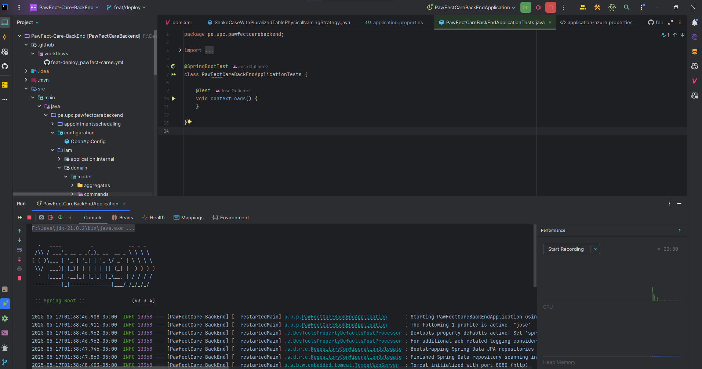

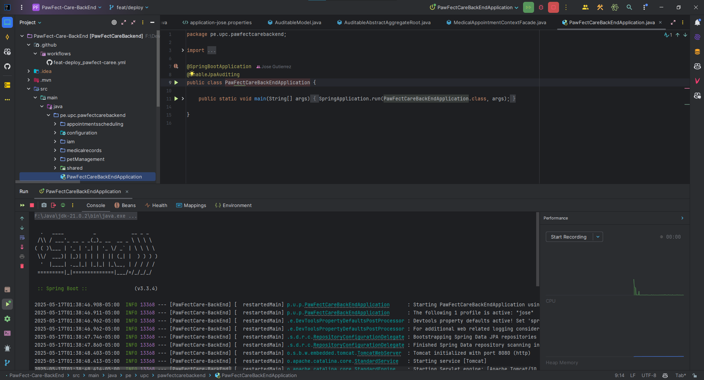

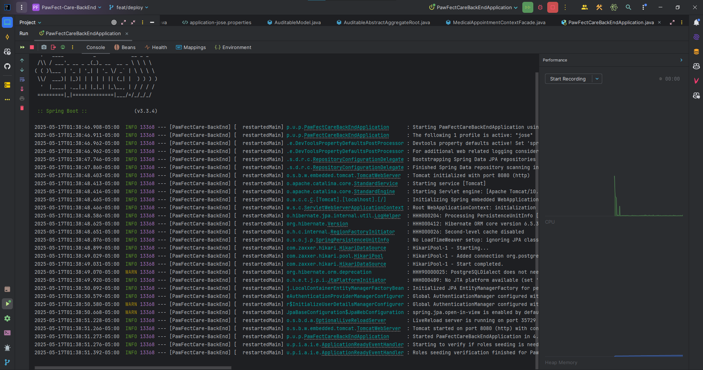

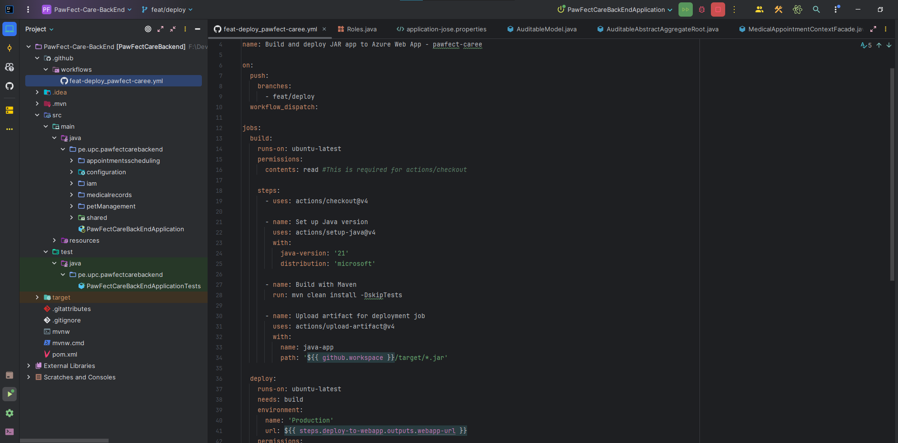

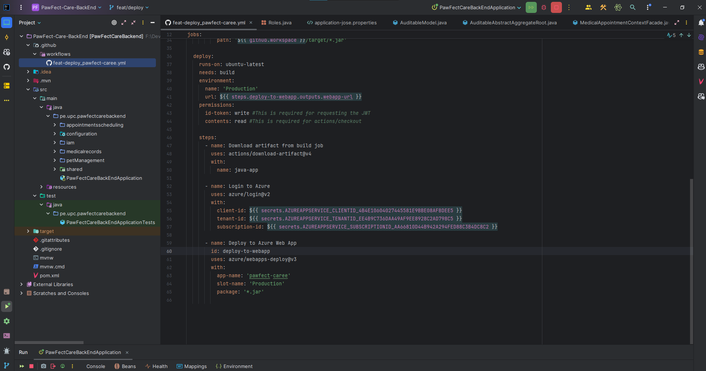

#### FrontEnd

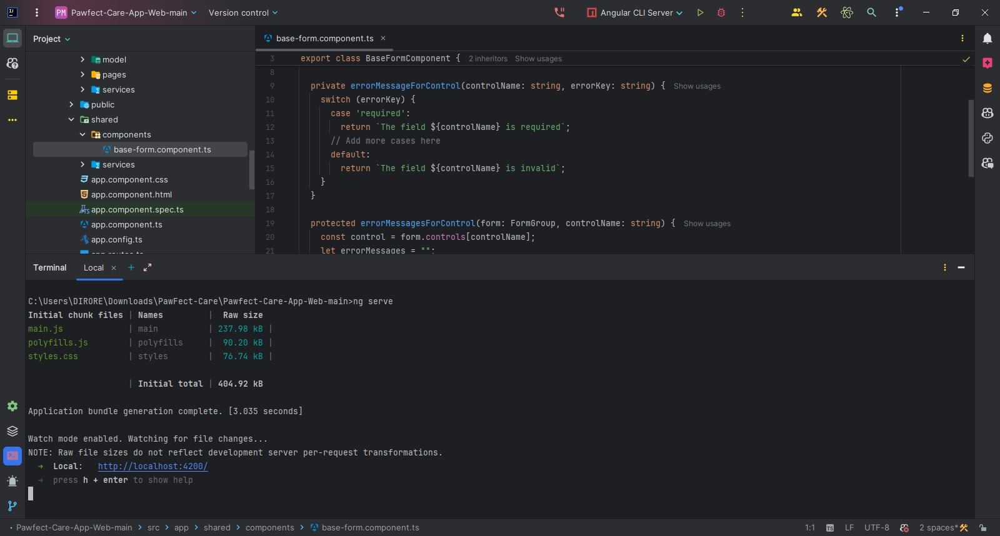

#### 5.3.1.5       Microservices Documentation Evidence for Sprint Review

En esta seccion presentamos las capturas de los endpoints de microservicios que tiene nuestro BackEnd:

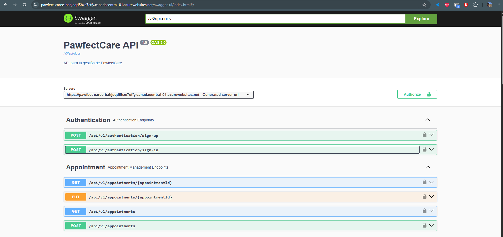

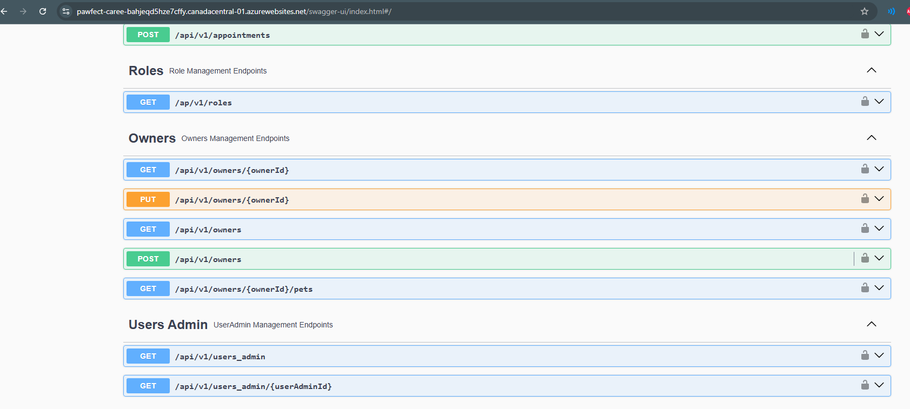

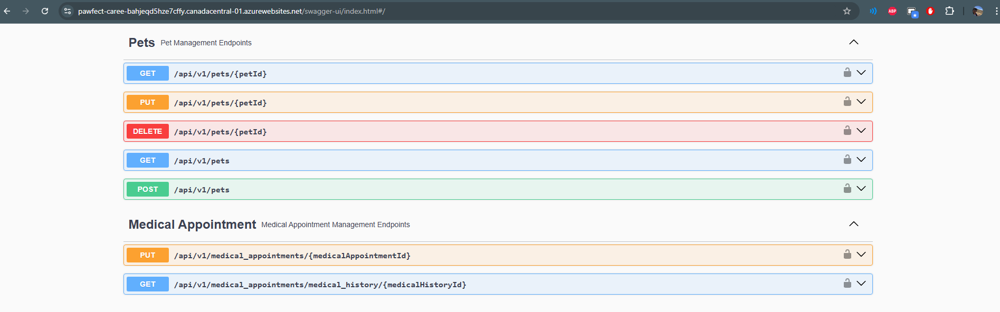


En esta seccion presentamos las capturas de los servicios que tiene nuestro FrontEnd:

#### Inicio:


#### Vista para registrar clientes o para visualizarlos:
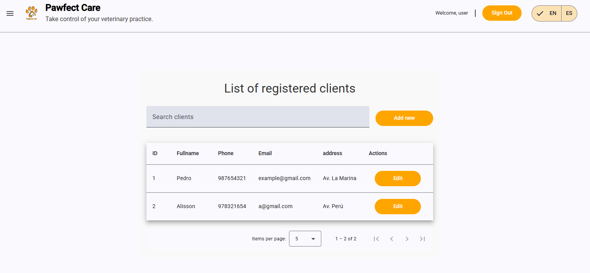

#### Vista para registrar mascotas o para visualizarlas:


#### Vista para registrar una cita o para visualizarlas:
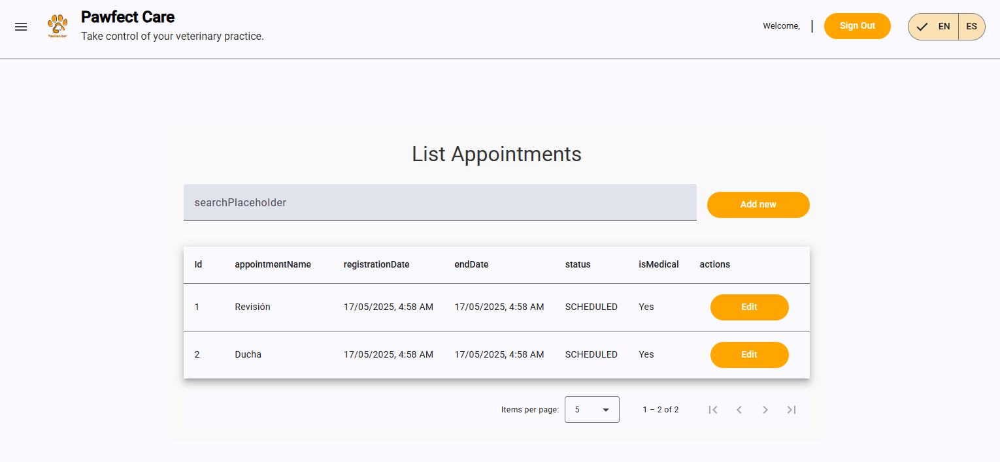


Acá presentamos las capturas de los endpoints de microservicios que tiene nuestro BackEnd:

#### 5.3.1.6       Software Deployment Evidence for Sprint Review

En esta seccion mostramos las evidencias de nuestro deployment con azure app services:

#### Vista del servicio de Azure App Services:
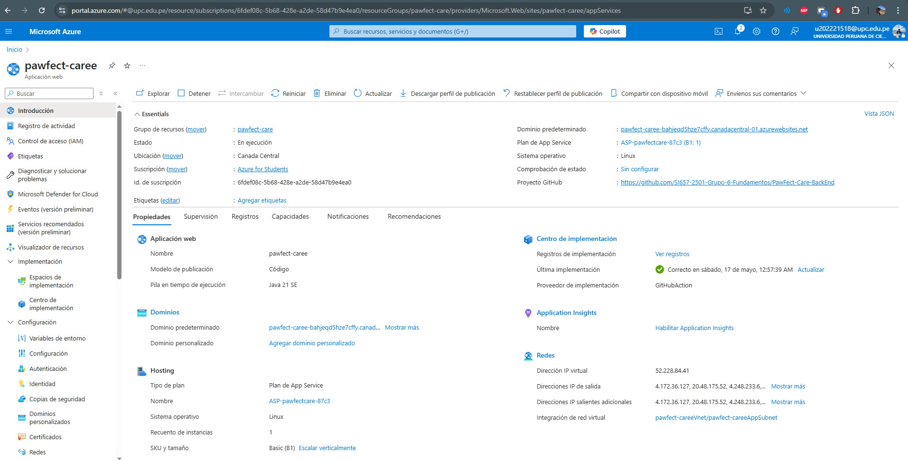

#### Vista del servicio Servidor flexible de Azure Database for PostgreSQL :
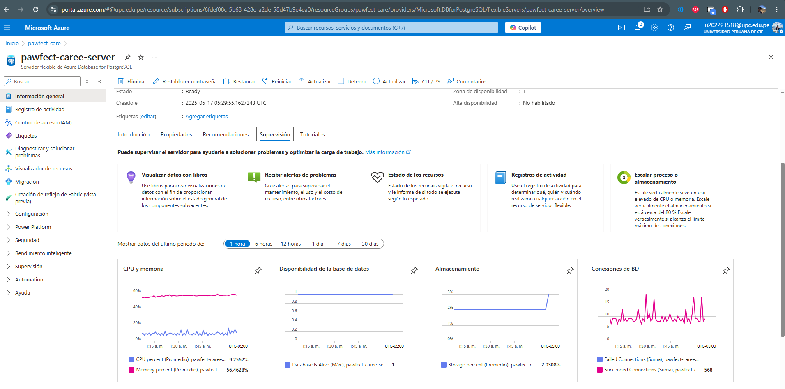

#### Vista del dashboard del servicio de hosting Firebase para el web frontend

[](https://postimg.cc/VSwtPVJd)


#### 5.3.1.7       Team Collaboration Insights during Sprint

En esta seccion Mostramos la colaboracion de todos los integrantes en todos nuestros repositorios.

#### Repositorio para el Report
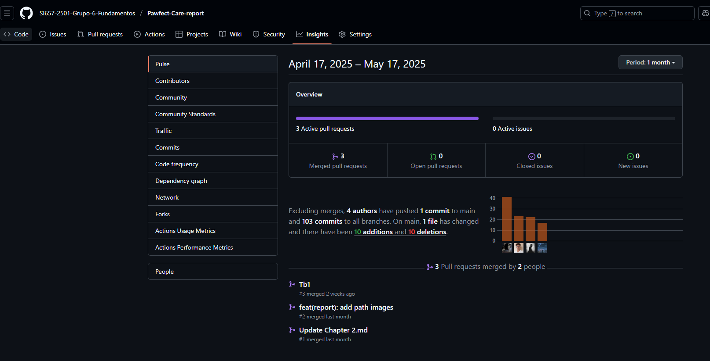

#### Repositorio para el BackEnd
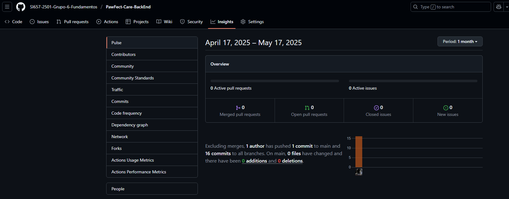

#### Repositorio para el FrontEnd
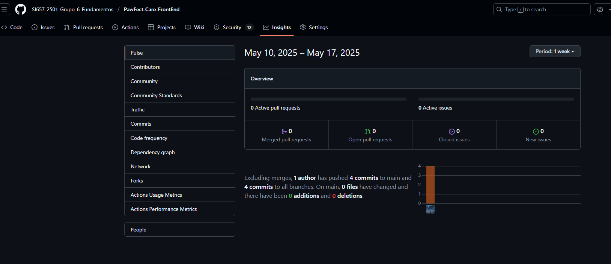

#### Repositorio para el Acceptance-Tests
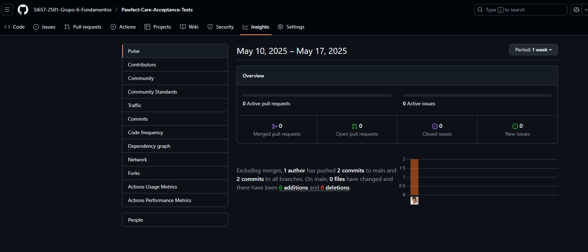

#### Repositorio para el Testing del Backend
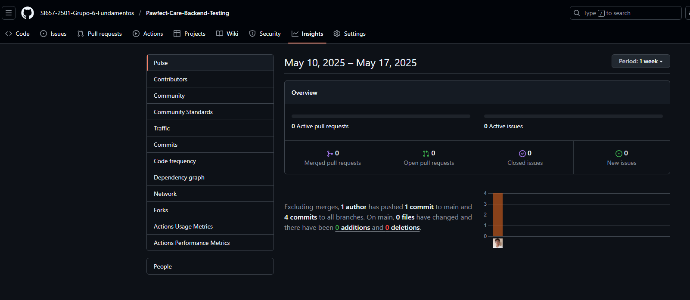


#### 5.3.1.8       Kanban Board
A continuación presentamos nuestro Kanban Board Realizado en Trello, correspondiente al Sprint 1. En él se reflejan las distintas etapas del flujo de trabajo (To‑Do, In‑Process, Testing y Done) y la asignación de cada User Story a su estado actual, facilitando la visualización clara del avance del equipo y la identificación de cuellos de botella. Este tablero nos permitió coordinar esfuerzos, priorizar tareas y asegurar que todas las historias de usuario planificadas para el sprint se completaran con éxito.

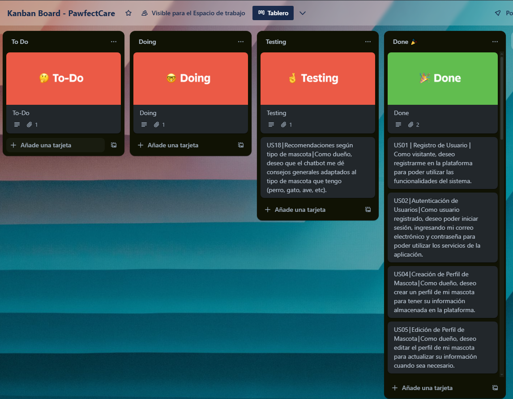

### 5.3.2   Sprint 2

#### 5.3.2.1       Sprint Backlog 2
| **Sprint #**   | **Sprint 1**                                                                                                                                                                                                                  |     |     |                                                                                             |           |                    |     |
|-----------------|----------------------------------------------------------------------------------------------------------------------------------------------------------------------------------------|-----|-----|---------------------------------------------------------------------------------------------|-----------|--------------------|-----|
| **User Story**  |   |  **Work-item / Task**    |     |                                                                                             |           |                    |     |
| **ID**         | **Title**                        | **Id** | **Title**                        | **Description**                                                                             | **Estimation (hours)** | **Assigned To**    | **Status (To-do / In-Process / To-Review / Done)** |
| **US01**     | Registro de Usuario | **T01** | Registro de Usuario | Implementar el registro de usuarios |   1h   |  José Gutierrez  |  Done   |
| **US02**     | Autenticación de Usuarios | **T02** | Autenticación de Usuarios | Implementar la autenticación de usuarios |   1h   |  José Gutierrez  |  Done   |
| **US04**     | Creación de Perfil de Mascota | **T03** | Creación de Perfil de Mascota | Implementar el correcto formulario para la creción del perfil de la mascota |   2h   |  Rodrigo Chirinos  |  Done   |
| **US05**     | Edición de Perfil de Mascota | **T04** | Edición de Perfil de Mascota | Implementar el formulario adecuado para editar el perfil de la mascota |   2h   |  Rodrigo Chirinos  |  Done   |
| **US06**     | Visualización de Perfiles de Mascotas	 | **T05** | Visualización de Perfiles de Mascotas	 | Implementar la vista para la visualización de Perfiles de Mascotas	 |   2h   |  José Gutierrez  |  Done   |
| **US08**     | Gestión de Perfiles de Mascotas | **T06** | Gestión de Perfiles de Mascotas | Implementar la correcta gestión de los perfiles de las mascotas. |   2h   |  Oscar Aranda  |  Done   |
| **US09**     | Agendamiento de Citas | **T07** | Agendamiento de Citas | Implementar el formulario pertinente para que se puedan agendar las citas. |   2h   |  Rodrigo Chirinos  |  Done   |
| **US010**     | Cancelación de Citas | **T08** | Cancelación de Citas | Implementar la opción de cancelar una cita. |   2h   |  Oscar Aranda  |  Done   |
| **US12**     | Edición de Citas Veterinarias | **T09** | Edición de Citas Veterinarias | Implementar la opción de editar una cita programada. |   2h   |  Renzo Silva  |  Done   |
| **US13**     | Búsqueda de dueños de mascota | **T10** | Búsqueda de dueños de mascota | Implementar la opción de buscar a las mascotas. |   2h   |  José Gutierrez  |  Done   |
| **US14**     | Consulta sobre alimentación adecuada | **T11** | Consulta sobre alimentación adecuada | Implementar la opción para que la veterinaria registre este servicio. |   2h   |  Oscar Aranda  |  Done   |
| **US15**     | Consejos de higiene para mascotas | **T12** | Consejos de higiene para mascotas | Implementar la opción para que la veterinaria registre este servicio. |   3h   |  José Gutierrez  |  Done   |
| **US16**     | Preguntas frecuentes sobre salud | **T13** | Preguntas frecuentes sobre salud | Implementar la opción para que la veterinaria registre este servicio.|   2h   |  Renzo Silva  |  Done   |
| **US17**     | Consejos de entrenamiento básico | **T14** | Consejos de entrenamiento básico | Implementar la opción para que la veterinaria registre este servicio. |   3h   |  José Gutierrez  |  Done   |
| **US18**     | Recomendaciones según tipo de mascota | **T15** | Recomendaciones según tipo de mascota | Implementar la opción de las recomendaciones. |   2h   |  Renzo Silva  |  Done   |
| **US19**     | Visualización del Historial Médico | **T16** | Visualización del Historial Médico | Implementar la opción para visualizar el historial médico. |   2h   |  José Gutierrez  |  Done   |
| **US20**     | Actualización del Historial Médico | **T17** | Actualización del Historial Médico | Implementar la opción para editar y actualizar el historial médico. |   2h   |  Oscar Aranda  |  Done   |

#### 5.3.2.2       Development Evidence for Sprint Review

En esta sección, se presentan los commits realizados en el repositorio del backend microservices y el reporte en GitHub. Estos commits reflejan el progreso y las mejoras implementadas durante el Sprint 1, proporcionando una visión detallada de las actividades de desarrollo y las contribuciones del equipo.

| **Repository**                                                                 | **Branch** | **Commit Id**                              | **Commit Message**                                                                                                                                                                                                                                                                        | **Commit Message Body** | **Committed on (Date)** |
|--------------------------------------------------------------------------------|------------|--------------------------------------------|-------------------------------------------------------------------------------------------------------------------------------------------------------------------------------------------------------------------------------------------------------------------------------------------|-------------------------|-------------------------|
| [https://github.com/SI657-2501-Grupo-6-Fundamentos/PawFect-Care-Microservices](https://github.com/SI657-2501-Grupo-6-Fundamentos/PawFect-Care-Microservices) | main | `2b24fbf` |Feat: Initialize Core Microservices | - | 04/06/25 |
| [https://github.com/SI657-2501-Grupo-6-Fundamentos/PawFect-Care-Microservices](https://github.com/SI657-2501-Grupo-6-Fundamentos/PawFect-Care-Microservices) | development | `2b24fbf` |Feat: Initialize Core Microservices | - | 04/06/25 |
| [https://github.com/SI657-2501-Grupo-6-Fundamentos/PawFect-Care-Microservices](https://github.com/SI657-2501-Grupo-6-Fundamentos/PawFect-Care-Microservices) | feat/iam-service | `75ee2c6` |feat: add iamservice | - | 06/06/25 |
| [https://github.com/SI657-2501-Grupo-6-Fundamentos/PawFect-Care-Microservices](https://github.com/SI657-2501-Grupo-6-Fundamentos/PawFect-Care-Microservices) | feature/oscar | `2b24fbf` | Feat: Initialize Core Microservices | - | 04/06/25 |
| [https://github.com/SI657-2501-Grupo-6-Fundamentos/PawFect-Care-Microservices](https://github.com/SI657-2501-Grupo-6-Fundamentos/PawFect-Care-Microservices) | feature/oscar | `045b874` | Feat: Initialize Core Microservices | - | 07/06/25 |
| [https://github.com/SI657-2501-Grupo-6-Fundamentos/PawFect-Care-Microservices](https://github.com/SI657-2501-Grupo-6-Fundamentos/PawFect-Care-Microservices) | feature/oscar | `c06d285` | Feat: Add Veterinary And Client Service | - | 07/06/25 |
| [https://github.com/SI657-2501-Grupo-6-Fundamentos/PawFect-Care-Microservices](https://github.com/SI657-2501-Grupo-6-Fundamentos/PawFect-Care-Microservices) | feature/oscar | `982a2ca` | Feat: Add Rest Templates for Intercomunication between pets and pet owners | - | 07/06/25 |


#### 5.3.2.3       Testing Suite Evidence for Sprint Review

En este sprint, se han incorporado pruebas de aceptación escritas en **Gherkin**, asegurando que los requisitos del usuario se validen de manera efectiva. A continuación, se proporciona el enlace al repositorio de las pruebas de aceptación, donde se encuentra una descripción detallada de los escenarios de prueba y su implementación:

**Repositorio de pruebas de aceptación:**  
[https://github.com/SI657-2501-Grupo-6-Fundamentos/Pawfect-Care-Backend-Testing](https://github.com/SI657-2501-Grupo-6-Fundamentos/Pawfect-Care-Backend-Testing)

| **Repository**                                                                             | **Branch** | **Commit Id**                          | **Commit Message**                                                                                                                                                         | **Commit Message Body** | **Committed on (Date)** |
|--------------------------------------------------------------------------------------------|------------|----------------------------------------|----------------------------------------------------------------------------------------------------------------------------------------------------------------------------|-------------------------|-------------------------|
| [Pawfect-Care-Acceptance-Tests](https://github.com/SI657-2501-Grupo-6-Fundamentos/Pawfect-Care-Acceptance-Tests) | `main`     | `5ba730d2580f106bf46ee74aa7d6b9baab668554` | feat: add gherkin files .feature | - | 16/05/25 |


#### 5.3.2.4       Execution Evidence for Sprint Review

En esta seccion mostramos la ejecucion de nuestros servicios:

#### Backend

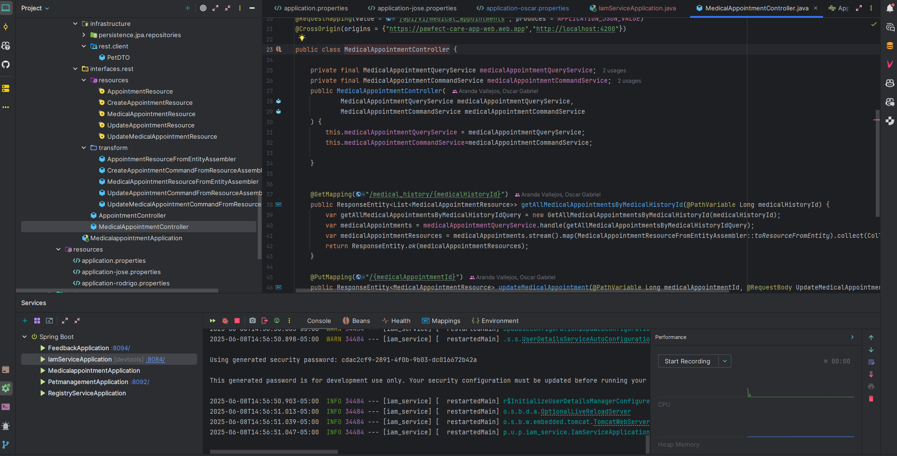

#### 5.3.2.5       Microservices Documentation Evidence for Sprint Review

En esta seccion presentamos las capturas de los endpoints de microservicios que tiene nuestro BackEnd:

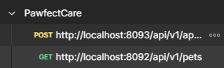

#### 5.3.2.6       Software Deployment Evidence for Sprint Review

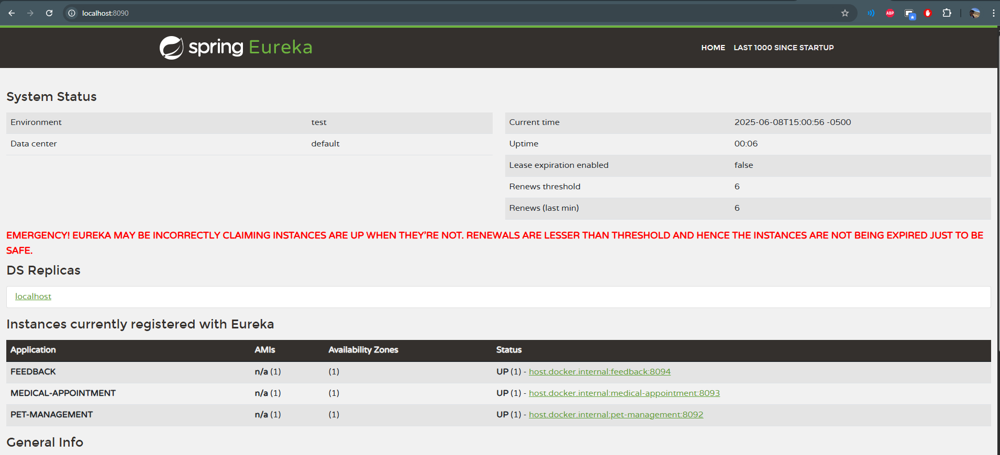


#### 5.3.2.7       Team Collaboration Insights during Sprint

En esta seccion Mostramos la colaboracion de todos los integrantes en todos nuestros repositorios.

#### Repositorio para el Report
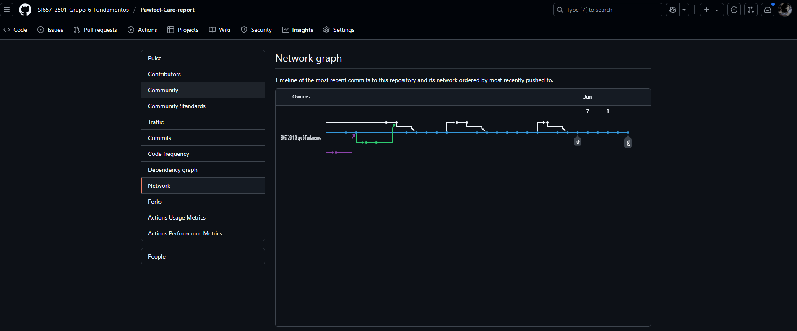

#### Repositorio para el BackEnd Microservices
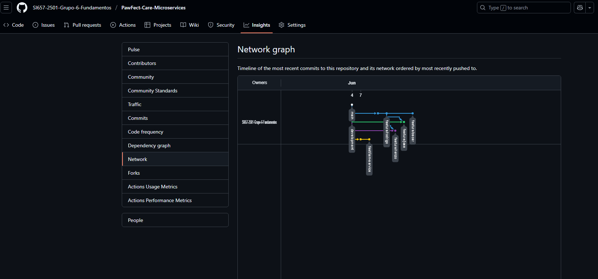


#### 5.3.2.8       Kanban Board
A continuación presentamos nuestro Kanban Board Realizado en Trello, correspondiente al Sprint 2. En él se reflejan las distintas etapas del flujo de trabajo (To‑Do, In‑Process, Testing y Done) y la asignación de cada User Story a su estado actual, facilitando la visualización clara del avance del equipo y la identificación de cuellos de botella. Este tablero nos permitió coordinar esfuerzos, priorizar tareas y asegurar que todas las historias de usuario planificadas para el sprint se completaran con éxito.

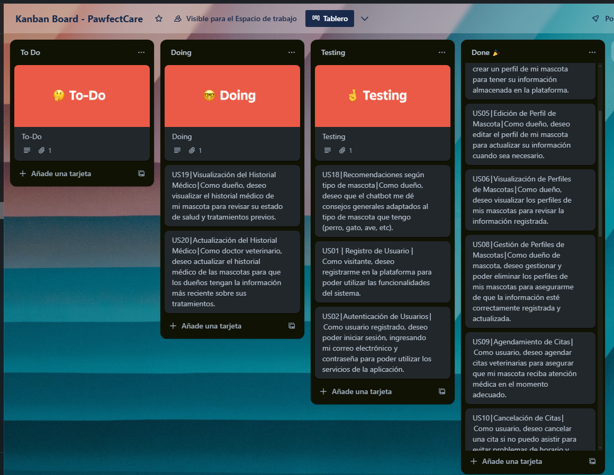


### 5.2.3   Sprint 3

| **Sprint #**   | **Sprint 3**                                                                                                                                                                                                                  |     |     |                                                                                             |           |                    |     |
|-----------------|----------------------------------------------------------------------------------------------------------------------------------------------------------------------------------------|-----|-----|---------------------------------------------------------------------------------------------|-----------|--------------------|-----|
| **User Story**  |   |  **Work-item / Task**    |     |                                                                                             |           |                    |     |
| **ID**         | **Title**                        | **Id** | **Title**                        | **Description**                                                                             | **Estimation (hours)** | **Assigned To**    | **Status (To-do / In-Process / To-Review / Done)** |
| **US01**     | Registro de Usuario | **T01** | Registro de Usuario | Implementar el registro de usuarios |   1h   |  José Gutierrez  |  Done   |
| **US02**     | Autenticación de Usuarios | **T02** | Autenticación de Usuarios | Implementar la autenticación de usuarios |   1h   |  José Gutierrez  |  Done   |
| **US04**     | Creación de Perfil de Mascota | **T03** | Creación de Perfil de Mascota | Implementar el correcto formulario para la creción del perfil de la mascota |   2h   |  Rodrigo Chirinos  |  Done   |
| **US05**     | Edición de Perfil de Mascota | **T04** | Edición de Perfil de Mascota | Implementar el formulario adecuado para editar el perfil de la mascota |   2h   |  Rodrigo Chirinos  |  Done   |
| **US06**     | Visualización de Perfiles de Mascotas	 | **T05** | Visualización de Perfiles de Mascotas	 | Implementar la vista para la visualización de Perfiles de Mascotas	 |   2h   |  José Gutierrez  |  Done   |
| **US08**     | Gestión de Perfiles de Mascotas | **T06** | Gestión de Perfiles de Mascotas | Implementar la correcta gestión de los perfiles de las mascotas. |   2h   |  Oscar Aranda  |  Done   |
| **US09**     | Agendamiento de Citas | **T07** | Agendamiento de Citas | Implementar el formulario pertinente para que se puedan agendar las citas. |   2h   |  Rodrigo Chirinos  |  Done   |
| **US010**     | Cancelación de Citas | **T08** | Cancelación de Citas | Implementar la opción de cancelar una cita. |   2h   |  Oscar Aranda  |  Done   |
| **US12**     | Edición de Citas Veterinarias | **T09** | Edición de Citas Veterinarias | Implementar la opción de editar una cita programada. |   2h   |  Renzo Silva  |  Done   |
| **US13**     | Búsqueda de dueños de mascota | **T10** | Búsqueda de dueños de mascota | Implementar la opción de buscar a las mascotas. |   2h   |  José Gutierrez  |  Done   |
| **US14**     | Consulta sobre alimentación adecuada | **T11** | Consulta sobre alimentación adecuada | Implementar la opción para que la veterinaria registre este servicio. |   2h   |  Oscar Aranda  |  Done   |
| **US15**     | Consejos de higiene para mascotas | **T12** | Consejos de higiene para mascotas | Implementar la opción para que la veterinaria registre este servicio. |   3h   |  José Gutierrez  |  Done   |
| **US16**     | Preguntas frecuentes sobre salud | **T13** | Preguntas frecuentes sobre salud | Implementar la opción para que la veterinaria registre este servicio.|   2h   |  Renzo Silva  |  Done   |
| **US17**     | Consejos de entrenamiento básico | **T14** | Consejos de entrenamiento básico | Implementar la opción para que la veterinaria registre este servicio. |   3h   |  José Gutierrez  |  Done   |
| **US18**     | Recomendaciones según tipo de mascota | **T15** | Recomendaciones según tipo de mascota | Implementar la opción de las recomendaciones. |   2h   |  Renzo Silva  |  Done   |
| **US19**     | Visualización del Historial Médico | **T16** | Visualización del Historial Médico | Implementar la opción para visualizar el historial médico. |   2h   |  José Gutierrez  |  Done   |
| **US20**     | Actualización del Historial Médico | **T17** | Actualización del Historial Médico | Implementar la opción para editar y actualizar el historial médico. |   2h   |  Oscar Aranda  |  Done   |
#### 5.2.3.2       Development Evidence for Sprint Review

En esta sección, mostramos los commits y ramas clave en los repositorios de microservicios que reflejan el trabajo realizado durante el Sprint 3:

| **Repository**                                                                 | **Branch**     | **Commit Id**  | **Commit Message**                                   | **Date**    |
|--------------------------------------------------------------------------------|----------------|----------------|------------------------------------------------------|-------------|
| `<repo-backend-microservices>`                                                 | `feature/...`  | `abcdef1`      | feat: implementar X microservicio                    | dd/mm/25    |
| `<repo-frontend>`                                                              | `feature/...`  | `1234567`      | feat: actualizar integración con microservicio Y     | dd/mm/25    |
| *(Agregar más filas según corresponda)*                                                                                                                                                                                                 |

#### 5.2.3.3       Testing Suite Evidence for Sprint Review

En este sprint, se han incorporado pruebas de aceptación escritas en **Gherkin**, asegurando que los requisitos del usuario se validen de manera efectiva. A continuación, se proporciona el enlace al repositorio de las pruebas de aceptación, donde se encuentra una descripción detallada de los escenarios de prueba y su implementación:

**Repositorio de pruebas de aceptación:**  
[https://github.com/SI657-2501-Grupo-6-Fundamentos/Pawfect-Care-Backend-Testing](https://github.com/SI657-2501-Grupo-6-Fundamentos/Pawfect-Care-Backend-Testing)

| **Repository**                                                                             | **Branch** | **Commit Id**                          | **Commit Message**                                                                                                                                                         | **Commit Message Body** | **Committed on (Date)** |
|--------------------------------------------------------------------------------------------|------------|----------------------------------------|----------------------------------------------------------------------------------------------------------------------------------------------------------------------------|-------------------------|-------------------------|
| [Pawfect-Care-Acceptance-Tests](https://github.com/SI657-2501-Grupo-6-Fundamentos/Pawfect-Care-Acceptance-Tests) | `main`     | `5ba730d2580f106bf46ee74aa7d6b9baab668554` | feat: add gherkin files .feature | - | 16/05/25 |


#### 5.2.3.4       Execution Evidence for Sprint Review

En esta sección se muestran capturas de pantalla o logs que prueban la ejecución de los microservicios y su correcto funcionamiento:

- **Backend**  
  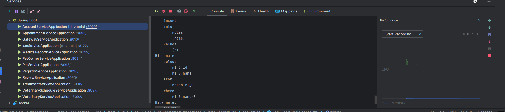


- **Frontend**  
  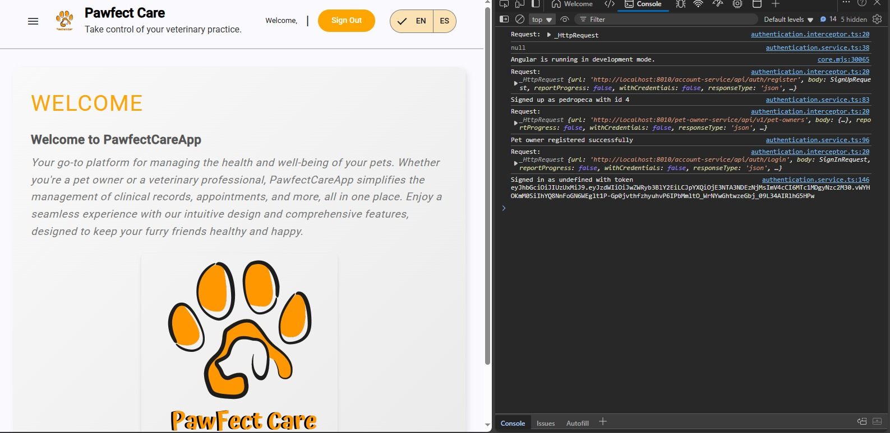

#### 5.2.3.5       Microservices Documentation Evidence for Sprint Review

Aquí presentamos las capturas de los endpoints documentados (Swagger/Postman) para los nuevos servicios o actualizaciones:

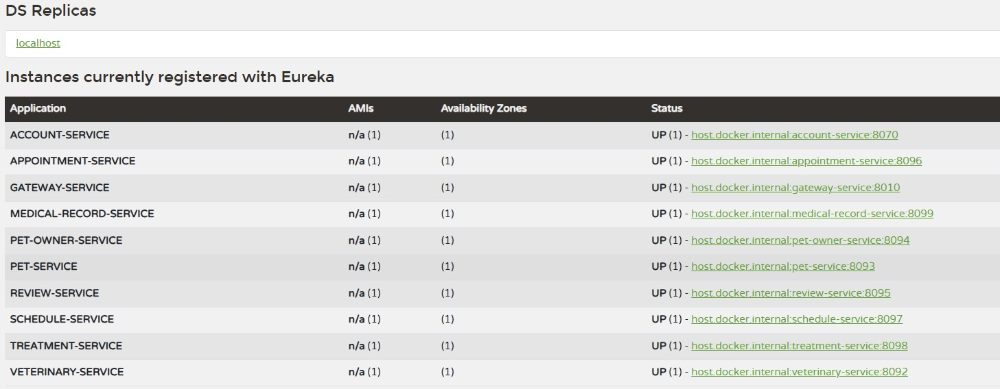

#### 5.2.3.6       Software Deployment Evidence for Sprint Review

Para este sprint uan no se ha hecho deployment, esta planeado para el sprint 4

#### 5.2.3.7       Team Collaboration Insights during Sprint

Capturas de las contribuciones de cada integrante en los repositorios:

- **Repo Backend**: 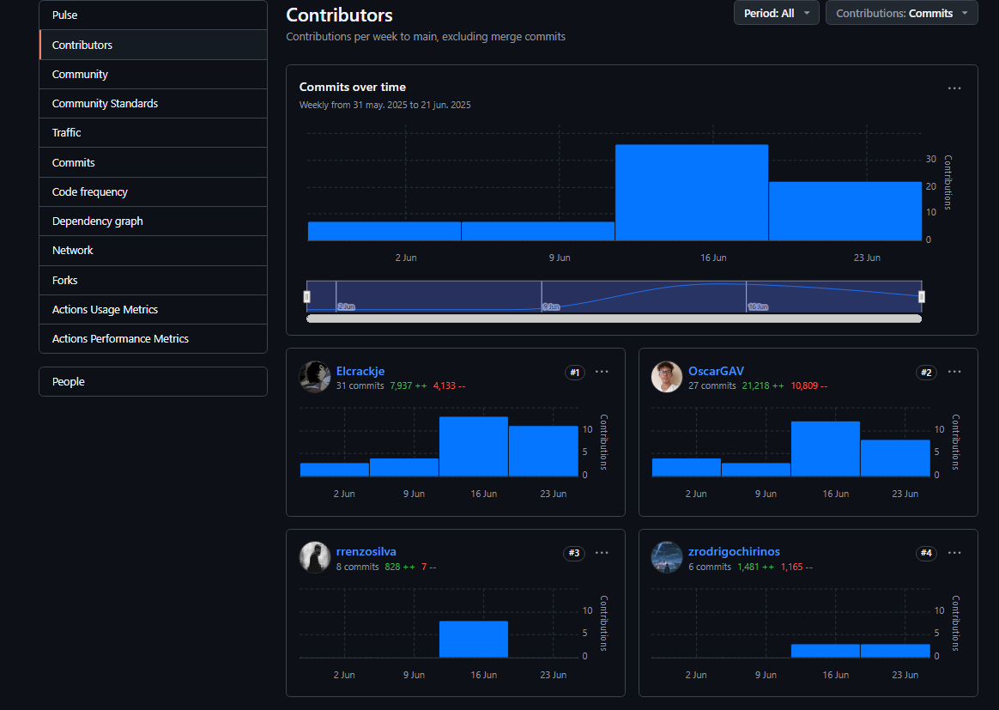  
- **Repo Frontend**: 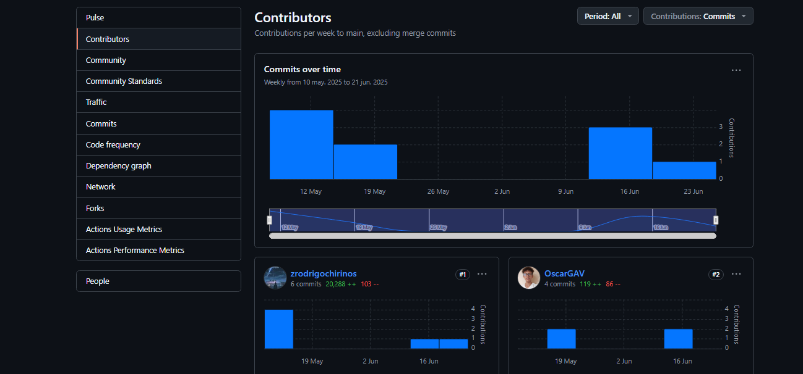

#### 5.2.3.8       Kanban Board

A continuación presentamos nuestro Kanban Board realizado en Trello (o la herramienta que hayan usado) para el Sprint 3. En él se reflejan las distintas columnas (To-Do, In-Progress, To-Review, Done) y la asignación de cada User Story a su estado actual, facilitando la visualización del avance y la identificación de bloqueos:


---

## Conclusiones

### Conclusiones Y Recomendaciones

**Conclusiones**

Durante el desarrollo de este proyecto, el equipo ha podido aplicar varios conceptos que hemos aprendido a lo largo de la carrera, como el uso de microservicios, control de versiones con Git y GitFlow, y metodologías ágiles como el trabajo por sprints. Esto nos ha ayudado a organizarnos mejor, repartir tareas de forma clara y avanzar de manera ordenada.

También nos dimos cuenta de lo importante que es entender bien los requisitos del cliente desde el inicio. Gracias a eso, pudimos desarrollar una solución que realmente responde a sus necesidades. Además, en cada iteración aprendimos algo nuevo, tanto a nivel técnico como en trabajo en equipo, y eso ha sido clave para mejorar el producto y nuestra propia formación profesional.

**Recomendaciones**

Para continuar con el desarrollo del sistema, recomendamos realizar pruebas con usuarios reales para validar que la experiencia sea la adecuada y detectar posibles mejoras. También sería bueno reforzar la documentación, sobre todo para facilitar el mantenimiento o si alguien más se suma al equipo más adelante.

Además, se debería considerar implementar funciones de seguridad como login y control de accesos, y en etapas futuras pensar en herramientas de monitoreo que ayuden a revisar el rendimiento y estabilidad del sistema una vez que esté en producción.

Por último, sería útil analizar cómo escalar el sistema en caso aumente la cantidad de usuarios o se añadan más módulos, así evitamos problemas de rendimiento más adelante.

## Bibliografía

- Sedano, L. (2024). _Manual para la gestión eficaz de clínicas veterinarias: Estrategias administrativas y organizativas._ Recuperado de https://puntomedic.cl/blogs/manuales-y-guias/manual-para-la-gestion-eficaz-de-clinicas-veterinarias-estrategias-administrativas-y-organizativas 

- BioSystems S.A. (s.f.). _Guía de buenas prácticas en veterinaria._ Barcelona, España: ioSystems S.A. Recuperado de https://covetrioja.org/wp-content/uploads/2021/10/VET_GuiaBuenasPracticas_ESP.pdf 

---

## Anexos

**Anexo 1:**

**Entrevias de Needfinding**

Entrevistas a Clinicas Veterinarias:<br>
- [`https://upcedupe-my.sharepoint.com/:v:/g/personal/u202221518_upc_edu_pe/EYevHRw9GQ5PmnarGePq9lsB9kIXpRvegYORyQnQLeUsQg?nav=eyJyZWZlcnJhbEluZm8iOnsicmVmZXJyYWxBcHAiOiJTdHJlYW1XZWJBcHAiLCJyZWZlcnJhbFZpZXciOiJTaGFyZURpYWxvZy1MaW5rIiwicmVmZXJyYWxBcHBQbGF0Zm9ybSI6IldlYiIsInJlZmVycmFsTW9kZSI6InZpZXcifX0%3D&e=wTtOfn`](https://upcedupe-my.sharepoint.com/:v:/g/personal/u202221518_upc_edu_pe/EYevHRw9GQ5PmnarGePq9lsB9kIXpRvegYORyQnQLeUsQg?nav=eyJyZWZlcnJhbEluZm8iOnsicmVmZXJyYWxBcHAiOiJTdHJlYW1XZWJBcHAiLCJyZWZlcnJhbFZpZXciOiJTaGFyZURpYWxvZy1MaW5rIiwicmVmZXJyYWxBcHBQbGF0Zm9ybSI6IldlYiIsInJlZmVycmFsTW9kZSI6InZpZXcifX0%3D&e=wTtOfn)

- [`https://upcedupe-my.sharepoint.com/:v:/g/personal/u20221c362_upc_edu_pe/EenhPQh7QtNJv8TMRTHvYP0BzjPaqB_rTUv0wqjPt7JQIQ?e=FNTg1h&nav=eyJyZWZlcnJhbEluZm8iOnsicmVmZXJyYWxBcHAiOiJTdHJlYW1XZWJBcHAiLCJyZWZlcnJhbFZpZXciOiJTaGFyZURpYWxvZy1MaW5rIiwicmVmZXJyYWxBcHBQbGF0Zm9ybSI6IldlYiIsInJlZmVycmFsTW9kZSI6InZpZXcifX0%3D`](https://upcedupe-my.sharepoint.com/:v:/g/personal/u20221c362_upc_edu_pe/EenhPQh7QtNJv8TMRTHvYP0BzjPaqB_rTUv0wqjPt7JQIQ?e=FNTg1h&nav=eyJyZWZlcnJhbEluZm8iOnsicmVmZXJyYWxBcHAiOiJTdHJlYW1XZWJBcHAiLCJyZWZlcnJhbFZpZXciOiJTaGFyZURpYWxvZy1MaW5rIiwicmVmZXJyYWxBcHBQbGF0Zm9ybSI6IldlYiIsInJlZmVycmFsTW9kZSI6InZpZXcifX0%3D)

- [`https://upcedupe-my.sharepoint.com/:v:/g/personal/u20221c362_upc_edu_pe/EVHJf-z0S_xLmFGdEM4xjqgBlsb3F-q3hD-1zjTQ1UHpLA?e=kZdvhS&nav=eyJyZWZlcnJhbEluZm8iOnsicmVmZXJyYWxBcHAiOiJTdHJlYW1XZWJBcHAiLCJyZWZlcnJhbFZpZXciOiJTaGFyZURpYWxvZy1MaW5rIiwicmVmZXJyYWxBcHBQbGF0Zm9ybSI6IldlYiIsInJlZmVycmFsTW9kZSI6InZpZXcifX0%3D`](https://upcedupe-my.sharepoint.com/:v:/g/personal/u20221c362_upc_edu_pe/EVHJf-z0S_xLmFGdEM4xjqgBlsb3F-q3hD-1zjTQ1UHpLA?e=kZdvhS&nav=eyJyZWZlcnJhbEluZm8iOnsicmVmZXJyYWxBcHAiOiJTdHJlYW1XZWJBcHAiLCJyZWZlcnJhbFZpZXciOiJTaGFyZURpYWxvZy1MaW5rIiwicmVmZXJyYWxBcHBQbGF0Zm9ybSI6IldlYiIsInJlZmVycmFsTW9kZSI6InZpZXcifX0%3D)

Entrevistas a Dueños de Mascotas:<br>

- [`https://upcedupe-my.sharepoint.com/:v:/g/personal/u202217804_upc_edu_pe/EW0OxQboN91CuWYKpGd_4MwBlAsR0SZe-MXv2JYI9tr2sA?nav=eyJyZWZlcnJhbEluZm8iOnsicmVmZXJyYWxBcHAiOiJPbmVEcml2ZUZvckJ1c2luZXNzIiwicmVmZXJyYWxBcHBQbGF0Zm9ybSI6IldlYiIsInJlZmVycmFsTW9kZSI6InZpZXciLCJyZWZlcnJhbFZpZXciOiJNeUZpbGVzTGlua0NvcHkifX0&e=hOaFtS`](https://upcedupe-my.sharepoint.com/:v:/g/personal/u202217804_upc_edu_pe/EW0OxQboN91CuWYKpGd_4MwBlAsR0SZe-MXv2JYI9tr2sA?nav=eyJyZWZlcnJhbEluZm8iOnsicmVmZXJyYWxBcHAiOiJPbmVEcml2ZUZvckJ1c2luZXNzIiwicmVmZXJyYWxBcHBQbGF0Zm9ybSI6IldlYiIsInJlZmVycmFsTW9kZSI6InZpZXciLCJyZWZlcnJhbFZpZXciOiJNeUZpbGVzTGlua0NvcHkifX0&e=hOaFtS)

- [`https://upcedupe-my.sharepoint.com/:v:/g/personal/u20221c362_upc_edu_pe/Ee5rXgJAqnREmSoDnOD-WfUBGOscyXbOLMpNCqAw-zoysg?nav=eyJyZWZlcnJhbEluZm8iOnsicmVmZXJyYWxBcHAiOiJTdHJlYW1XZWJBcHAiLCJyZWZlcnJhbFZpZXciOiJTaGFyZURpYWxvZy1MaW5rIiwicmVmZXJyYWxBcHBQbGF0Zm9ybSI6IldlYiIsInJlZmVycmFsTW9kZSI6InZpZXcifX0%3D&e=SSRBR3`](https://upcedupe-my.sharepoint.com/:v:/g/personal/u20221c362_upc_edu_pe/Ee5rXgJAqnREmSoDnOD-WfUBGOscyXbOLMpNCqAw-zoysg?nav=eyJyZWZlcnJhbEluZm8iOnsicmVmZXJyYWxBcHAiOiJTdHJlYW1XZWJBcHAiLCJyZWZlcnJhbFZpZXciOiJTaGFyZURpYWxvZy1MaW5rIiwicmVmZXJyYWxBcHBQbGF0Zm9ybSI6IldlYiIsInJlZmVycmFsTW9kZSI6InZpZXcifX0%3D&e=SSRBR3)

- [`https://upcedupe-my.sharepoint.com/:v:/g/personal/u202218167_upc_edu_pe/ESaf-2VJ0zJGpLnNv2DsVwsBl6m8PtmuTuQSefq_dH90YQ?e=lp9DhQ`](https://upcedupe-my.sharepoint.com/:v:/g/personal/u202218167_upc_edu_pe/ESaf-2VJ0zJGpLnNv2DsVwsBl6m8PtmuTuQSefq_dH90YQ?e=lp9DhQ)

**Anexo 2:**
Respositorio en GitHub para el reporte:
[`https://github.com/SI657-2501-Grupo-6-Fundamentos/Pawfect-Care-report`](https://github.com/SI657-2501-Grupo-6-Fundamentos/Pawfect-Care-report)


**Anexo 3:**
**Link del Trello**

Avance 1 - [`https://trello.com/invite/b/68173b56108458c9054e4b88/ATTIf1f82e9d1bf8cc315055176045a0cf762A3E947E/architectural-design-backlog`](https://trello.com/invite/b/68173b56108458c9054e4b88/ATTIf1f82e9d1bf8cc315055176045a0cf762A3E947E/architectural-design-backlog)

Sprints - [`https://trello.com/invite/b/68182726f3abe511b7a3fd1b/ATTIa80fc72e5abff414c8889e41de34c05c628F4462/kanban-board-pawfectcare`](https://trello.com/invite/b/68182726f3abe511b7a3fd1b/ATTIa80fc72e5abff414c8889e41de34c05c628F4462/kanban-board-pawfectcare)


**Anexo 4: Deploys**

- Landing Page:
[`https://si657-2501-grupo-6-fundamentos.github.io/Pawfect-CareLanding-Page/`](https://si657-2501-grupo-6-fundamentos.github.io/Pawfect-CareLanding-Page/)

- Frontend:
[`https://pawfect-care-app-web-ef319.web.app/`](https://pawfect-care-app-web-ef319.web.app/)

- Backend:
[`https://pawfect-caree-bahjeqd5hze7cffy.canadacentral-01.azurewebsites.net/swagger-ui/index.html#/`](https://pawfect-caree-bahjeqd5hze7cffy.canadacentral-01.azurewebsites.net/swagger-ui/index.html#/)
